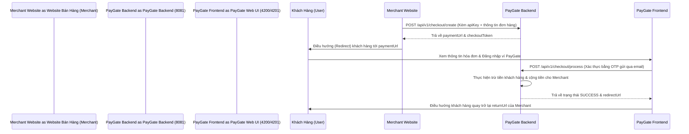

# HƯỚNG DẪN CHẠY DỰ ÁN & KẾT NỐI API PAYGATE (API CONNECTION GUIDE FOR AI & DEVELOPERS)

Tài liệu này cung cấp toàn bộ hướng dẫn khởi chạy các dịch vụ trong hệ thống PayGate, thông số cổng kết nối và tài liệu API chi tiết để các AI Agent hoặc nhà phát triển khác có thể dễ dàng kết nối, tích hợp.

---

## 1. Hướng Dẫn Khởi Chạy Hệ Thống (Setup & Run Commands)

Dự án PayGate có thể chạy theo 2 cách dưới đây. Trước khi chạy bất cứ lệnh nào, hãy đảm bảo **Docker Desktop** đã được mở trên máy tính của bạn.

### Cách A: Khởi chạy toàn bộ hệ thống bằng Docker Compose (Đơn giản nhất)
Cách này chạy tất cả các dịch vụ (Database, Redis, Message Queue, Backend, Frontend) trong các container Docker.

1. Mở terminal tại thư mục gốc của dự án (`d:\Java\PayGate`).
2. Khởi chạy tất cả dịch vụ:
   ```bash
   docker compose up -d
   ```
3. Kiểm tra danh sách các dịch vụ đang chạy:
   ```bash
   docker compose ps
   ```
   *Hệ thống sẽ chạy:*
   - **PostgreSQL**: `localhost:5432`
   - **Redis**: `localhost:6379`
   - **RabbitMQ**: `localhost:5672` (Quản lý tại port `15672`)
   - **Backend API**: `http://localhost:8081`
   - **Frontend App**: `http://localhost:4201`

---

### Cách B: Chạy môi trường Phát triển (Development Mode - Khuyên dùng)
Cách này chỉ chạy hạ tầng (Database, Redis, RabbitMQ, MailHog) trên Docker, còn Backend, Frontend và Provider-Mock sẽ chạy trực tiếp trên máy của bạn để dễ dàng chỉnh sửa code và debug.

#### Bước 1: Khởi chạy hạ tầng dịch vụ (Docker)
1. Di chuyển vào thư mục `backend`:
   ```bash
   cd backend
   ```
2. Chạy docker-compose để dựng database và các hàng đợi:
   ```bash
   docker compose up -d
   ```
   *Lệnh này sẽ khởi tạo các dịch vụ:*
   - **PostgreSQL** (DB: `training_db`, User/Pass: `postgres`/`postgres`) tại `localhost:5432`
   - **Redis** tại `localhost:6379`
   - **RabbitMQ** tại `localhost:5672` (Trang quản lý: `http://localhost:15672` với user/pass: `guest`/`guest`)
   - **MailHog (SMTP Mock)** tại `localhost:1025` (Giao diện xem mail: `http://localhost:8025`)
   - **pgAdmin** tại `http://localhost:5050` (Email/Pass: `admin@paygate.com`/`admin`)

#### Bước 2: Chạy Backend (Spring Boot)
1. Mở một terminal mới tại thư mục `backend`.
2. Chạy lệnh để khởi tạo server:
   ```bash
   ./mvnw.cmd spring-boot:run
   ```
   *Lưu ý:* Khi Backend khởi chạy thành công, nó sẽ tự động chạy cơ chế di chuyển database (Flyway migrations) và khởi tạo một tài khoản quản trị mặc định:
   - **Admin Username**: `admin`
   - **Admin Password**: `Admin@123456!`
   - **Admin Email**: `admin@paygate.dev`
   - **API Port**: `8081`

#### Bước 3: Chạy Frontend (Angular)
1. Mở một terminal mới tại thư mục `frontend`.
2. Cài đặt các gói thư viện (nếu chạy lần đầu):
   ```bash
   npm install
   ```
3. Chạy Angular dev server:
   ```bash
   npm start
   ```
   - **Frontend Web URL**: `http://localhost:4200`
   - Giao diện Frontend sẽ tự động chuyển tiếp (proxy) các request `/api/*` và `/ws/*` sang Backend ở `http://localhost:8081`.

#### Bước 4: Chạy Provider-Mock (Giả lập ngân hàng đối tác - Tùy chọn)
Nếu bạn cần kiểm tra luồng liên kết ngân hàng hoặc thanh toán đầy đủ:
1. Mở terminal tại thư mục `provider-mock`.
2. Khởi chạy:
   ```bash
   ./mvnw.cmd spring-boot:run
   ```
   - **Provider Mock URL**: `http://localhost:8090`

---

## 2. Thông Tin Địa Chỉ Các Dịch Vụ (Service Registry & Endpoints)

| Dịch vụ | URL | Thông tin đăng nhập / Credentials |
| :--- | :--- | :--- |
| **Backend API** | `http://localhost:8081` | - |
| **Swagger UI (OpenAPI Docs)** | `http://localhost:8081/swagger-ui.html` | Xem thông tin chi tiết cấu trúc Request/Response |
| **JSON API Docs** | `http://localhost:8081/v3/api-docs` | AI có thể đọc file JSON này để import trực tiếp |
| **Frontend Angular (Dev)** | `http://localhost:4200` | - |
| **Frontend Angular (Docker)** | `http://localhost:4201` | - |
| **PostgreSQL** | `localhost:5432` | DB: `training_db` \| User: `postgres` \| Pass: `postgres` |
| **Redis** | `localhost:6379` | Không có mật khẩu |
| **RabbitMQ Management** | `http://localhost:15672` | User: `guest` \| Pass: `guest` |
| **MailHog Web UI (Xem OTP/Email)** | `http://localhost:8025` | Không có mật khẩu |
| **pgAdmin (Quản lý DB trực quan)** | `http://localhost:5050` | Email: `admin@paygate.com` \| Pass: `admin` |

---

## 3. Quy Trình Xác Thực & Gọi API (Authentication & Authorization Flow)

Hệ thống sử dụng cơ chế bảo mật **JWT (JSON Web Token)**. Hầu hết các API yêu cầu xác thực bằng cách truyền Access Token qua Header.

### Bước 1: Đăng ký tài khoản (Register)
* **Endpoint**: `POST /api/v1/auth/register`
* **Request Body (JSON)**:
  ```json
  {
    "username": "customer_demo",
    "email": "customer@gmail.com",
    "password": "Password123!",
    "fullName": "Nguyen Van A"
  }
  ```

### Bước 2: Đăng nhập (Login)
* **Endpoint**: `POST /api/v1/auth/login`
* **Request Body (JSON)**:
  ```json
  {
    "username": "customer_demo",
    "password": "Password123!"
  }
  ```
* **Response Body thành công (JSON)**:
  ```json
  {
    "status": "SUCCESS",
    "message": "Login successful",
    "data": {
      "accessToken": "eyJhbGciOiJIUzI1NiIsInR5cCI6IkpXVCJ9...",
      "refreshToken": "7c5e3f42-...",
      "user": {
        "id": 2,
        "username": "customer_demo",
        "email": "customer@gmail.com",
        "fullName": "Nguyen Van A",
        "role": "USER",
        "active": true
      }
    }
  }
  ```

### Bước 3: Đính kèm Token khi gọi các API bảo mật
Để gọi các API cần đăng nhập, AI phải đính kèm Header:
```http
Authorization: Bearer <accessToken>
```

---

## 4. Tích Hợp Thanh Toán (Checkout API Flow dành cho Merchant)

Đây là luồng cốt lõi của cổng thanh toán dành cho Bên thứ ba (Merchant) muốn tích hợp PayGate vào website bán hàng của họ.

### Luồng nghiệp vụ tổng quan:


### Chi tiết các API Tích hợp:

#### 1. Tạo phiên thanh toán (Merchant tạo đơn)
* **Endpoint**: `POST /api/v1/checkout/create` (Public - Không cần Token Bearer của User, nhưng cần `apiKey` của Merchant)
* **Request Body (JSON)**:
  ```json
  {
    "apiKey": "MC_API_KEY_HO_LE_TREN_SYSTEM",
    "orderId": "ORD-998822",
    "amount": 50000,
    "description": "Thanh toan mua giay Adidas size 41",
    "returnUrl": "http://my-shop.com/payment-success",
    "cancelUrl": "http://my-shop.com/payment-cancelled"
  }
  ```
* **Response Body (JSON)**:
  ```json
  {
    "status": "SUCCESS",
    "message": "Tạo phiên thanh toán thành công",
    "data": {
      "token": "CHK_E38B29C4710A42EAA26A20A2F45B3878",
      "paymentUrl": "http://localhost:4201/checkout?token=CHK_E38B29C4710A42EAA26A20A2F45B3878",
      "expiresAt": "2026-07-30T11:41:00"
    }
  }
  ```

#### 2. Lấy thông tin đơn hàng thanh toán công khai
Khi khách hàng tải trang thanh toán, Frontend hoặc AI có thể đọc thông tin chi tiết hóa đơn từ Token.
* **Endpoint**: `GET /api/v1/checkout/info/{token}`
* **Response Body (JSON)**:
  ```json
  {
    "status": "SUCCESS",
    "message": "Operation successful",
    "data": {
      "token": "CHK_E38B29C4710A42EAA26A20A2F45B3878",
      "merchantName": "Cửa Hàng Adidas Việt Nam",
      "merchantCode": "ADIDAS_VN",
      "orderId": "ORD-998822",
      "amount": 50000.00,
      "description": "Thanh toan mua giay Adidas size 41",
      "returnUrl": "http://my-shop.com/payment-success",
      "cancelUrl": "http://my-shop.com/payment-cancelled",
      "status": "PENDING",
      "createdAt": "2026-07-30T11:26:00",
      "expiresAt": "2026-07-30T11:41:00"
    }
  }
  ```

#### 3. Xử lý & hoàn tất thanh toán
Sau khi khách hàng đăng nhập và nhận được mã OTP (gửi qua MailHog), gửi OTP để hoàn tất thanh toán.
* **Endpoint**: `POST /api/v1/checkout/process`
* **Headers**: `Authorization: Bearer <accessToken_của_khách_hàng>`
* **Request Body (JSON)**:
  ```json
  {
    "token": "CHK_E38B29C4710A42EAA26A20A2F45B3878",
    "otpCode": "123456"
  }
  ```
* **Response Body thành công (JSON)**:
  ```json
  {
    "status": "SUCCESS",
    "message": "Thanh toán đơn hàng thành công",
    "data": {
      "transactionRef": "TXN_7A8D...",
      "redirectUrl": "http://my-shop.com/payment-success?status=SUCCESS&orderId=ORD-998822&transactionRef=TXN_7A8D..."
    }
  }
  ```

---

## 5. Hướng Dẫn Dành Riêng Cho AI Đọc Để Kết Nối (AI Agent Prompts & Context)

Nếu bạn là một AI Agent đang cố gắng tích hợp với hệ thống PayGate này, hãy tuân thủ các quy tắc sau:
1. **Lấy file OpenAPI**: Tải tài liệu đặc tả đầy đủ từ `http://localhost:8081/v3/api-docs` để có thông tin cập nhật nhất của tất cả các route (khoảng 21+ controller bao gồm: Tài khoản, Tiết kiệm Vault, Khoản vay Loan, Hóa đơn Bill, Voucher, AI chat, ...).
2. **Quản lý Tokens**: Luôn lưu trạng thái `accessToken` sau khi đăng nhập và đưa vào header `Authorization: Bearer <token>`.
3. **Môi trường Test**: Khi thử nghiệm OTP, hãy kiểm tra hòm thư MailHog tại `http://localhost:8025` để lấy mã OTP gửi về cho tài khoản email đăng ký của user.
4. **API Key của Merchant**: Bạn có thể đăng ký tài khoản Merchant bằng cách gọi `POST /api/v1/merchants/request` sau khi đăng nhập với User thông thường, sau đó dùng tài khoản `admin` (`Admin@123456!`) đăng nhập vào trang Quản trị duyệt Merchant để lấy API Key, hoặc gọi API `GET /api/v1/merchants/me/api-key` để lấy khóa API của bạn.
