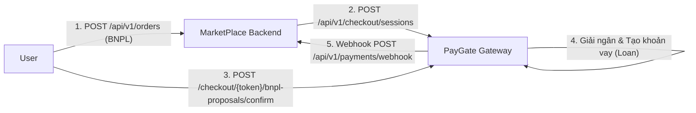

# PayGate (GatePay) & MarketPlace — Báo cáo Review chi tiết (Tính năng BNPL)

> [!info] Phạm vi
> Code review và kiểm tra bảo mật tĩnh (static review) luồng thanh toán trả sau (Buy Now Pay Later) trên cả 2 repository `PayGate/GatePay` và `MarketPlace`. Phụ trách: BNPL Feature. Xem tổng hợp chung tại [[Code-Review-Summary]].

## 1. Kiến trúc

- **Stack**: Java 17, Spring Boot 3.2.5, Spring Security + JWT, Spring Data JPA/Hibernate, PostgreSQL 16.
- **Thành phần chính**: 
  - **PayGate**: `BnplCheckoutService` (quản lý checkout/proposal/confirm), `LoanServiceImpl` (quản lý khoản vay/trả nợ/sự kiện).
  - **MarketPlace**: `OrderServiceImpl` (tạo đơn BNPL, tính cọc), `PaymentServiceImpl` (tạo session & hoàn tiền), `PaymentWebhookServiceImpl` (nhận webhook kết quả thanh toán từ PayGate).
- **Điểm tốt cần giữ nguyên**: Sử dụng `BigDecimal` cho mọi tính toán tiền tệ (lãi suất, dư nợ), gọi hàm từ `TransactionService` để ghi nhận sổ cái khi giải ngân và trả nợ.



## 2. Bảng tổng hợp issue

### Phía PayGate (GatePay)
| ID | Mức độ | Tiêu đề | Vị trí |
|---|---|---|---|
| BNPL-C1 | Critical | Lỗ hổng IDOR - Ép người khác vay nợ | `BnplCheckoutService.java:confirmProposal` |
| BNPL-H1 | High | Lỗ hổng Race Condition (Multi-loan) | `BnplCheckoutService.java:confirmProposal` |
| BNPL-H2 | High | Lỗ hổng tự động bơm hạn mức ảo | `LoanServiceImpl.java:handlePaymentCompleted` |
| BNPL-H3 | High | Lỗi vượt trần hạn mức tín dụng khi có nợ active | `BnplCheckoutService.java:createProposal` |
| BNPL-H4 | High | Tái sử dụng Checkout Session đã hoàn tất (SUCCESS) | `BnplCheckoutService.java:checkout` |

### Phía MarketPlace
| ID | Mức độ | Tiêu đề | Vị trí |
|---|---|---|---|
| MP-BNPL-C1 | Critical | Hoàn 100% tiền đơn BNPL thành tiền mặt Ví Marketplace khi hủy | `PaymentServiceImpl.java:processBnplMarketplaceWalletCredit` |
| MP-BNPL-H1 | High | Thao túng số âm cọc/vay gây rút ruột tài khoản Merchant trên PayGate | `OrderServiceImpl.java:createOrder` |
| MP-BNPL-H2 | High | Bỏ quên hoàn tiền cọc về Ví PayGate khi Webhook báo hủy | `PaymentWebhookServiceImpl.java:processPaygateWebhook` |

---

## 3. Chi tiết issue + Test case phát hiện lỗi

### Phía PayGate (GatePay)

#### BNPL-C1 — Lỗ hổng IDOR - Ép người khác vay nợ (Broken Access Control)

> [!danger] Critical
> **Vị trí:** `BnplCheckoutService.java` (hàm `confirmProposal`)

**Mô tả:** Hàm `confirmProposal` nhận `proposalRef` để chốt duyệt khoản vay nhưng không kiểm tra xem mã này có thuộc về user đang đăng nhập (authenticated user) hay không.

**Kịch bản khai thác:** Hacker dò được mã `proposalRef` đang chờ duyệt của nạn nhân và tự bấm chốt thay. Nạn nhân vô cớ bị trừ tiền cọc (upfrontAmount) trong ví và mắc một khoản nợ khổng lồ trên trời rơi xuống.

**Test case phát hiện lỗi:**
```
Given: User A (nạn nhân) tạo 1 proposal hợp lệ, trạng thái PENDING_CONFIRMATION, ref = "REF123".
When:  User B (kẻ tấn công) đăng nhập và gọi POST /api/v1/checkout/bnpl-proposals/REF123/confirm
Then (kỳ vọng an toàn): 403 Forbidden hoặc báo lỗi "Access denied".
Thực tế (bug): 200 OK. Nạn nhân User A tự động bị gán nợ và trừ tiền cọc.
```

---

#### BNPL-H1 — Lỗ hổng Race Condition (Double Spend / Multi-loan)

> [!warning] High
> **Vị trí:** `BnplCheckoutService.java` (hàm `confirmProposal`)

**Mô tả:** Việc kiểm tra trạng thái `"PENDING_CONFIRMATION"` không có khóa bản ghi (`@Lock(LockModeType.PESSIMISTIC_WRITE)`).

**Test case phát hiện lỗi:**
```
Given: 1 proposal hợp lệ ở trạng thái PENDING_CONFIRMATION.
When:  Bắn 50 request confirm cùng lúc (concurrent) cho cùng 1 proposalRef.
Then (kỳ vọng an toàn): Chỉ 1 request thành công, 49 request còn lại bị reject.
Thực tế (bug): Hàng chục request cùng lọt qua, tạo ra hàng chục khoản vay (Loan) 
               và giải ngân hàng chục lần cho cùng 1 đơn hàng.
```

---

#### BNPL-H2 — Lỗ hổng tự động bơm hạn mức ảo (Infinite Limit Inflation)

> [!warning] High
> **Vị trí:** `LoanServiceImpl.java` (hàm `handlePaymentCompleted`)

**Mô tả:** Sau khi thanh toán thành công, hệ thống tự động gọi `profile.setApprovedLimit(profile.getApprovedLimit().add(event.amount()))` vô điều kiện.

**Test case phát hiện lỗi:**
```
Given: User có approvedLimit = 5,000,000 VND. User đang có khoản nợ 5,000,000 VND.
When:  User gọi API thanh toán trả nợ toàn bộ 5,000,000 VND.
Then (kỳ vọng an toàn): approvedLimit vẫn là 5,000,000 VND.
Thực tế (bug): approvedLimit tự động tăng thành 10,000,000 VND. Lặp lại chu kỳ 
               này, user có thể đẩy hạn mức ảo lên hàng chục tỷ đồng không cần CIC.
```

---

#### BNPL-H3 — Lỗi vượt trần hạn mức tín dụng khi đang có nợ Active (Credit Limit Over-Borrowing)

> [!warning] High
> **Vị trí:** `BnplCheckoutService.java` (hàm `createProposal`)

**Mô tả:** Khi tạo Proposal, hệ thống sử dụng trực tiếp `profile.getApprovedLimit()` làm trần hạn mức mà không trừ đi tổng dư nợ hiện tại của các khoản vay đang hoạt động (`ACTIVE`, `OVERDUE`).

**Test case phát hiện lỗi:**
```
Given: User có approvedLimit = 10,000,000 VND và đang nợ active 8,000,000 VND (hạn mức còn lại = 2,000,000 VND).
When:  User tạo proposal vay BNPL mới với financedAmount = 5,000,000 VND.
Then (kỳ vọng an toàn): 400 Bad Request (Financed amount exceeds available credit limit).
Thực tế (bug): 200 OK. Hệ thống cho phép tạo khoản vay 5,000,000 VND, đẩy tổng nợ lên 13,000,000 VND (vượt trần hạn mức).
```

---

#### BNPL-H4 — Lỗi tái sử dụng Checkout Session đã hoàn tất (Checkout Session Reuse)

> [!warning] High
> **Vị trí:** `BnplCheckoutService.java` (hàm `checkout`)

**Mô tả:** Hàm `checkout(token)` chỉ kiểm tra `expiresAt` mà không kiểm tra trạng thái `session.getStatus()`. Do đó, session đã hoàn tất (`SUCCESS`) vẫn có thể tiếp tục được sử dụng để tạo và confirm các khoản vay mới.

**Test case phát hiện lỗi:**
```
Given: Checkout session với token = "TOK123" đã thanh toán thành công (status = "SUCCESS").
When:  Gửi request POST /api/v1/checkout/TOK123/bnpl-proposals để tạo proposal mới.
Then (kỳ vọng an toàn): 400 Bad Request (Checkout session already completed).
Thực tế (bug): 200 OK. Hệ thống cho phép tạo proposal mới và confirm giải ngân thêm lần nữa trên cùng đơn hàng.
```

---

### Phía MarketPlace

#### MP-BNPL-C1 — Hoàn 100% giá trị đơn hàng BNPL thành tiền mặt Ví Marketplace khi hủy đơn

> [!danger] Critical
> **Vị trí:** `PaymentServiceImpl.java` (hàm `processBnplMarketplaceWalletCredit`)

**Mô tả:** Khi một đơn hàng BNPL đã thanh toán bị hủy, Marketplace tự động cộng 100% `order.getTotalAmount()` (gồm cả cọc 30% + tiền vay 70%) vào `walletBalance` của user trên Marketplace thay vì chỉ xử lý hoàn phần tiền mặt thực tế đã thu.

**Test case phát hiện lỗi:**
```
Given: Đơn hàng BNPL 10,000,000 VND (Khách cọc 3,000,000 VND, vay BNPL PayGate 7,000,000 VND).
When:  Đơn hàng bị hủy (Customer hoặc Admin cancel).
Then (kỳ vọng an toàn): Không cấp tiền mặt 10,000,000 VND vào ví Marketplace hoặc chỉ xử lý hoàn trả tiền cọc về PayGate/Ví theo chính sách.
Thực tế (bug): User được cộng ngay 10,000,000 VND tiền mặt khả dụng vào Ví Marketplace, có thể dùng mua hàng khác trong khi chỉ mới bỏ ra 3,000,000 VND.
```

---

#### MP-BNPL-H1 — Thao túng phân bổ tiền cọc (`upfrontAmount`) và tiền vay (`financeAmount`) bằng số âm

> [!warning] High
> **Vị trí:** `OrderServiceImpl.java` (hàm `createOrder`)

**Mô tả:** Marketplace kiểm tra `upfront + finance == grandTotal` nhưng bỏ quên điều kiện `upfront >= 0` và `finance >= 0`. Khi số âm `financeAmount` lọt sang PayGate, luồng giải ngân của PayGate sẽ tính toán sai lệch, trừ tiền trong tài khoản Merchant trên PayGate và bơm tiền ngược lại vào tài khoản System.

**Test case phát hiện lỗi:**
```
Given: Đơn hàng grandTotal = 10,000,000 VND.
When:  Gửi request POST /api/v1/orders với body { "upfrontAmount": 15000000, "financeAmount": -5000000 }.
Then (kỳ vọng an toàn): 400 Bad Request (Upfront and finance amounts must be positive).
Thực tế (bug): 200 OK. Đơn tạo thành công, khi confirm bên PayGate tài khoản Merchant bị trừ 5,000,000 VND và System PayGate được cộng 5,000,000 VND.
```

---

#### MP-BNPL-H2 — Bỏ quên hoàn tiền cọc (`upfrontAmount`) về Ví PayGate khi Webhook báo hủy/thất bại

> [!warning] High
> **Vị trí:** `PaymentWebhookServiceImpl.java` (hàm `processPaygateWebhook`)

**Mô tả:** Khi PayGate gửi Webhook thông báo kết quả thanh toán BNPL thất bại hoặc bị hủy (`PAYMENT_CANCELLED` / `PAYMENT_FAILED`), Marketplace chỉ đổi trạng thái đơn thành `CANCELLED` và trả lại kho mà không gọi thủ tục hoàn lại tiền cọc `upfrontAmount` (nếu có) về Ví PayGate của khách hàng.

**Test case phát hiện lỗi:**
```
Given: Đơn BNPL đã bị trừ 3,000,000 VND tiền cọc trên PayGate nhưng luồng duyệt vay sau đó bị hủy.
When:  PayGate gửi Webhook PAYMENT_CANCELLED sang Marketplace.
Then (kỳ vọng an toàn): Marketplace ghi nhận và hoàn 3,000,000 VND cọc về Ví PayGate cho user.
Thực tế (bug): Đơn bị hủy ở Marketplace nhưng 3,000,000 VND cọc bị giam kẹt lại ở tài khoản System của PayGate.
```

---

## 4. Ưu tiên fix (khuyến nghị)

1. **BNPL-C1 (PayGate) & MP-BNPL-C1 (MarketPlace)**: Chặn lỗi IDOR gán nợ trên PayGate và lỗi hoàn 100% tiền đơn BNPL thành tiền mặt ví Marketplace.
2. **BNPL-H1 & MP-BNPL-H1**: Chặn Race Condition giải ngân và chặn truyền số âm `financeAmount`/`upfrontAmount`.
3. **BNPL-H2 & MP-BNPL-H2**: Loại bỏ code lạm phát hạn mức tín dụng trên PayGate và bổ sung cơ chế hoàn tiền cọc về Ví PayGate khi đơn bị hủy.
4. **BNPL-H3 & BNPL-H4**: Trừ dư nợ active khi kiểm tra trần hạn mức và khóa các Checkout Session đã ở trạng thái `SUCCESS`.
