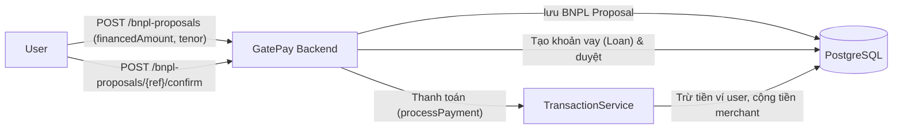

# PayGate (GatePay) — Báo cáo Review chi tiết (Tính năng BNPL)

> [!info] Phạm vi
> Code review và kiểm tra bảo mật tĩnh (static review) luồng thanh toán trả sau (Buy Now Pay Later). Repo: `PayGate/GatePay` nhánh `feature/bnpl-credit-checkout`. Phụ trách: BNPL Feature. Xem tổng hợp chung tại [[Code-Review-Summary]].

## 1. Kiến trúc

- **Stack**: Java 17, Spring Boot 3.2.5, Spring Security + JWT, Spring Data JPA/Hibernate, PostgreSQL 16.
- **Thành phần chính**: 
  - `BnplCheckoutService`: Quản lý luồng thanh toán (chọn khách, nộp hồ sơ, duyệt hạn mức CIC, tạo/chốt khoản vay).
  - `LoanServiceImpl`: Quản lý khoản vay (trả nợ, giải ngân, sinh hợp đồng PDF).
- **Điểm tốt cần giữ nguyên**: Sử dụng `BigDecimal` cho mọi tính toán tiền tệ (lãi suất, dư nợ), gọi hàm từ `TransactionService` để ghi nhận sổ cái khi giải ngân và trả nợ.



## 2. Bảng tổng hợp issue

| ID | Mức độ | Tiêu đề | Vị trí |
|---|---|---|---|
| BNPL-C1 | Critical | Lỗ hổng In Tiền / Thao túng số âm | `BnplCheckoutService.java:createProposal` |
| BNPL-C2 | Critical | Lỗ hổng IDOR - Ép người khác vay nợ | `BnplCheckoutService.java:confirmProposal` |
| BNPL-H1 | High | Lỗ hổng chia cho số 0 (DoS) | `BnplCheckoutService.java:createProposal` |
| BNPL-H2 | High | Lỗ hổng Race Condition (Multi-loan) | `BnplCheckoutService.java:confirmProposal` |
| BNPL-H3 | High | Lỗ hổng tự động bơm hạn mức ảo | `LoanServiceImpl.java:repayLoan` |

---

## 3. Chi tiết issue + Test case phát hiện lỗi

### BNPL-C1 — Lỗ hổng In Tiền / Thao túng số âm (Negative Amount Injection)

> [!danger] Critical
> **Vị trí:** `BnplCheckoutService.java` (hàm `createProposal` và `disburseToMerchant`)

**Mô tả:** Hệ thống kiểm tra `financedAmount` không được lớn hơn mức cho phép, nhưng bỏ quên việc kiểm tra số âm. 

**Kịch bản khai thác:** Kẻ tấn công cố tình truyền `financedAmount` là số âm. Số âm này dễ dàng lọt qua các vòng check. Khi `confirmProposal` giải ngân, hệ thống thực hiện cộng số âm vào ví người bán (lấy tiền của người bán) và trừ số âm khỏi hệ thống (cộng tiền cho GatePay). Đồng thời tạo ra khoản nợ âm (hệ thống nợ ngược lại hacker).

**Test case phát hiện lỗi (integration test / manual):**
```
Given: Checkout session có order amount = 10,000,000 VND.
When:  Gửi POST /api/v1/checkout/.../bnpl-proposals 
       với body { "financedAmount": -10000000, "tenorMonths": 3 }
Then (kỳ vọng an toàn): 400 Bad Request (Financed amount must be > 0).
Thực tế (bug): 200 OK. Khi confirmProposal, merchantAccount bị trừ 10tr và 
               systemAccount được cộng 10tr.
```

---

### BNPL-C2 — Lỗ hổng IDOR - Ép người khác vay nợ (Broken Access Control)

> [!danger] Critical
> **Vị trí:** `BnplCheckoutService.java` (hàm `confirmProposal`)

**Mô tả:** Hàm `confirmProposal` nhận `proposalRef` để chốt duyệt khoản vay nhưng không kiểm tra xem mã này có thuộc về user đang đăng nhập (authenticated user) hay không.

**Kịch bản khai thác:** Hacker dò được mã `proposalRef` đang chờ duyệt của nạn nhân và tự bấm chốt thay. Nạn nhân vô cớ bị trừ tiền cọc (upfrontAmount) trong ví và mắc một khoản nợ khổng lồ trên trời rơi xuống.

**Test case phát hiện lỗi:**
```
Given: User A (nạn nhân) tạo 1 proposal hợp lệ, trạng thái PENDING_CONFIRMATION, ref = "REF123".
When:  User B (kẻ tấn công) đăng nhập và gọi POST /api/v1/checkout/bnpl-proposals/REF123/confirm
Then (kỳ vọng an toàn): 403 Forbidden hoặc báo lỗi "Access denied".
Thực tế (bug): 200 OK. Nạn nhân User A tự động bị gán nợ và trừ tiền cọc.
```

---

### BNPL-H1 — Lỗ hổng chia cho số 0 gây sập hệ thống (DoS)

> [!warning] High
> **Vị trí:** `BnplCheckoutService.java` (hàm `createProposal`)

**Mô tả:** Số tháng vay `tenorMonths` được nhận trực tiếp từ request mà không kiểm tra > 0. Code sử dụng trực tiếp biến này để chia gốc hàng tháng.

**Test case phát hiện lỗi:**
```
Given: Checkout session hợp lệ.
When:  Gửi POST /api/v1/checkout/.../bnpl-proposals 
       với body { "financedAmount": 5000000, "tenorMonths": 0 }
Then (kỳ vọng an toàn): 400 Bad Request (Tenor must be > 0).
Thực tế (bug): 500 Internal Server Error do ArithmeticException: Division by zero, 
               khiến thread bị văng lỗi. Nếu bị spam sẽ gây DoS.
```

---

### BNPL-H2 — Lỗ hổng Race Condition (Double Spend / Multi-loan)

> [!warning] High
> **Vị trí:** `BnplCheckoutService.java` (hàm `confirmProposal`)

**Mô tả:** Việc kiểm tra trạng thái `"PENDING_CONFIRMATION"` không có khóa bản ghi (`@Lock(LockModeType.PESSIMISTIC_WRITE)`).

**Test case phát hiện lỗi:**
```
Given: 1 proposal hợp lệ ở trạng thái PENDING_CONFIRMATION.
When:  Bắn 50 request confirm cùng lúc (concurrent) cho cùng 1 proposalRef.
Then (kỳ vọng an toàn): Chỉ 1 request thành công, 49 request còn lại bị reject.
Thực tế (bug): Hàng chục request cùng lọt qua, tạo ra hàng chục khoản vay (Loan) 
               và giải ngân hàng chục lần cho cùng 1 đơn hàng.
```

---

### BNPL-H3 — Lỗ hổng tự động bơm hạn mức ảo (Infinite Limit Inflation)

> [!warning] High
> **Vị trí:** `LoanServiceImpl.java` (hàm `repayLoan`)

**Mô tả:** Sau khi thanh toán thành công, hệ thống tự động gọi `profile.setApprovedLimit(profile.getApprovedLimit().add(amountToPay))` vô điều kiện.

**Test case phát hiện lỗi:**
```
Given: User có approvedLimit = 5,000,000 VND. User đang có khoản nợ 5,000,000 VND.
When:  User gọi API thanh toán trả nợ toàn bộ 5,000,000 VND.
Then (kỳ vọng an toàn): approvedLimit vẫn là 5,000,000 VND.
Thực tế (bug): approvedLimit tự động tăng thành 10,000,000 VND. Lặp lại chu kỳ 
               này, user có thể đẩy hạn mức ảo lên hàng chục tỷ đồng không cần CIC.
```

---

## 4. Ưu tiên fix (khuyến nghị)

1. **BNPL-C1, BNPL-C2**: Chặn đường tấn công đánh cắp quỹ và gán nợ vô lý. Đây là lỗi logic tài chính chí mạng nên cần vá lập tức.
2. **BNPL-H2**: Chặn Race Condition khi giải ngân để chống Double Spend.
3. **BNPL-H1**: Validate dữ liệu đầu vào chặn nguy cơ gây sập hệ thống (DoS).
4. **BNPL-H3**: Xóa đoạn code lạm phát hạn mức tín dụng sai quy tắc kinh doanh.
