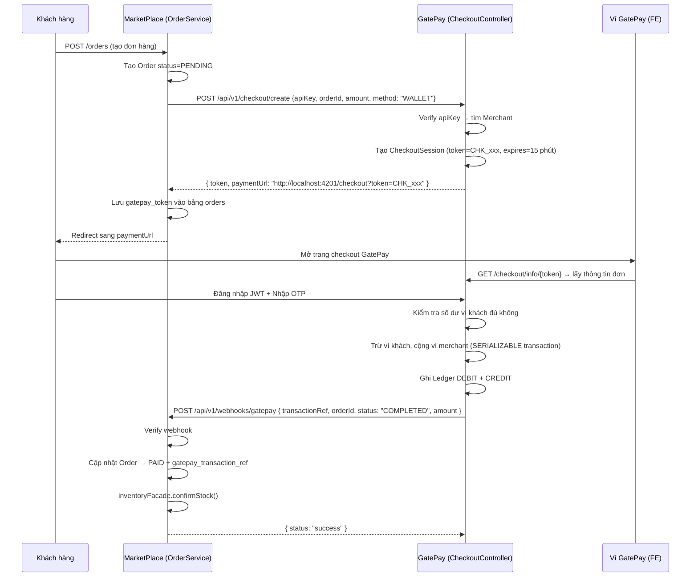

# 🔌 Feature 00: Payment Gateway — Tích Hợp Cổng Thanh Toán Thật

> **Mã:** `FEATURE-00-GATEWAY`
> **Mức độ ưu tiên:** ⚠️ **NỀN TẢNG — làm TRƯỚC HẾT mọi feature khác**
> **Phụ trách:** Trí (GatePay BE - 3 ngày), Hoàng (MarketPlace UI/Client - 2-3 ngày)
> **Review:** Vinh (chỉ review, không code)

---

## 1. Vấn Đề Hiện Tại

MarketPlace đang dùng **payment giả lập**:
```java
// PaymentConsumer.java — Cái này CẦN XOÁ
private boolean simulatePaymentGateway(Order order) {
    return true; // Luôn trả TRUE — không trừ tiền thật
}
```
Kết quả: đơn hàng tự chuyển `CONFIRMED` mà **không có tiền thật chạy qua**.

Feature này thay bằng **luồng thanh toán thật** kết nối GatePay.

---

## 2. Tổng Quan 2 Phương Thức

### Phương thức A — Ví GatePay (Redirect + OTP)
Dành cho khách **đã có ví GatePay**.

```
[Khách đặt đơn]
     ↓
MarketPlace gọi GatePay: POST /checkout/create
     ↓
GatePay trả: { paymentUrl: "http://localhost:4201/checkout?token=CHK_xxx" }
     ↓
MarketPlace REDIRECT trình duyệt sang paymentUrl
     ↓
[Khách đăng nhập ví GatePay + nhập OTP]
     ↓
GatePay xử lý: trừ ví khách, cộng ví merchant
     ↓
GatePay gọi Webhook về MarketPlace: POST /api/v1/webhooks/gatepay
     ↓
MarketPlace cập nhật Order → PAID + confirmStock()
```

### Phương thức B — Bank Transfer / VietQR ⭐ (Mặc định cho khách mới)
Dành cho khách **chưa có ví** — chỉ cần chuyển khoản ngân hàng.

> **Lý do chọn B làm mặc định:** Yêu cầu khách đăng ký ví trước khi mua = UX rất tệ. Chuyển khoản ngân hàng là quen thuộc nhất với người dùng Việt Nam.

```
[Khách đặt đơn → Chọn "Chuyển khoản"]
     ↓
MarketPlace gọi GatePay: POST /checkout/create { method: "BANK_TRANSFER" }
     ↓
GatePay trả: thông tin TK ngân hàng chủ PayGate + QR code + nội dung chuyển khoản
     ↓
MarketPlace hiển thị màn hình: "Chuyển khoản đến: MBBank 8888999988
                                 Nội dung: PAYGATE MER-ADIDAS-VN ORD-001"
     ↓
[Khách mở app ngân hàng → quét QR hoặc chuyển khoản thủ công]
     ↓
Ngân hàng báo GatePay: tiền đã về TK chủ PayGate
     ↓
GatePay parse nội dung chuyển khoản → xác định đây là merchant nào, order nào
GatePay nạp tiền vào ví merchant trên hệ thống
GatePay gọi Webhook về MarketPlace
     ↓
MarketPlace cập nhật Order → PAID + confirmStock()
```

---

## 3. Sequence Diagrams Chi Tiết

### 3.1. Phương thức A — Ví GatePay



### 3.2. Phương thức B — Bank Transfer

```mermaid
sequenceDiagram
    participant K as Khách hàng
    participant M as MarketPlace
    participant G as GatePay
    participant B as App Ngân hàng Khách

    K->>M: POST /orders + chọn BANK_TRANSFER
    M->>G: POST /api/v1/checkout/create { apiKey, orderId, amount, method: "BANK_TRANSFER" }
    G->>G: Tạo CheckoutSession + sinh QR payload + nội dung chuyển khoản
    G-->>M: { token, bankAccount: {name, number, bank}, transferContent, qrPayload, expiresAt }
    M-->>K: Hiển thị màn hình:
    Note over K: TK: MBBank - 8888999988
                 Chủ TK: PAYGATE GATEWAY SYSTEM
                 Số tiền: 15,000,000 VND
                 Nội dung: PAYGATE MER-ADIDAS-VN ORD-001
                 [QR Code]

    K->>B: Quét QR hoặc chuyển khoản thủ công (ghi đúng nội dung)
    B-->>G: Báo tiền về TK ngân hàng chủ PayGate (bank webhook)
    G->>G: Parse transferContent → tìm merchantCode + orderId
    G->>G: Tìm CheckoutSession hợp lệ, validate amount khớp
    G->>G: Nạp tiền vào ví merchant (ghi ledger)
    G->>M: POST /api/v1/webhooks/gatepay { transactionRef, orderId, status: "COMPLETED" }
    M->>M: Cập nhật Order → PAID
    M->>M: inventoryFacade.confirmStock()
```

---

## 4. API Specifications Đầy Đủ

### 4.1. Tạo Checkout Session (MarketPlace → GatePay)

**Endpoint:** `POST http://localhost:8081/api/v1/checkout/create`

**Request Body — Ví GatePay:**
```json
{
  "apiKey": "gp_live_marketplace_key_99",
  "orderId": "ORD-2026-0803-9988",
  "amount": 15000000,
  "description": "Thanh toan don hang #ORD-2026-0803-9988",
  "returnUrl": "http://localhost:4200/payment-success",
  "cancelUrl": "http://localhost:4200/payment-cancelled"
}
```

**Request Body — Bank Transfer:**
```json
{
  "apiKey": "gp_live_marketplace_key_99",
  "orderId": "ORD-2026-0803-9988",
  "amount": 15000000,
  "method": "BANK_TRANSFER",
  "description": "Thanh toan don hang #ORD-2026-0803-9988",
  "returnUrl": "http://localhost:4200/payment-success",
  "cancelUrl": "http://localhost:4200/payment-cancelled"
}
```

**Response 200 — Ví GatePay:**
```json
{
  "code": 200,
  "message": "Checkout session created",
  "data": {
    "token": "CHK_A1B2C3D4E5F6",
    "paymentUrl": "http://localhost:4201/checkout?token=CHK_A1B2C3D4E5F6",
    "expiresAt": "2026-08-03T15:30:00"
  }
}
```

**Response 200 — Bank Transfer:**
```json
{
  "code": 200,
  "message": "Checkout session created (bank transfer)",
  "data": {
    "token": "CHK_B1C2D3E4F5G6",
    "method": "BANK_TRANSFER",
    "bankAccount": {
      "bankName": "MBBank - Ngân hàng TMCP Quân Đội",
      "accountNumber": "8888999988",
      "accountHolder": "PAYGATE GATEWAY SYSTEM",
      "amount": 15000000
    },
    "transferContent": "PAYGATE MER-ADIDAS-VN ORD-2026-0803-9988",
    "qrPayload": "PAYGATE|MER-ADIDAS-VN|ORD-2026-0803-9988|15000000",
    "expiresAt": "2026-08-03T15:45:00"
  }
}
```

### 4.2. Webhook GatePay gọi về MarketPlace (GatePay → MarketPlace)

**Endpoint:** `POST http://localhost:8080/api/v1/webhooks/gatepay`

**Request Body:**
```json
{
  "transactionRef": "TXN-PAY-2026-ABCD1234",
  "orderId": "ORD-2026-0803-9988",
  "status": "COMPLETED",
  "amount": 15000000
}
```

**Response kỳ vọng từ MarketPlace:**
```json
{ "status": "success" }
```

> ⚠️ Nếu MarketPlace trả non-2xx → GatePay sẽ retry webhook theo backoff: `1p → 5p → 30p → 2h` (tối đa 5 lần).

### 4.3. Mock Nhận Chuyển Khoản (GatePay nội bộ)

Dùng trong giai đoạn phát triển để mô phỏng ngân hàng báo về.

**Endpoint:** `POST http://localhost:8081/api/v1/bank-transfers/receive`

```json
{
  "bankRef": "BANK-REF-20260803-001",
  "amount": 15000000,
  "transferContent": "PAYGATE MER-ADIDAS-VN ORD-2026-0803-9988"
}
```

**Logic xử lý:**
1. Parse `transferContent` → tách `merchantCode` = `MER-ADIDAS-VN`, `orderId` = `ORD-2026-0803-9988`
2. Tìm `CheckoutSession` hợp lệ theo `merchantCode + orderId`
3. Validate `amount` nhận được khớp `session.amount` (cho phép sai lệch nhỏ)
4. Idempotent check: `bankRef` chưa được xử lý
5. Nạp tiền ví merchant → ghi Ledger
6. Gọi webhook về MarketPlace

---

## 5. Schema Database

### GatePay — Bảng `checkout_sessions` (Đã có sẵn)
```sql
id, token (UNIQUE), merchant_id, order_id, amount,
method (WALLET/BANK_TRANSFER), status (PENDING/COMPLETED/EXPIRED/CANCELLED),
payment_url, return_url, cancel_url, expires_at, created_at
```

### MarketPlace — Thêm cột vào bảng `orders`
```sql
-- Migration: V9__add_gatepay_columns_to_orders.sql
ALTER TABLE orders ADD COLUMN gatepay_token VARCHAR(100);
ALTER TABLE orders ADD COLUMN gatepay_status VARCHAR(20);
ALTER TABLE orders ADD COLUMN gatepay_transaction_ref VARCHAR(100);
ALTER TABLE orders ADD COLUMN gatepay_url TEXT;
ALTER TABLE orders ADD COLUMN gatepay_expires_at TIMESTAMP;
```

---

## 6. Task Breakdown Chi Tiết

### 🟢 GatePay — Trí (3 ngày)

**Ngày 1:**
- [ ] Kiểm tra API `POST /api/v1/checkout/create` đang hoạt động (có sẵn trong `CheckoutController`)
- [ ] Đảm bảo webhook gọi đúng `webhookUrl` của Merchant khi thanh toán xong
- [ ] Cung cấp `apiKey` mẫu + `webhookUrl` cho team MarketPlace

**Ngày 2-3 (Bank Transfer):**
- [ ] Tạo endpoint `POST /bank-transfers/receive` (mock ngân hàng báo về)
- [ ] Implement logic parse `transferContent` → `merchantCode + orderId`
- [ ] Validate `amount` khớp + Idempotent theo `bankRef`
- [ ] Nạp tiền ví merchant + ghi Ledger
- [ ] Gọi webhook về MarketPlace sau khi nạp tiền thành công
- [ ] Sinh `qrPayload` chuẩn format VietQR

### 🔵 MarketPlace — Hoàng (2-3 ngày)

**Ngày 1:**
- [ ] Xoá `simulatePaymentGateway()` trong `PaymentConsumer`
- [ ] Thay bằng gọi `POST http://localhost:8081/api/v1/checkout/create`
- [ ] Lưu `gatepay_token`, `gatepay_url`, `gatepay_expires_at` vào bảng `orders`
- [ ] Redirect khách sang `paymentUrl` (hoặc hiện màn hình Bank Transfer)

**Ngày 2:**
- [ ] Tạo endpoint `POST /api/v1/webhooks/gatepay`
- [ ] Verify chữ ký webhook (không public trần)
- [ ] Khi nhận webhook COMPLETED: cập nhật `order.status → PAID`, gọi `inventoryFacade.confirmStock()`
- [ ] Idempotent: kiểm tra `transactionRef` đã xử lý chưa trước khi update

**Ngày 3 (Bank Transfer UI):**
- [ ] Màn hình hiển thị thông tin TK + QR code khi khách chọn "Chuyển khoản"
- [ ] Xử lý luồng lỗi: session hết hạn → hiện thông báo + cho retry

---

## 7. Security Bắt Buộc

| Yêu cầu | Cách làm |
|---|---|
| Verify API Key | `merchantRepository.findByApiKey(apiKey)` + kiểm tra `merchant.isActive()` |
| Webhook không public trần | Verify chữ ký hoặc API key trong header webhook |
| Idempotent webhook | Kiểm tra `transactionRef` đã tồn tại trong DB trước khi update order |
| Bank Transfer — chống sai tiền | Validate `amount` nhận khớp `session.amount` (± 1000 VND) |
| Bank Transfer — chống trùng | `bankRef` unique — không nạp merchant 2 lần cho 1 chuyển khoản |
| Token hết hạn | `session.expiresAt < now()` → trả lỗi 410 GONE |

---

## 8. Definition of Done (DoD)

- [ ] `POST /checkout/create` từ MarketPlace nhận được `paymentUrl` hợp lệ
- [ ] Redirect khách sang GatePay → thanh toán thành công end-to-end
- [ ] Webhook về → Order chuyển `PAID` + stock được confirm
- [ ] Đơn thất bại/hủy → Order → `CANCELLED`, release stock
- [ ] Bank Transfer: màn hình hiện thông tin TK + QR + nội dung chuẩn
- [ ] Mock `/bank-transfers/receive` → parse content → nạp merchant → webhook → Order PAID
- [ ] Chống trùng `bankRef` + validate amount
- [ ] Test end-to-end cả 2 phương thức

---

## Liên Kết
- [[System Overview]] — Kiến trúc tổng thể
- [[Database Design]] — Schema `checkout_sessions`
- [[Feature 01 - BNPL]] — Phụ thuộc feature này
- [[Security Model]] — Webhook security chi tiết
