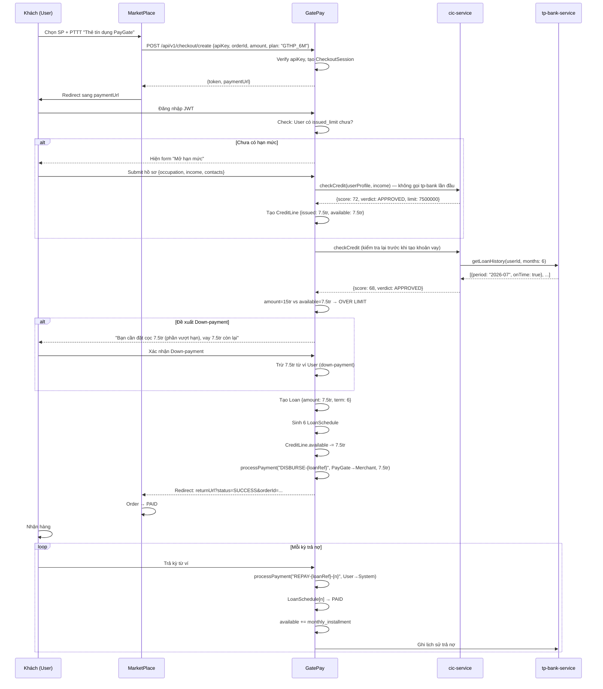

# 💳 Feature 01: BNPL & Credit Score Engine

> **Mã:** `FEATURE-01-BNPL`
> **Phụ trách:** Nhi (GatePay Logic/API - 5 ngày), Hoàng (MarketPlace UI/Client - 4 ngày)
> **Phụ thuộc:** [[Feature 00 - Payment Gateway]] phải XONG trước
> **Review:** Vinh

---

## 1. BNPL Là Gì?

**BNPL = Buy Now Pay Later = Mua trước Trả sau.**

Khách vào MarketPlace, thay vì trả tiền ngay, họ chọn **"Thẻ tín dụng PayGate"** để:
- Nhận hàng ngay hôm nay
- Trả tiền trong 30-45 ngày sau (hoặc trả góp 3-12 tháng)

**PayGate đóng vai trò:** Ngân hàng cấp tín dụng + Xử lý tiền cho Merchant.

---

## 2. Khái Niệm Cốt Lõi (PHẢI HIỂU)

| Khái niệm | Giải thích | Ví dụ |
|---|---|---|
| **Issued Limit** | Hạn mức tối đa được phê duyệt | User được duyệt 10 triệu |
| **Available Limit** | `issued − tổng dư nợ chưa trả` | Đang nợ 3tr → available = 7tr |
| **Vay thẳng Merchant** | PayGate trả tiền thẳng cho Merchant | Không qua ví User |
| **Ghi nợ (Loan)** | Tạo bản ghi User đang "nợ" PayGate | Không trừ ví User |
| **LoanSchedule** | Lịch trả nợ từng kỳ | Kỳ 1: 15/9, Kỳ 2: 15/10, ... |

> ⚠️ **Quy tắc quan trọng nhất:** Khi User mua BNPL, tiền PayGate chuyển thẳng cho Merchant. **Ví User KHÔNG BỊ TRỪ TIỀN.** User chỉ mang "nợ" trong hệ thống.

---

## 3. Các Bên Tham Gia

| Bên | Vai trò |
|---|---|
| **User (Khách)** | Mua hàng, đăng ký hạn mức, trả nợ kỳ |
| **MarketPlace** | Bán hàng, chuyển thanh toán sang GatePay, nhận tiền ngay |
| **GatePay** | Cấp hạn mức, tạo khoản vay, xử lý payout cho Merchant, thu nợ |
| **cic-service** | Chấm điểm tín dụng 0-100 dựa trên hồ sơ + lịch sử |
| **tp-bank-service** | Nguồn vốn + lưu lịch sử trả nợ (đúng hạn/trễ/số ngày trễ) |

---

## 4. Luồng Toàn Trình 6 Phase

### Phase 1 — Khách Chọn BNPL Tại MarketPlace
1. User chọn sản phẩm, chọn PTTT **"Thẻ tín dụng PayGate"**
2. Bấm **[Tiến hành thanh toán]**
3. MarketPlace gọi GatePay: `POST /api/v1/checkout/create` (đã có sẵn từ F00)
4. GatePay tạo `CheckoutSession` (token `CHK_xxx`, expires 15 phút)
5. MarketPlace **REDIRECT** trình duyệt sang `paymentUrl` → User sang trang PayGate

### Phase 2 — Kiểm Tra Hạn Mức (tại GatePay)
6. User đăng nhập GatePay (JWT)
7. Hệ thống kiểm tra: User đã có `issued_limit` chưa?

```
Nếu CHƯA có → Hiện form "Mở hạn mức":
  - Họ tên, nghề nghiệp, tên công ty/địa chỉ
  - Thu nhập tháng (VND)
  - 2 liên hệ: (tên, số điện thoại, mối quan hệ)
  → Bấm [Tiếp tục]

Nếu ĐÃ có → Chuyển thẳng Phase 3
```

### Phase 3 — Chấm Điểm Tín Dụng & Quyết Định Hạn Mức

**Lần đầu mở hạn mức (chưa có lịch sử):**
```
GatePay → cic-service: checkCredit(userProfile, income)
cic chấm dựa trên HỒ SƠ (income, nghề nghiệp)
→ KHÔNG gọi tp-bank (vì chưa có lịch sử)

Kết quả tốt → Tạo issued_limit = f(thu nhập, điểm) 
             Ví dụ: thu nhập 15tr → issued = 7.5tr (50%)
Hồ sơ yếu   → TỪ CHỐI mở hạn
```

**Nâng hạn mức (đơn > available):**
```
GatePay → cic-service → tp-bank: getLoanHistory(6-12 tháng)
tp-bank trả: danh sách kỳ trả {đúng hạn/trễ/số ngày trễ}
cic tính điểm mới → điều chỉnh issued_limit
```

### Phase 4 — Tạo Khoản Vay Cụ Thể

**Bất kể đã có hạn mức hay chưa**, khi tạo khoản vay mới → **luôn gọi lại cic-service**:
```
GatePay → cic → tp-bank: getLoanHistory (6-12 tháng gần nhất)
→ Cập nhật điểm tín dụng theo lịch sử thực tế

Verdict:
  Điểm < ngưỡng tối thiểu → ❌ TỪ CHỐI (dù available còn tiền)
  Điểm ≥ ngưỡng → ✅ Tiếp tục

So sánh amount với available:
  amount ≤ available → Chọn kỳ hạn (3/6/9/12 tháng)
  amount > available → Đề xuất DOWN-PAYMENT (trả phần chênh từ ví)
                        hoặc Từ chối / Gợi ý nâng hạn
```

### Phase 5 — Ghi Sổ & Payout Merchant (1 Transaction Duy Nhất)

```
1. Tạo Loan { amount, term, monthly_installment, status: ACTIVE }
2. Sinh LoanSchedule cho từng kỳ:
   Kỳ 1: due_date = now + 30 ngày, amount = principal + interest
   Kỳ 2: due_date = now + 60 ngày, ...
3. Ghi nợ: CreditLine.available -= amount
4. Payout thẳng Merchant (REUSE TransactionService.processPayment()):
   idempotencyKey = "DISBURSE-{loanRef}"
   source = PayGate System Account
   dest = Merchant Account
   amount = số vay
   → Merchant nhận tiền NGAY, User KHÔNG bị trừ ví
```

> ⚠️ Bước 4 phải dùng idempotencyKey `"DISBURSE-{loanRef}"` để chống double-payout nếu bị retry.

### Phase 5b — Redirect Về MarketPlace

```
GatePay redirect về: {returnUrl}?status=SUCCESS&orderId=...&transactionRef=...
MarketPlace cập nhật Order → PAID (lưu paygate_plan)
User nhận hàng
```

### Phase 6 — Trả Nợ Hàng Kỳ (Lặp Lại)

```
Đến hạn kỳ → User trả từ ví GatePay:
  TransactionService.processPayment(
    idempotencyKey = "REPAY-{loanRef}-{period}",
    source = User Account,
    dest = System Account,
    amount = monthly_installment
  )
→ Mark LoanSchedule[period] → PAID
→ CreditLine.available += monthly_installment (hồi phục hạn mức)
→ Ghi lịch sử vào tp-bank: { loanRef, period, onTime: true/false, daysLate: 0 }
```

---

## 5. Sequence Diagram Đầy Đủ



---

## 6. API Specifications

### 6.1. Duyệt BNPL (MarketPlace → GatePay)

`POST http://localhost:8081/api/v1/credit/checkout`

```json
// Request
{
  "apiKey": "gp_live_marketplace_key_99",
  "orderId": "ORD-2026-0803-9988",
  "amount": 15000000,
  "plan": "GTHP_6M",
  "customerId": 1024
}

// Response thành công
{
  "code": 200,
  "data": {
    "approved": true,
    "token": "BNPL_CHK_A1B2C3",
    "paymentUrl": "http://localhost:4201/checkout?token=BNPL_CHK_A1B2C3",
    "monthlyInstallment": 2625000,
    "fee": 150000,
    "termMonths": 6
  }
}

// Response từ chối
{
  "code": 200,
  "data": {
    "approved": false,
    "reason": "Điểm tín dụng không đủ điều kiện (score: 38/100)"
  }
}
```

### 6.2. Mở/Nâng Hạn Mức

`POST http://localhost:8081/api/v1/credit/limit`

```json
// Request
{
  "customerId": 1024,
  "profile": {
    "occupation": "Software Engineer",
    "company": "ABC Corp",
    "monthlyIncome": 15000000,
    "contacts": [
      { "name": "Nguyễn Văn A", "phone": "0901234567", "relation": "Anh/Chị" },
      { "name": "Trần Thị B",   "phone": "0912345678", "relation": "Bạn bè" }
    ]
  }
}

// Response
{
  "code": 200,
  "data": {
    "approved": true,
    "issuedLimit": 7500000,
    "creditScore": 72,
    "reason": "Hồ sơ hợp lệ, thu nhập đáp ứng yêu cầu tối thiểu"
  }
}
```

### 6.3. Trả Nợ Kỳ

`POST http://localhost:8081/api/v1/loans/{loanId}/repay`

```json
// Request
{
  "period": 1,
  "idempotencyKey": "REPAY-LOAN-123-1"
}

// Response
{
  "code": 200,
  "data": {
    "paidAmount": 2625000,
    "remainingPeriods": 5,
    "newAvailableLimit": 2625000
  }
}
```

---

## 7. Database Schema

### GatePay — Bảng Mới

```sql
-- credit_lines: Hạn mức tín dụng mỗi user
CREATE TABLE credit_lines (
    id BIGSERIAL PRIMARY KEY,
    user_id BIGINT UNIQUE REFERENCES users(id),
    issued_limit DECIMAL(15,2) NOT NULL,
    available_limit DECIMAL(15,2) NOT NULL,
    credit_score INT,
    status VARCHAR(20) DEFAULT 'ACTIVE',
    created_at TIMESTAMP DEFAULT NOW()
);

-- installments / loan_schedules: Lịch trả góp
CREATE TABLE loan_schedules (
    id BIGSERIAL PRIMARY KEY,
    loan_id BIGINT REFERENCES loans(id),
    period INT NOT NULL,           -- Kỳ số 1, 2, 3...
    due_date DATE NOT NULL,
    amount DECIMAL(15,2) NOT NULL,
    status VARCHAR(20) DEFAULT 'PENDING',  -- PENDING | PAID | OVERDUE
    paid_at TIMESTAMP,
    created_at TIMESTAMP DEFAULT NOW()
);

-- credit_events: Lịch sử sự kiện mua/trả để tính điểm
CREATE TABLE credit_events (
    id BIGSERIAL PRIMARY KEY,
    user_id BIGINT REFERENCES users(id),
    order_id VARCHAR(100),
    event_type VARCHAR(50),   -- ORDER_COMPLETED, LOAN_REPAID, LOAN_OVERDUE
    amount DECIMAL(15,2),
    occurred_at TIMESTAMP DEFAULT NOW()
);
```

### Migration
```
V28__create_credit_lines.sql
V29__create_loan_schedules.sql
V30__create_credit_events.sql
```

---

## 8. Task Breakdown Chi Tiết

### 🟢 GatePay — Nhi (5 ngày)

**Ngày 1-2 (API Core):**
- [ ] Viết `POST /api/v1/credit/checkout` — nhận request từ MarketPlace, duyệt BNPL
- [ ] Integrate `CreditScoreService` (đã có V27) vào flow
- [ ] Implement logic so sánh `amount` vs `available_limit`

**Ngày 3 (Services phụ trợ):**
- [ ] Tạo `cic-service` mock (Spring Boot đơn giản): endpoint `POST /check-credit`
- [ ] Tạo `tp-bank-service` mock: endpoint `GET /loan-history/{userId}`
- [ ] Kết nối GatePay → cic → tp-bank trong flow

**Ngày 4 (Loan & Payout):**
- [ ] Logic tạo `Loan` + sinh đủ `LoanSchedule` kỳ hạn
- [ ] Gọi `TransactionService.processPayment("DISBURSE-{loanRef}", ...)` để payout Merchant
- [ ] Down-payment flow khi amount > available

**Ngày 5 (Repayment & Testing):**
- [ ] API `POST /loans/{id}/repay` trả nợ kỳ với idempotency
- [ ] Ghi lịch sử vào tp-bank async (sau commit)
- [ ] Unit test happy path + edge cases

### 🗄 GatePay — DB/Migration (Trí + members)
- [ ] Migration `V28-V30` + Entity: `CreditLine`, `LoanSchedule`, `CreditEvent`
- [ ] Index trên `credit_lines.user_id`, `loan_schedules.loan_id + status`

### 🔵 MarketPlace — Hoàng (4 ngày)
- [ ] UI trang Checkout: hiện block chọn gói BNPL (`30 ngày / 45 ngày / 3 tháng / 6 tháng`)
- [ ] Gọi `POST /credit/checkout` khi User chọn BNPL
- [ ] Lưu `paygate_plan` vào bảng `orders`
- [ ] Webhook callback → cập nhật Order `PAID`
- [ ] (Optional) Form "Mở hạn mức" + hiển thị hạn mức khả dụng

---

## 9. Security Bắt Buộc

| Yêu cầu | Cách làm |
|---|---|
| Verify API Key | `findByApiKey()` + `merchant.isActive()` |
| OTP xác nhận | Bắt buộc trước khi ký hợp đồng vay |
| Rate limit | `/credit/checkout`: 10 req/phút/user |
| Fraud check | Gọi `FraudDetectionService` trước duyệt — nếu CRITICAL → từ chối |
| Chống double-payout | `idempotencyKey = "DISBURSE-{loanRef}"` |
| Chống double-repay | `idempotencyKey = "REPAY-{loanRef}-{period}"` |
| Credit score bảo mật | Chỉ ADMIN xem; webhook event dùng API key |
| cic/tp-bank nội bộ | Không public ra ngoài, chỉ GatePay gọi |

---

## 10. Definition of Done

- [ ] `POST /credit/checkout` duyệt BNPL end-to-end (từ MarketPlace → cic → tp-bank → tạo loan → payout merchant)
- [ ] `LoanSchedule` được sinh đúng số kỳ với `due_date` chính xác
- [ ] Payout thẳng merchant — **KHÔNG trừ ví User**
- [ ] Trường hợp `amount > available` → đề xuất Down-payment đúng
- [ ] Trường hợp `credit score` thấp → TỪ CHỐI rõ ràng
- [ ] Trả nợ kỳ → `available` hồi phục, ghi tp-bank
- [ ] Webhook `order.confirmed` cập nhật MarketPlace → PAID
- [ ] Idempotent: gửi lại request 2 lần → không tạo 2 khoản vay

---

## Liên kết
- [[Feature 00 - Payment Gateway]] — Phụ thuộc
- [[Feature 04 - Refund & Settlement]] — Hoàn tiền BNPL
- [[Services Overview]] — LoanServiceImpl chi tiết
- [[Database Design]] — Schema core
