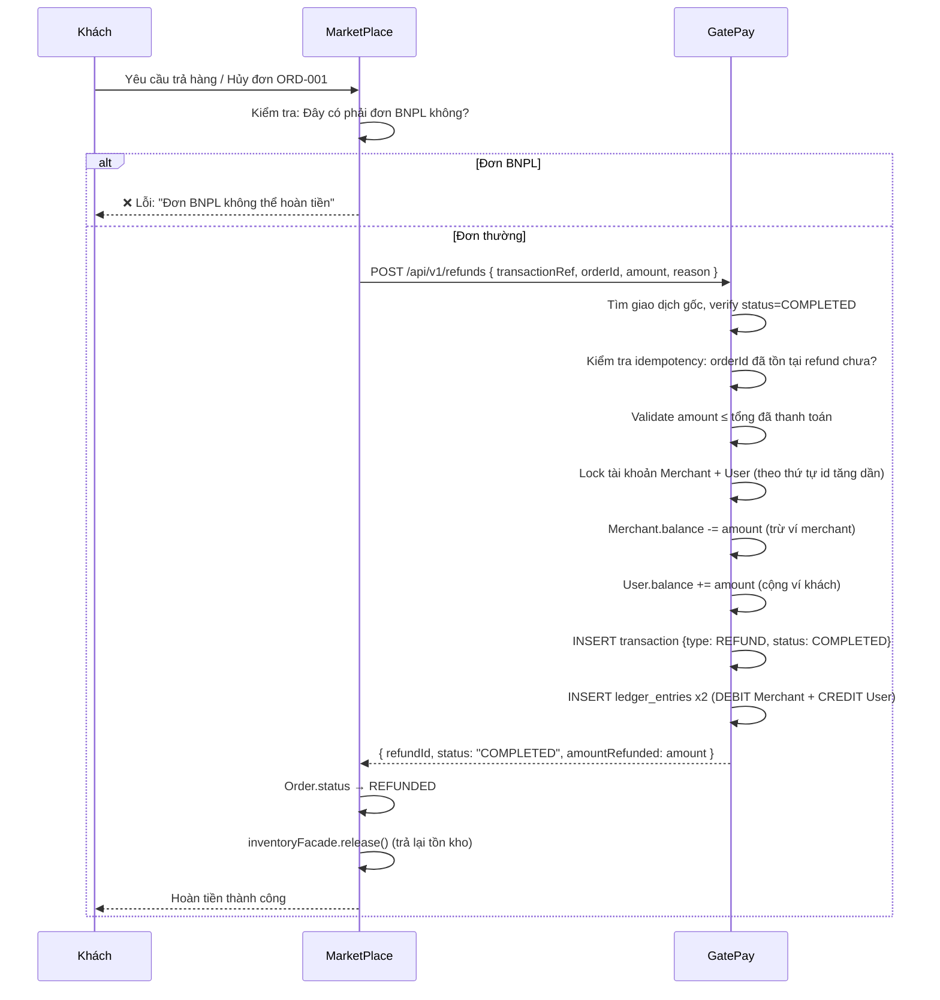

# 🔄 Feature 04: Refund Management + Merchant 2-Bucket Settlement

> **Mã:** `FEATURE-04-REFUND`
> **Phụ trách:** Trí (GatePay - 3-5 ngày), Trí v2 (MarketPlace)
> **Phụ thuộc:** [[Feature 01 - BNPL]] phải có giao dịch thật để test hoàn tiền

---

## ⚠️ Cập Nhật Bắt Buộc (Đọc Trước)

> **BNPL Refund bị vô hiệu hoá từ nguồn.**
>
> Đơn hàng mua bằng hình thức BNPL **TUYỆT ĐỐI KHÔNG** được phép gửi yêu cầu Trả hàng / Hoàn tiền.
> **Trí v2 phải block ngay điều kiện này ở MarketPlace** — khi đơn là BNPL, ẩn/disable nút "Trả hàng".

---

## 1. Tổng Quan Feature

Feature này gồm **2 phần độc lập**:
1. **Hoàn tiền (Refund):** Khách trả hàng → tiền về ví GatePay
2. **Cơ chế 2 Hũ (Settlement):** Bảo vệ merchant không rút tiền trước khi chắc chắn không có refund

---

## 2. Phần 1: Hoàn Tiền (Refund)

### 2.1. Các Trường Hợp Hoàn Tiền

| Loại đơn | Hành động |
|---|---|
| **Mua thường — Hoàn toàn bộ** | Hoàn `totalAmount` vào ví GatePay của khách, trừ ví Merchant |
| **Mua thường — Hoàn một phần** | Chỉ hoàn `amount` tương ứng sản phẩm bị trả |
| **BNPL** | ❌ **KHÔNG ĐƯỢC HOÀN** — Block tại MarketPlace |

### 2.2. Luồng Hoàn Tiền Mua Thường



### 2.3. API Hoàn Tiền

`POST http://localhost:8081/api/v1/refunds`

```json
// Request
{
  "transactionRef": "TXN-PAY-2026-ABCD",
  "orderId": "ORD-2026-0803-9988",
  "amount": 2500000,
  "refundItems": ["ITEM-1", "ITEM-3"],
  "reason": "Khách trả hàng do sai kích thước"
}

// Response thành công
{
  "code": 200,
  "data": {
    "refundId": "RF-2026-0803-0055",
    "transactionRef": "TXN-PAY-2026-ABCD",
    "amountRefunded": 2500000,
    "status": "COMPLETED"
  }
}
```

---

## 3. Phần 2: Cơ Chế 2 Hũ (Merchant Settlement)

### 3.1. Tại Sao Cần 2 Hũ?

**Vấn đề:** Nếu Merchant rút tiền ngay sau khi khách thanh toán, nhưng sau đó khách hủy đơn → GatePay không thu hồi được tiền từ Merchant.

**Giải pháp:** Giữ tiền trong `HŨ A (chờ đợi)` trong 30 ngày. Sau đủ 30 ngày, tiền mới chuyển sang `HŨ B (sẵn sàng rút)`.

### 3.2. Cơ Chế Hoạt Động

```
Khách thanh toán đơn hàng
         │
         ▼
    ┌─────────────────────────────────────────┐
    │  HŨ A — pending_settlement               │
    │  (Mỗi giao dịch là 1 dòng riêng)        │
    │                                          │
    │  TXN-001 │ 5,000,000 VND │ avail: 09/09  │
    │  TXN-002 │ 3,000,000 VND │ avail: 10/09  │
    │  TXN-003 │ 8,000,000 VND │ avail: 12/09  │
    └──────────────┬──────────────────────────┘
                   │
         Scheduler chạy mỗi ngày 00:00
         Quét: giao dịch nào có avail_date ≤ hôm nay?
                   │
                   ▼
    ┌─────────────────────────────────────────┐
    │  HŨ B — available_settlement             │
    │  Merchant RÚT ĐƯỢC từ đây               │
    │                                          │
    │  Số dư: 5,000,000 VND (TXN-001 đã đủ)  │
    └─────────────────────────────────────────┘
```

**Quy tắc:**
- Mỗi giao dịch tính riêng lẻ. `available_date = createdAt + 30 ngày`
- Merchant **chỉ rút được từ HŨ B** — không rút được Hũ A
- Nếu đơn bị refund khi còn trong Hũ A → xoá dòng đó khỏi Hũ A

### 3.3. Sequence Diagram Rút Tiền

```mermaid
sequenceDiagram
    participant SCHED as Scheduler (00:00 hàng ngày)
    participant DB as PostgreSQL
    participant M as Merchant

    SCHED->>DB: SELECT * FROM settlement_buckets
               WHERE bucket_type='A' AND available_date <= NOW()
    DB-->>SCHED: [TXN-001: 5tr, TXN-005: 3tr]
    SCHED->>DB: UPDATE bucket_type='B' (chuyển sang Hũ B)
    SCHED->>DB: Cộng vào available_balance của Merchant

    M->>DB: GET /merchants/me/pending-balance
    DB-->>M: { bucketA: 11tr, bucketB: 5tr }

    M->>DB: POST /merchants/me/payout { amount: 4tr }
    DB->>DB: Kiểm tra: 4tr ≤ bucketB (5tr) → OK
    DB->>DB: bucketB -= 4tr
    DB->>DB: INSERT payouts record
    DB->>DB: INSERT ledger_entry {type: PAYOUT}
    DB-->>M: { payoutId, netDisbursed: 3_920_000, fee: 80_000 }
```

### 3.4. API Xem & Rút Tiền

**Xem số dư 2 hũ:**
`GET http://localhost:8081/api/v1/merchants/me/pending-balance`
```json
{
  "code": 200,
  "data": {
    "bucketA_pending": 50000000,    // Hũ A: chờ đủ 30 ngày
    "bucketB_available": 12000000,  // Hũ B: rút được ngay
    "feePct": 0.02                  // Phí rút 2%
  }
}
```

**Rút tiền (chỉ từ Hũ B):**
`POST http://localhost:8081/api/v1/merchants/me/payout`
```json
// Request
{ "amount": 10000000 }

// Response
{
  "code": 200,
  "data": {
    "payoutId": "PO-2026-0803-0012",
    "requestedAmount": 10000000,
    "fee": 200000,
    "netDisbursed": 9800000,
    "status": "COMPLETED"
  }
}
```

---

## 4. Database Schema

### Bảng mới trên GatePay

```sql
-- refunds: Lưu vết mọi yêu cầu hoàn tiền
CREATE TABLE refunds (
    id BIGSERIAL PRIMARY KEY,
    idempotency_key VARCHAR(100) UNIQUE,  -- orderId làm key
    transaction_ref VARCHAR(100),          -- Ref giao dịch gốc
    order_id VARCHAR(100),
    amount DECIMAL(15,2) NOT NULL,
    reason TEXT,
    status VARCHAR(20) DEFAULT 'PENDING', -- PENDING | COMPLETED | FAILED
    created_at TIMESTAMP DEFAULT NOW()
);

-- settlement_buckets: Cơ chế 2 hũ
CREATE TABLE settlement_buckets (
    id BIGSERIAL PRIMARY KEY,
    merchant_id BIGINT REFERENCES merchants(id),
    transaction_ref VARCHAR(100) NOT NULL,
    amount DECIMAL(15,2) NOT NULL,
    bucket_type VARCHAR(1) NOT NULL,       -- 'A' hoặc 'B'
    available_date TIMESTAMP NOT NULL,     -- createdAt + 30 ngày
    created_at TIMESTAMP DEFAULT NOW()
);

-- payouts: Lịch sử rút tiền của Merchant
CREATE TABLE payouts (
    id BIGSERIAL PRIMARY KEY,
    merchant_id BIGINT REFERENCES merchants(id),
    amount DECIMAL(15,2) NOT NULL,
    fee DECIMAL(15,2) NOT NULL,
    net_disbursed DECIMAL(15,2) NOT NULL,
    status VARCHAR(20) DEFAULT 'COMPLETED',
    created_at TIMESTAMP DEFAULT NOW()
);
```

### Migration
```
V31__create_refunds_table.sql
V32__create_settlement_buckets.sql
V33__create_payouts.sql
```

---

## 5. Task Breakdown Chi Tiết

### 🟢 GatePay — Trí (3-5 ngày)

**Ngày 1 — Refund cơ bản:**
- [ ] Entity `Refund` + Migration `V31`
- [ ] API `POST /api/v1/refunds` — hoàn tiền mua thường (toàn bộ + một phần)
- [ ] Ledger `EntryType.REFUND` thu hồi tiền từ ví Merchant đúng
- [ ] Idempotent: kiểm tra `orderId` đã refund chưa trước khi xử lý

**Ngày 2 — Settlement 2 Hũ:**
- [ ] Entity `SettlementBucket` + `Payout` + Migration `V32`, `V33`
- [ ] Khi khách thanh toán thành công → ghi vào Hũ A kèm `available_date = +30 ngày`
- [ ] `MerchantSettlementWorker` (Scheduler chạy mỗi ngày 00:00): chuyển Hũ A → Hũ B
- [ ] API `GET /merchants/me/pending-balance` — trả Hũ A + Hũ B riêng biệt

**Ngày 3 — Payout:**
- [ ] API `POST /merchants/me/payout` — rút từ Hũ B + tính phí 2%
- [ ] Chặn rút quá Hũ B + idempotent payout
- [ ] Ghi Ledger PAYOUT

**Ngày 4-5 — Testing:**
- [ ] Test: Refund trong Hũ A → xoá dòng Hũ A
- [ ] Test: Scheduler chuyển đúng (chỉ chuyển giao dịch đủ 30 ngày)
- [ ] Test: Merchant không rút được Hũ A

### 🔵 MarketPlace — Trí v2

- [ ] Khi load trang chi tiết đơn: kiểm tra `order.paymentMethod == BNPL` → **ẩn** nút "Trả hàng"
- [ ] Gọi `POST /api/v1/refunds` khi khách yêu cầu hoàn tiền (chỉ với đơn thường)
- [ ] Cập nhật `order.status → REFUNDED` khi nhận response thành công
- [ ] Gọi `inventoryFacade.release()` để trả lại tồn kho

---

## 6. Security

| Yêu cầu | Cách làm |
|---|---|
| Chỉ người liên quan hoàn được | JWT verify + kiểm tra owner của transaction |
| Idempotent refund | `orderId` làm idempotency key — không hoàn 2 lần |
| Chặn hoàn quá số đã trả | Validate `amount ≤ total_paid_amount` |
| Rate limit | `/refunds`: chặn spam |
| Ledger đúng | REFUND phải tạo đúng 2 dòng DEBIT + CREDIT, không để số dư âm |
| Payout an toàn | Chỉ rút từ Hũ B, không vượt số dư Hũ B |

---

## 7. Definition of Done

**Refund:**
- [ ] Hoàn tiền mua thường → về ví khách đúng amount
- [ ] Hoàn một phần → đúng số tương ứng sản phẩm trả
- [ ] Đơn BNPL → MarketPlace block, không gửi request về GatePay
- [ ] Ledger `REFUND` thu hồi từ ví Merchant đúng
- [ ] Idempotent: gửi lại request hoàn tiền 2 lần → không hoàn 2 lần

**2-Bucket Settlement:**
- [ ] Thanh toán xong → vào Hũ A kèm `available_date = +30 ngày`
- [ ] Scheduler chuyển đúng giao dịch đủ 30 ngày → Hũ B
- [ ] `GET /pending-balance` phân biệt Hũ A / Hũ B rõ ràng
- [ ] `POST /payout` chỉ lấy từ Hũ B, trừ phí 2%, ghi Ledger đúng
- [ ] Refund đơn hàng đang trong Hũ A → xoá khỏi Hũ A

---

## Liên kết
- [[Feature 01 - BNPL]] — Phụ thuộc
- [[System Overview]] — Kiến trúc và SERIALIZABLE isolation
- [[Database Design]] — Schema Ledger
