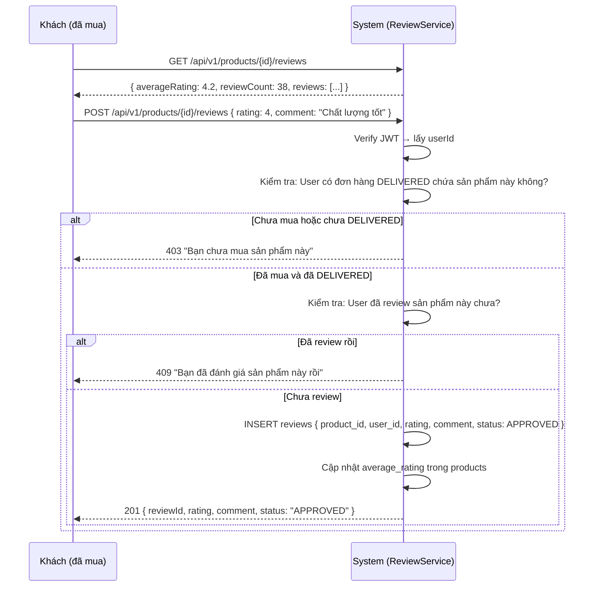

# 🚚 Feature 02: Delivery Tracking

> **Mã:** `FEATURE-02-DELIVERY`
> **Phụ trách:** Giảng (MarketPlace Backend + UI - 3 ngày)
> **Phụ thuộc:** Order phải tồn tại và có trạng thái rõ ràng

---

## 1. Vấn Đề Hiện Tại

MarketPlace có `OrderStatus` (`SHIPPED`/`DELIVERED`) nhưng chỉ là trạng thái "cứng". **Không có chi tiết hành trình** như:
- Đã lấy hàng lúc mấy giờ?
- Hiện đang ở đâu?
- Dự kiến giao khi nào?

---

## 2. Luồng Nghiệp Vụ

```
Admin kho xử lý đơn SHIPPED
   ↓
Admin gọi API tạo Delivery {carrier, trackingCode, estimatedDelivery}
   ↓
Shipper cập nhật từng mốc vận chuyển (gọi API hoặc hệ thống tự cập nhật)
   ↓
Khách vào trang đơn → xem timeline vận chuyển
   ↓
Khi status = DELIVERED → Order tự chuyển sang DELIVERED (tự động)
```

---

## 3. Sequence Diagram

```mermaid
sequenceDiagram
    participant A as Admin (Kho)
    participant S as System (DeliveryService)
    participant K as Khách hàng

    A->>S: POST /api/v1/orders/{id}/delivery
           { carrier: "GHTK", trackingCode: "GHTK100200300", estimatedDelivery: "2026-08-12" }
    S->>S: Validate: Order phải ở status SHIPPED
    S->>S: Tạo Delivery { status: PENDING }
    S->>S: Tạo DeliveryEvent đầu tiên { status: PENDING, note: "Đơn hàng đang được đóng gói" }
    S-->>A: { deliveryId: 42, status: "PENDING" }

    A->>S: PUT /api/v1/delivery/42/status { status: "IN_TRANSIT", note: "Đã giao cho GHTK" }
    S->>S: Cập nhật Delivery.status = IN_TRANSIT
    S->>S: Thêm DeliveryEvent { status: IN_TRANSIT, occurredAt: now() }
    S-->>A: { deliveryId: 42, status: "IN_TRANSIT" }

    K->>S: GET /api/v1/delivery/{orderId}
    S-->>K: {
              carrier: "GHTK",
              trackingCode: "GHTK100200300",
              status: "IN_TRANSIT",
              estimatedDelivery: "2026-08-12",
              events: [
                { status: "PENDING", note: "Đóng gói", occurredAt: "2026-08-10T09:00" },
                { status: "IN_TRANSIT", note: "Giao cho GHTK", occurredAt: "2026-08-10T14:30" }
              ]
            }

    A->>S: PUT /api/v1/delivery/42/status { status: "DELIVERED", note: "Đã giao tận tay" }
    S->>S: Delivery.status = DELIVERED
    S->>S: TỰ ĐỘNG: Order.status = DELIVERED
    S-->>A: { deliveryId: 42, status: "DELIVERED" }
```

---

## 4. API Specifications

### 4.1. Tạo Delivery (Admin only)
`POST /api/v1/orders/{orderId}/delivery`

```json
// Request
{
  "carrier": "GHTK",
  "trackingCode": "GHTK100200300",
  "estimatedDelivery": "2026-08-12"
}

// Response
{
  "code": 201,
  "data": {
    "deliveryId": 42,
    "orderId": 1001,
    "carrier": "GHTK",
    "trackingCode": "GHTK100200300",
    "status": "PENDING",
    "estimatedDelivery": "2026-08-12"
  }
}
```

Điều kiện: `order.status == SHIPPED` → nếu không trả 409.

### 4.2. Xem Delivery (Khách hoặc Admin)
`GET /api/v1/delivery/{orderId}`

```json
{
  "code": 200,
  "data": {
    "deliveryId": 42,
    "carrier": "GHTK",
    "trackingCode": "GHTK100200300",
    "status": "IN_TRANSIT",
    "estimatedDelivery": "2026-08-12",
    "events": [
      { "status": "PENDING",    "note": "Đơn hàng đang đóng gói",  "occurredAt": "2026-08-10T09:00:00" },
      { "status": "IN_TRANSIT", "note": "Đã giao cho đơn vị GHTK", "occurredAt": "2026-08-10T14:30:00" }
    ]
  }
}
```

Khách chỉ xem được delivery của **đơn của mình** (kiểm tra JWT userId).

### 4.3. Cập Nhật Trạng Thái (Admin only)
`PUT /api/v1/delivery/{deliveryId}/status`

```json
// Request
{
  "status": "DELIVERED",
  "note": "Đã giao tận tay khách lúc 15:30"
}

// Response
{
  "code": 200,
  "data": {
    "deliveryId": 42,
    "status": "DELIVERED"
  }
}
```

Status flow: `PENDING → IN_TRANSIT → DELIVERED | FAILED`

---

## 5. Database Schema (MarketPlace)

```sql
-- deliveries: Hồ sơ giao hàng
CREATE TABLE deliveries (
    id BIGSERIAL PRIMARY KEY,
    order_id BIGINT UNIQUE REFERENCES orders(id),
    carrier VARCHAR(100),              -- GHTK, GHN, Viettel Post, ...
    tracking_code VARCHAR(100),
    status VARCHAR(20) DEFAULT 'PENDING',
    estimated_delivery DATE,
    created_at TIMESTAMP DEFAULT NOW(),
    updated_at TIMESTAMP DEFAULT NOW()
);

-- delivery_events: Các mốc vận chuyển (append-only, không update)
CREATE TABLE delivery_events (
    id BIGSERIAL PRIMARY KEY,
    delivery_id BIGINT REFERENCES deliveries(id),
    status VARCHAR(20) NOT NULL,       -- PENDING | IN_TRANSIT | DELIVERED | FAILED
    note TEXT,                          -- "Đã giao cho bưu tá", "Giao thất bại do vắng nhà"
    occurred_at TIMESTAMP DEFAULT NOW()
);
```

### Migration
```
V9__create_deliveries.sql
V10__create_delivery_events.sql
```

---

## 6. Task Breakdown

### MarketPlace — Giảng (3 ngày)

**Ngày 1:**
- [ ] Entity `Delivery` + `DeliveryEvent` + Repository
- [ ] Migration V9, V10
- [ ] Service `DeliveryService`: `create()`, `updateStatus()`, `getByOrderId()`

**Ngày 2:**
- [ ] Controller với 3 API trên
- [ ] Logic tự động cập nhật `Order.status → DELIVERED` khi delivery là DELIVERED
- [ ] Validate: chỉ tạo delivery khi order ở trạng thái SHIPPED

**Ngày 3:**
- [ ] UI Admin: form tạo delivery + dropdown cập nhật trạng thái
- [ ] UI Khách: Timeline vận chuyển trên trang chi tiết đơn
- [ ] Unit test

---

## 7. Security

- Khách chỉ xem delivery của đơn **mình** → check `order.userId == token.userId`
- Chỉ Admin/Staff mới tạo + cập nhật trạng thái (RBAC `@PreAuthorize("hasRole('ADMIN')")`)

---

## Liên kết
- [[Features 02 03 04 05]] — Overview tóm tắt
- [[System Overview]] — Kiến trúc chung

---

# ⭐ Feature 03: Product Reviews & Ratings

> **Mã:** `FEATURE-03-REVIEWS`
> **Phụ trách:** Khoa (MarketPlace Backend + UI - 3 ngày)
> **Phụ thuộc:** Cần đơn hàng đã DELIVERED để test

---

## 1. Nghiệp Vụ

Khách sau khi **nhận hàng (đơn DELIVERED)** có thể đánh giá sản phẩm:
- Rating 1-5 sao + Comment
- Rating trung bình hiển thị trên trang sản phẩm
- Lọc reviews theo số sao

---

## 2. Ràng Buộc Hai Chiều (Bắt Buộc Implement)

| Trường hợp | Xử lý |
|---|---|
| Đơn CANCELLED | ❌ KHÔNG được review sản phẩm đó |
| Đơn đã có review | ❌ KHÔNG được hủy đơn hàng |

---

## 3. Sequence Diagram



---

## 4. API Specifications

### Xem Reviews + Rating Trung Bình
`GET /api/v1/products/{id}/reviews?rating=4` (filter optional)

```json
{
  "code": 200,
  "data": {
    "productId": 55,
    "averageRating": 4.2,
    "reviewCount": 38,
    "ratingDistribution": { "5": 15, "4": 12, "3": 7, "2": 3, "1": 1 },
    "reviews": [
      {
        "reviewId": 101,
        "username": "user_123",
        "rating": 5,
        "comment": "Chất liệu rất tốt, giao hàng nhanh!",
        "createdAt": "2026-08-05T10:00:00"
      }
    ]
  }
}
```

### Gửi Đánh Giá (JWT Required)
`POST /api/v1/products/{id}/reviews`

```json
// Request
{
  "rating": 4,
  "comment": "Hàng đúng mô tả, size hơi nhỏ cần mua lớn hơn 1 size"
}

// Response
{
  "code": 201,
  "data": {
    "reviewId": 102,
    "rating": 4,
    "comment": "Hàng đúng mô tả, size hơi nhỏ...",
    "status": "APPROVED"
  }
}
```

---

## 5. Database Schema

```sql
-- reviews: Đánh giá sản phẩm
CREATE TABLE reviews (
    id BIGSERIAL PRIMARY KEY,
    product_id BIGINT REFERENCES products(id),
    user_id BIGINT REFERENCES users(id),
    order_id BIGINT REFERENCES orders(id),     -- Đơn hàng chứa sản phẩm
    rating INT NOT NULL CHECK (rating BETWEEN 1 AND 5),
    comment TEXT,
    status VARCHAR(20) DEFAULT 'APPROVED',     -- APPROVED | PENDING | REJECTED
    created_at TIMESTAMP DEFAULT NOW(),
    UNIQUE(product_id, user_id)                -- 1 user 1 review/sản phẩm
);
```

### Migration
```
V11__create_reviews.sql
```

---

## 6. Task Breakdown

### MarketPlace — Khoa (3 ngày)

**Ngày 1:**
- [ ] Entity `Review` + Repository (tìm theo product, tính avg rating)
- [ ] Migration V11
- [ ] Service logic: validate đã mua + đã DELIVERED

**Ngày 2:**
- [ ] API GET reviews (có avg rating, có filter theo sao)
- [ ] API POST review (validate đủ điều kiện)
- [ ] Chặn hủy đơn khi đã review

**Ngày 3:**
- [ ] UI: Rating stars + danh sách review + filter sao trên trang sản phẩm
- [ ] UI: Form gửi review cho khách đã mua
- [ ] Unit test

---

## 7. Security

- JWT required để gửi review
- 1 khách / 1 review / 1 sản phẩm (UNIQUE constraint)
- Chỉ review khi đơn DELIVERED (không phải CANCELLED)

---

## Liên kết
- [[Feature 02 - Delivery Tracking]] — Cần đơn DELIVERED
- [[Features 02 03 04 05]] — Overview

---

# 🧠 Feature 05: AI Smart Experience

> **Phụ trách:** Đang cập nhật (MarketPlace)

---

## 1. Tính Năng 1: AI Review Summarization

**Bài toán:** Sản phẩm nhiều review → bắt khách đọc từng trang = tệ.

**Giải pháp:** AI tổng hợp thành đoạn tóm tắt + phân loại Ưu/Nhược.

### Luồng

```
Cronjob chạy mỗi đêm (hoặc khi đạt mốc 10 review mới)
  ↓
Gom toàn bộ comment của sản phẩm
  ↓
Gọi LLM API (OpenAI/Gemini):
  Prompt: "Tóm tắt ngắn gọn ưu/nhược điểm của sản phẩm dựa trên các review sau..."
  ↓
Lưu kết quả vào products.ai_summary (hoặc Redis cache)
```

### Database
```sql
-- Thêm cột vào bảng products hiện có
ALTER TABLE products ADD COLUMN ai_summary TEXT;
ALTER TABLE products ADD COLUMN ai_summary_updated_at TIMESTAMP;
-- Migration: V12__add_ai_summary_to_products.sql
```

### API
`GET /api/v1/products/{id}/ai-summary`
```json
{
  "data": {
    "summary": "Khách hàng đánh giá cao chất lượng vải và form dáng thoải mái. Lưu ý: size hơi nhỏ (nên mua lớn hơn 1 size) và đôi khi giao hàng chậm hơn dự kiến.",
    "pros": ["Chất lượng vải tốt", "Form dáng thoải mái"],
    "cons": ["Size hơi nhỏ", "Giao hàng đôi lúc chậm"],
    "updatedAt": "2026-08-09T03:00:00"
  }
}
```

---

## 2. Tính Năng 2: Smart Category Recommendation

**Bài toán:** Khách dạo quanh MarketPlace xem nhiều sản phẩm → Trang chủ không biết gợi ý gì phù hợp.

**Giải pháp:** Tracking ngầm category User xem → Redis Queue → Gợi ý trang chủ.

### Quy Tắc Core

| Quy tắc | Giá trị |
|---|---|
| Queue size tối đa | 5 category (FIFO — category cũ nhất bị đẩy ra khi đủ 5) |
| TTL dữ liệu | 4 ngày — quá 4 ngày tự xoá |
| Cold Start (Queue rỗng) | Hiện "Top Bán Chạy 7 ngày" thay vì "Gợi ý dành riêng" |

### Luồng Tracking

```
User click xem sản phẩm (category: "Điện thoại")
  ↓
Frontend bắn API ngầm (Fire-and-forget, < 50ms):
  POST /api/v1/tracking/view-category { categoryId: "DIEN_THOAI" }
  ↓
Backend:
  1. LPUSH user:{userId}:recent_categories "DIEN_THOAI"
  2. Xoá các entry có timestamp > 4 ngày
  3. Nếu LLEN > 5: RPOP (xoá phần tử cũ nhất)
```

### Luồng Gợi Ý Trang Chủ

```
User mở Trang chủ
  ↓
Frontend gọi: GET /api/v1/recommendations/homepage
  ↓
Backend:
  1. Đọc user:{userId}:recent_categories từ Redis
  2. Lọc categories còn hợp lệ trong 4 ngày
  3. Query sản phẩm ngẫu nhiên thuộc các categories đó

  Nếu Queue rỗng (Cold Start):
    Query TOP sản phẩm có sold_count cao nhất 7 ngày
    Trả kèm flag: isFallback: true
  ↓
Frontend:
  Nếu isFallback = true → Tiêu đề: "Đang thịnh hành tuần này"
  Nếu isFallback = false → Tiêu đề: "Gợi ý dành riêng cho bạn"
```

### API

`POST /api/v1/tracking/view-category` — Không cần response body, trả 200 OK ngay.

`GET /api/v1/recommendations/homepage`
```json
{
  "data": {
    "isFallback": false,
    "title": "Gợi ý dành riêng cho bạn",
    "products": [
      { "id": 55, "name": "iPhone 15 Pro", "price": 29000000, "category": "Điện thoại" },
      ...
    ]
  }
}
```

---

## Liên kết
- [[Feature 03 - Reviews]] — AI Summary cần có reviews
- [[System Overview]] — Redis cache strategy
