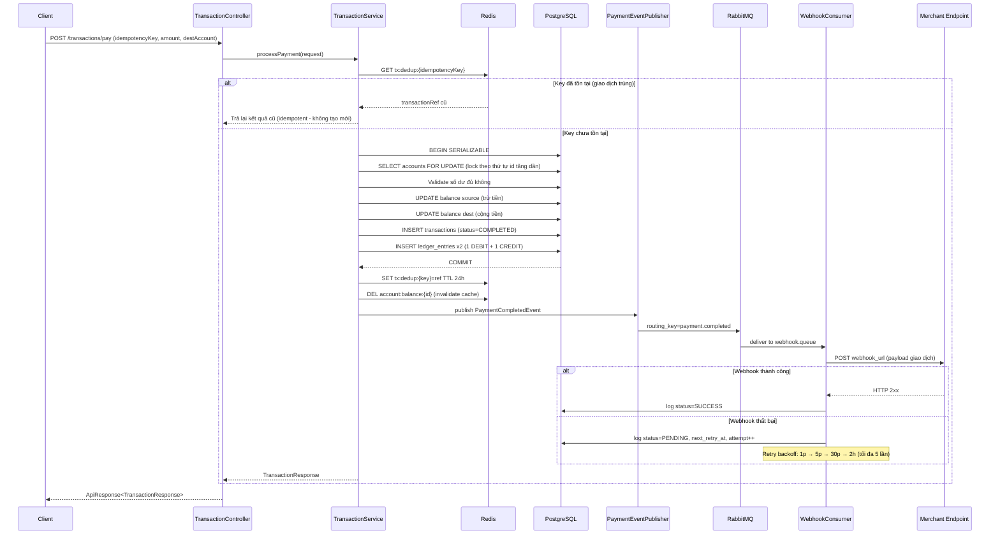

# 🏗 PayGate — Kiến Trúc Tổng Thể

> **Đọc file này trước** khi đọc bất kỳ tài liệu nào khác.
> **Nguồn gốc:** `README.md`, `docs/archive/03-ARCHITECTURE.md`

---

## 1. Dự Án Là Gì?

PayGate là hệ thống **Payment Gateway (Cổng thanh toán)** — tương tự MoMo, VNPay nhưng xây dựng từ đầu để học. Hệ thống có 2 dự án chạy song song:

| Dự án | Vai trò | Frontend | Backend |
|---|---|---|---|
| **GatePay** | Cổng thanh toán, ví điện tử, tín dụng | `localhost:4201` | `localhost:8081` |
| **MarketPlace** | Sàn thương mại điện tử (mua hàng) | `localhost:4200` | `localhost:8080` |

Hai dự án **KHÔNG share code** — giao tiếp với nhau qua REST API và Webhook.

---

## 2. Tech Stack

| Thành phần | Công nghệ | Mục đích |
|---|---|---|
| Backend | Java 17, Spring Boot 3.2 | API server |
| Bảo mật | Spring Security + JWT | Xác thực, phân quyền |
| Database | PostgreSQL 16 + Flyway | Lưu trữ, migration schema |
| Cache | Redis 7 | Idempotency, Balance cache |
| Message Broker | RabbitMQ 3 | Xử lý bất đồng bộ (webhook, settlement) |
| Mapping | MapStruct + Lombok | Chuyển đổi Entity ↔ DTO |
| API Docs | SpringDoc OpenAPI | Swagger UI tự động |
| Frontend | Angular 17 (Standalone) | SPA |
| Testing | JUnit 5 + Mockito + Testcontainers | Unit + Integration test |

---

## 3. Kiến Trúc Backend — Luồng Dữ Liệu Chuẩn

Mọi tính năng đều tuân theo luồng này:

```
HTTP Request
     │
     ▼
Controller (validate DTO, @Valid)
     │
     ▼
Service (business logic, @Transactional)
     │         │
     ▼         ▼
Repository   Publisher (RabbitMQ)
     │              │
     ▼              ▼
PostgreSQL       Consumer (Webhook, Settlement, Email)
     │
     ▼
Entity → Mapper (MapStruct) → Response DTO
     │
     ▼
Controller → ApiResponse<T> → HTTP Response
```

---

## 4. Cấu Trúc Package Backend

```
com.training.paygate
├── config/           # SecurityConfig, RedisConfig, RabbitMQConfig, SwaggerConfig
├── security/         # JwtTokenProvider, JwtAuthFilter
├── controller/       # REST endpoints (mỗi domain 1 controller)
├── service/          # Interfaces
│   └── impl/         # Implementations
├── repository/       # Spring Data JPA (extends JpaRepository)
├── dto/
│   ├── request/      # CreateMerchantRequest, PaymentRequest, ...
│   └── response/     # MerchantResponse, TransactionResponse, ...
├── entity/           # JPA Entities (extends BaseEntity)
├── mapper/           # MapStruct interfaces
├── messaging/
│   ├── config/       # RabbitMQConfig — khai báo exchange/queue/binding
│   ├── event/        # PaymentRequestEvent, PaymentCompletedEvent
│   ├── publisher/    # PaymentEventPublisher
│   └── consumer/     # WebhookConsumer, SettlementConsumer, ValidationConsumer
├── cache/            # IdempotencyCacheService, BalanceCacheService
├── exception/        # GlobalExceptionHandler + custom exceptions
├── util/             # Helper classes (AiIntentParserUtil, VietQrUtil, ...)
└── worker/           # Scheduled jobs (MerchantSettlementWorker, BillSubscriptionWorker, ...)
```

---

## 5. Kiến Trúc Xử Lý Thanh Toán (Quan Trọng Nhất)



---

## 6. Messaging Architecture (RabbitMQ)

| Exchange | Type | Queue | Routing Key | Consumer |
|---|---|---|---|---|
| payment.exchange | Topic | payment.validate.queue | payment.request | ValidationConsumer |
| payment.exchange | Topic | settlement.queue | payment.completed | SettlementConsumer |
| payment.exchange | Topic | webhook.queue | payment.completed | WebhookConsumer |
| payment.exchange | Topic | notification.queue | payment.# | NotificationConsumer |

**Tại sao dùng MQ?** `TransactionService.processPayment()` **không được gọi webhook trực tiếp** vì sẽ block HTTP response. Webhook gọi bất đồng bộ qua RabbitMQ.

---

## 7. Cache Strategy (Redis)

| Mục đích | Key | TTL | Ghi | Đọc/Xoá |
|---|---|---|---|---|
| Idempotency | `tx:dedup:{idempotencyKey}` | 24h | Sau khi commit transaction | Đọc đầu tiên trong processPayment() |
| Balance | `account:balance:{accountId}` | 5 phút | Khi đọc balance | Xoá ngay sau mọi transaction ảnh hưởng account |

---

## 8. Nguyên Tắc Bất Di Bất Dịch

> ⚠️ Vi phạm những điều sau = Bug nghiêm trọng:

1. **Không bao giờ dùng FLOAT/DOUBLE cho tiền** — chỉ dùng `BigDecimal` / `DECIMAL(15,2)`
2. **Lock 2 tài khoản theo thứ tự id tăng dần** — tránh deadlock
3. **Mỗi transaction tạo đúng 2 ledger_entries** — 1 DEBIT + 1 CREDIT, cùng amount
4. **Tổng DEBIT = Tổng CREDIT toàn hệ thống** mọi lúc
5. **Số dư không bao giờ âm** — validate trước khi debit
6. **Idempotency key trùng → trả kết quả cũ, không tạo transaction mới**
7. **TransactionService không gọi webhook trực tiếp** — publish event qua MQ

---

## 9. Phân Quyền (RBAC)

| Role | Được phép |
|---|---|
| `USER` | `/accounts/**`, `/transactions/pay`, xem giao dịch của mình |
| `ADMIN` | Mọi endpoint USER + `/admin/**`, refund, ledger verify, quản lý merchant |
| Merchant (qua API Key) | Tạo checkout session, nhận webhook |

---

## Liên Kết Chính

- [[Database Design]] — Chi tiết 7 bảng và ERD
- [[Security Model]] — JWT, HMAC, Fraud Detection
- [[Services Overview]] — Tất cả 15+ services
- [[Feature 00 - Payment Gateway]] — Tích hợp thật với MarketPlace
- [[Feature 01 - BNPL]] — Mua trước trả sau
- [[Features 02-05]] — Delivery, Reviews, Refund, AI
- [[Team & Roadmap]] — Ai làm gì, timeline
