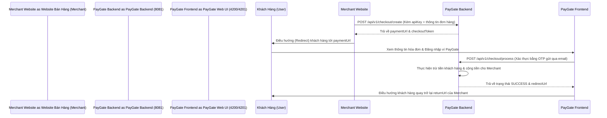

# HƯỚNG DẪN TÍCH HỢP PAYGATE DÀNH CHO DỰ ÁN THỨ 3 (THIRD-PARTY API INTEGRATION GUIDE FOR AI & DEVELOPERS)

Tài liệu này hướng dẫn chi tiết cách một dự án thứ 3 (Ví dụ: Website bán hàng, ứng dụng e-commerce) tích hợp và gọi các API của nền tảng cổng thanh toán PayGate để thanh toán đơn hàng.

---

## 1. Bản Đồ Tổng Quan Quy Trình Tích Hợp (Integration Map)

Có 3 bước chính mà bên thứ ba cần thực hiện để kết nối:
1. **Lấy thông tin xác thực**: Đăng ký làm Merchant trên cổng PayGate để có `apiKey` và thiết lập địa chỉ `webhookUrl` nhận kết quả.
2. **Khởi tạo thanh toán (Backend bên thứ 3)**: Khi khách hàng mua sắm và nhấn "Thanh toán", backend dự án thứ 3 gọi API PayGate tạo phiên và nhận `paymentUrl` để redirect khách hàng đi.
3. **Nhận kết quả (Webhook & Redirect)**:
   - **Frontend (Redirect)**: Khách hàng thanh toán xong sẽ được redirect về `returnUrl` (dùng để hiển thị giao diện thành công cho khách).
   - **Backend (Webhook)**: Nhận POST request từ hệ thống webhook của PayGate tại `webhookUrl` (dùng để cập nhật trạng thái đơn hàng trong DB một cách an toàn và tự động).



---

## 2. Các Bước Chi Tiết & Tài Liệu API

### Bước 1: Khai báo Cấu hình trên Dự án Thứ 3
Lưu các thông tin cấu hình cổng thanh toán trong file cấu hình của dự án thứ 3 (ví dụ `.env` hoặc `application.yml`):
```env
PAYGATE_API_BASE_URL=http://localhost:8081
PAYGATE_MERCHANT_API_KEY=MC_API_KEY_CUA_BAN
PAYGATE_RETURN_URL=http://your-shop.com/checkout/callback
PAYGATE_CANCEL_URL=http://your-shop.com/checkout/cancel
```

---

### Bước 2: Tạo Phiên Thanh Toán (Create Checkout Session)
Khi khách hàng tiến hành thanh toán trên Website của bạn, Backend của bạn sẽ gọi API này tới PayGate.

* **API Endpoint**: `POST ${PAYGATE_API_BASE_URL}/api/v1/checkout/create`
* **Content-Type**: `application/json`
* **Request Payload (JSON)**:
```json
{
  "apiKey": "MC_API_KEY_CUA_BAN",
  "orderId": "SHOP_ORDER_100234",
  "amount": 150000.00,
  "description": "Thanh toan don hang SHOP_ORDER_100234 tren YourShop",
  "returnUrl": "http://your-shop.com/checkout/callback",
  "cancelUrl": "http://your-shop.com/checkout/cancel"
}
```

* **Phản hồi thành công (Response JSON)**:
```json
{
  "status": "SUCCESS",
  "message": "Tạo phiên thanh toán thành công",
  "data": {
    "token": "CHK_5D7E8F9A0B1C2D3E4F5G6H7I8J9K0L1M",
    "paymentUrl": "http://localhost:4201/checkout?token=CHK_5D7E8F9A0B1C2D3E4F5G6H7I8J9K0L1M",
    "expiresAt": "2026-07-30T11:45:00"
  }
}
```

* **Xử lý phía Dự án thứ 3**: 
  1. Đọc trường `data.paymentUrl` từ kết quả trả về.
  2. Điều hướng (Redirect) trình duyệt của khách hàng tới URL này để họ tiến hành đăng nhập ví và nhập mã OTP.

---

### Bước 3: Nhận Kết Quả Trả Về (Return URL Redirect)
Sau khi khách hàng hoàn tất thanh toán hoặc hủy giao dịch trên giao diện PayGate, PayGate sẽ tự động chuyển hướng khách hàng quay lại URL của bạn kèm theo tham số giao dịch.

* **Nếu khách thanh toán THÀNH CÔNG**, trình duyệt sẽ redirect về:
  `${PAYGATE_RETURN_URL}?status=SUCCESS&orderId=SHOP_ORDER_100234&transactionRef=TXN_ABC123`
* **Nếu khách HỦY thanh toán**, trình duyệt sẽ redirect về:
  `${PAYGATE_CANCEL_URL}?status=CANCELLED&orderId=SHOP_ORDER_100234`

> [!WARNING]
> **Không sử dụng URL chuyển hướng để cập nhật trạng thái giao dịch trong Database của bạn.** Giao diện Client có thể bị tắt, mạng lỗi, hoặc bị giả mạo tham số. Luôn sử dụng Webhook (bước dưới) để xử lý nghiệp vụ tài chính một cách đáng tin cậy.

---

### Bước 4: Nhận Webhook Cập Nhật Trạng Thái (Webhook Listener)
Hệ thống PayGate sẽ bắn một HTTP POST request trực tiếp từ Backend tới `webhookUrl` của bên thứ 3 ngay khi trạng thái giao dịch được xác nhận thành công.

* **Địa chỉ nhận**: URL nhận webhook của bên thứ 3 (ví dụ: `POST http://your-shop-backend.com/api/v1/paygate-webhook`)
* **Content-Type**: `application/json`
* **Webhook Payload (JSON)**:
```json
{
  "event": "PAYMENT_COMPLETED",
  "transactionRef": "TXN_ABC123",
  "merchantId": 1,
  "amount": 150000.00,
  "status": "SUCCESS"
}
```

* **Quy tắc xử lý phía Dự án thứ 3 (Webhook Handler)**:
  1. Khi nhận được webhook, Backend của bạn cần kiểm tra `transactionRef` và đối chiếu `amount` với đơn hàng `orderId` tương ứng.
  2. Cập nhật trạng thái đơn hàng trong database thành **Đã thanh toán (Paid)**.
  3. Trả về HTTP Status `200 OK` cho PayGate để xác nhận đã xử lý thành công. Nếu không trả về `200`, hệ thống PayGate sẽ tự động thử lại (Retry) tối đa 5 lần với thời gian trễ tăng dần.

---

## 3. Bảng Tham Chiếu Mã Lỗi Hệ Thống (API Error Codes Reference)

| HTTP Code | Lỗi Gặp Phải | Nguyên Nhân | Cách Xử Lý |
| :--- | :--- | :--- | :--- |
| **400 Bad Request** | API Key của Merchant không hợp lệ | `apiKey` truyền trong body không tồn tại trên hệ thống. | Kiểm tra lại apiKey trong Dashboard quản trị của PayGate. |
| **400 Bad Request** | Tài khoản Merchant hiện đang bị khóa | Merchant chưa được Admin duyệt hoặc đã bị khóa. | Liên hệ Admin PayGate để kích hoạt tài khoản. |
| **400 Bad Request** | Số tiền thanh toán tối thiểu là 1,000 VND | Trường `amount` nhỏ hơn `1000`. | Cổng PayGate chỉ hỗ trợ giao dịch từ 1,000 VND trở lên. |
| **404 Not Found** | Phiên thanh toán không tồn tại | `token` trong URL thanh toán sai hoặc phiên đã hết hạn. | Tạo một phiên thanh toán (Checkout Session) mới. |

---

## 4. Hướng Dẫn Nhanh Dành Cho AI Tích Hợp (Prompt mẫu cho AI thế hệ thứ 3)

Nếu bạn là AI Agent chịu trách nhiệm viết code kết nối cho ứng dụng bên thứ 3, bạn có thể sao chép prompt dưới đây để tự thực thi:

```text
"Hãy viết một Service/Controller bằng [Ngôn ngữ lập trình của dự án thứ 3, ví dụ: Node.js, Spring Boot, Python, C#] để tích hợp cổng thanh toán PayGate:
1. Tạo một hàm call API POST 'http://localhost:8081/api/v1/checkout/create' truyền body chứa:
   {
      "apiKey": "MC_API_KEY_CUA_BAN",
      "orderId": "SHOP_ORDER_12345",
      "amount": 100000,
      "description": "Thanh toan don hang SHOP_ORDER_12345",
      "returnUrl": "http://your-shop.com/checkout/callback",
      "cancelUrl": "http://your-shop.com/checkout/cancel"
   }
   Trích xuất 'paymentUrl' từ phản hồi để điều hướng khách hàng.
2. Tạo một endpoint POST '/api/v1/paygate-webhook' để nhận dữ liệu từ PayGate. Khi nhận được payload JSON chứa event 'PAYMENT_COMPLETED' và status 'SUCCESS', hãy cập nhật trạng thái đơn hàng tương ứng trong cơ sở dữ liệu và trả về HTTP Status 200 OK."
```
