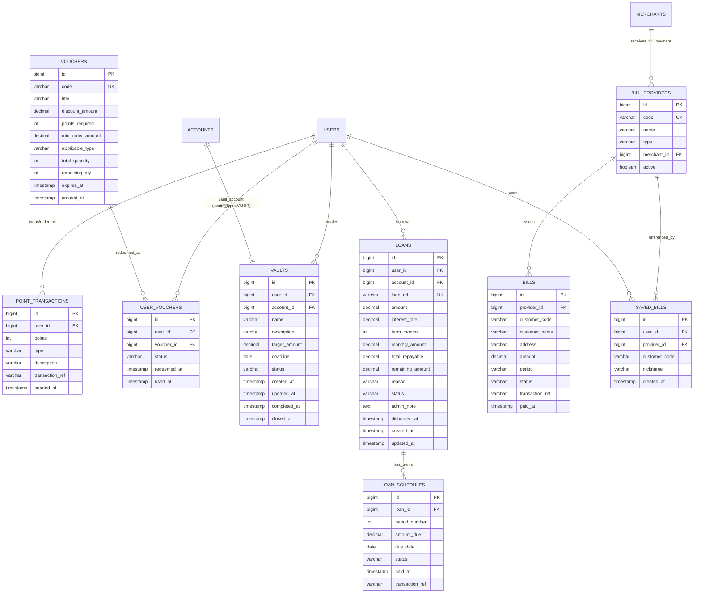

---
tags:
  - training
  - project
  - paygate
  - database
  - week2
created: 2026-07-27
---

# Database Design — PayGate Week 2

## 1. Tổng quan

- RDBMS: **PostgreSQL** (kế thừa Week 1)
- Quản lý schema qua **Flyway migration**, đặt tại `src/main/resources/db/migration`.
  - `V1` — `V10` (Week 1 / Core): bao gồm `users`, `merchants`, `accounts`, `transactions`, `ledger_entries`, `webhook_logs`, indexes, `recurring_payments`.
  - `V11` — `V16` (Week 2): các bảng mới cho 5 Features bổ sung (mô tả bên dưới).
- Tất cả số tiền dùng `DECIMAL(15,2)` — **không** dùng `FLOAT/DOUBLE`.
- Các entity mới kế thừa `BaseEntity` (id, createdAt, updatedAt) theo `backend_code_template.md`.

### Cập nhật Enum cần thiết (trước khi tạo bảng mới)
- **`OwnerType`**: Thêm `VAULT` (tài khoản ví phụ Hũ tiết kiệm).
- **`TransactionType`**: Thêm `VAULT_DEPOSIT`, `VAULT_WITHDRAW`, `LOAN_DISBURSEMENT`, `LOAN_REPAYMENT`, `BILL_PAYMENT`.

---

## 2. Sơ đồ quan hệ — Bảng mới Week 2



---

## 3. Chi tiết bảng & migration

### V11 — `vouchers` (Feature 1: Kho Voucher ưu đãi)
```sql
CREATE TABLE vouchers (
    id BIGSERIAL PRIMARY KEY,
    code VARCHAR(50) NOT NULL UNIQUE,
    title VARCHAR(150) NOT NULL,
    discount_amount DECIMAL(15,2) NOT NULL,
    points_required INT NOT NULL,
    min_order_amount DECIMAL(15,2) NOT NULL DEFAULT 0.00,
    applicable_type VARCHAR(30) NOT NULL DEFAULT 'ALL',    -- ALL, BILL_PAYMENT, PAYMENT, LOAN_REPAYMENT
    total_quantity INT NOT NULL,
    remaining_qty INT NOT NULL,
    expires_at TIMESTAMP NOT NULL,
    created_at TIMESTAMP NOT NULL DEFAULT NOW(),
    updated_at TIMESTAMP NOT NULL DEFAULT NOW()
);
```
**Ghi chú thiết kế**: `code UNIQUE` cho phép tra cứu nhanh mã voucher khi áp dụng thanh toán. `remaining_qty` giảm dần khi user redeem — dùng Optimistic Lock (`remaining_qty > 0`) hoặc `UPDATE ... SET remaining_qty = remaining_qty - 1 WHERE remaining_qty > 0` để tránh race condition.

### V12 — `user_vouchers` + `point_transactions` (Feature 1: Voucher cá nhân & Lịch sử điểm)
```sql
CREATE TABLE user_vouchers (
    id BIGSERIAL PRIMARY KEY,
    user_id BIGINT NOT NULL REFERENCES users(id),
    voucher_id BIGINT NOT NULL REFERENCES vouchers(id),
    status VARCHAR(20) NOT NULL DEFAULT 'AVAILABLE',       -- AVAILABLE, USED, EXPIRED
    redeemed_at TIMESTAMP NOT NULL DEFAULT NOW(),
    used_at TIMESTAMP
);

CREATE TABLE point_transactions (
    id BIGSERIAL PRIMARY KEY,
    user_id BIGINT NOT NULL REFERENCES users(id),
    points INT NOT NULL,                                    -- +100 (EARN) hoặc -100 (REDEEM)
    type VARCHAR(20) NOT NULL,                              -- EARN, REDEEM
    description VARCHAR(255) NOT NULL,
    transaction_ref VARCHAR(50),                            -- nullable: chỉ có khi type=EARN
    created_at TIMESTAMP NOT NULL DEFAULT NOW()
);
```

### V13 — `vaults` (Feature 3: Hũ tiết kiệm)
```sql
CREATE TABLE vaults (
    id BIGSERIAL PRIMARY KEY,
    user_id BIGINT NOT NULL REFERENCES users(id),
    account_id BIGINT NOT NULL REFERENCES accounts(id),    -- owner_type = VAULT
    name VARCHAR(100) NOT NULL,
    description VARCHAR(500),
    target_amount DECIMAL(15,2) NOT NULL,
    deadline DATE,
    status VARCHAR(20) NOT NULL DEFAULT 'ACTIVE',           -- ACTIVE, COMPLETED, CLOSED
    created_at TIMESTAMP NOT NULL DEFAULT NOW(),
    updated_at TIMESTAMP NOT NULL DEFAULT NOW(),
    completed_at TIMESTAMP,
    closed_at TIMESTAMP
);
```
**Ghi chú thiết kế**: `account_id` trỏ tới 1 `Account` riêng biệt với `owner_type = VAULT`, `owner_id = vault.id`. Số dư thực tế của hũ **chính là `account.balance`** — `vault` table không lưu số dư riêng, tránh data inconsistency. `progress = account.balance / vault.target_amount * 100%` (tính động).

### V14 — `loans` + `loan_schedules` (Feature 4: Vay tiêu dùng)
```sql
CREATE TABLE loans (
    id BIGSERIAL PRIMARY KEY,
    user_id BIGINT NOT NULL REFERENCES users(id),
    account_id BIGINT NOT NULL REFERENCES accounts(id),     -- ví nhận giải ngân & trả nợ
    loan_ref VARCHAR(30) NOT NULL UNIQUE,                   -- vd: LOAN-20260727-001
    amount DECIMAL(15,2) NOT NULL,                          -- tiền vay gốc
    interest_rate DECIMAL(5,2) NOT NULL,                    -- lãi suất %/tháng
    term_months INT NOT NULL,                               -- kỳ hạn (1, 3, 6, 12)
    monthly_amount DECIMAL(15,2) NOT NULL,                  -- gốc + lãi/tháng
    total_repayable DECIMAL(15,2) NOT NULL,                 -- tổng phải trả
    remaining_amount DECIMAL(15,2) NOT NULL,                -- dư nợ còn lại
    reason VARCHAR(255),
    status VARCHAR(30) NOT NULL DEFAULT 'PENDING_APPROVAL', -- PENDING_APPROVAL, ACTIVE, PAID_OFF, REJECTED, OVERDUE
    admin_note TEXT,
    approved_by BIGINT REFERENCES users(id),
    disbursed_at TIMESTAMP,
    created_at TIMESTAMP NOT NULL DEFAULT NOW(),
    updated_at TIMESTAMP NOT NULL DEFAULT NOW()
);

CREATE TABLE loan_schedules (
    id BIGSERIAL PRIMARY KEY,
    loan_id BIGINT NOT NULL REFERENCES loans(id),
    period_number INT NOT NULL,                             -- kỳ thứ (1, 2, 3...)
    amount_due DECIMAL(15,2) NOT NULL,
    due_date DATE NOT NULL,
    status VARCHAR(20) NOT NULL DEFAULT 'PENDING',          -- PENDING, PAID, OVERDUE
    paid_at TIMESTAMP,
    transaction_ref VARCHAR(50)                             -- mã giao dịch trả nợ
);
```

### V15 — `bill_providers` + `bills` + `saved_bills` + Seed Data (Feature 5: Hóa đơn)
```sql
CREATE TABLE bill_providers (
    id BIGSERIAL PRIMARY KEY,
    code VARCHAR(50) NOT NULL UNIQUE,                       -- vd: EVN_HANOI, VNPT_HCM
    name VARCHAR(100) NOT NULL,
    type VARCHAR(30) NOT NULL,                              -- ELECTRICITY, WATER, INTERNET
    merchant_id BIGINT NOT NULL REFERENCES merchants(id),   -- tài khoản nhận tiền
    active BOOLEAN NOT NULL DEFAULT TRUE
);

CREATE TABLE bills (
    id BIGSERIAL PRIMARY KEY,
    provider_id BIGINT NOT NULL REFERENCES bill_providers(id),
    customer_code VARCHAR(50) NOT NULL,
    customer_name VARCHAR(100) NOT NULL,
    address VARCHAR(255),
    amount DECIMAL(15,2) NOT NULL,
    period VARCHAR(20) NOT NULL,                            -- vd: 07/2026
    status VARCHAR(20) NOT NULL DEFAULT 'UNPAID',           -- UNPAID, PAID
    transaction_ref VARCHAR(50),
    paid_at TIMESTAMP
);

CREATE TABLE saved_bills (
    id BIGSERIAL PRIMARY KEY,
    user_id BIGINT NOT NULL REFERENCES users(id),
    provider_id BIGINT NOT NULL REFERENCES bill_providers(id),
    customer_code VARCHAR(50) NOT NULL,
    nickname VARCHAR(100),
    created_at TIMESTAMP NOT NULL DEFAULT NOW()
);

-- Seed data bill_providers & bills mẫu UNPAID
INSERT INTO bill_providers (code, name, type, merchant_id) VALUES
    ('EVN_HANOI', 'EVN Hà Nội', 'ELECTRICITY', 1),
    ('EVN_HCM', 'EVN TP.HCM', 'ELECTRICITY', 1),
    ('SAWACO', 'Nước Sài Gòn SAWACO', 'WATER', 2),
    ('VNPT_HN', 'VNPT Internet Hà Nội', 'INTERNET', 3),
    ('FPT_HCM', 'FPT Telecom TP.HCM', 'INTERNET', 3);

INSERT INTO bills (provider_id, customer_code, customer_name, address, amount, period) VALUES
    (1, 'PE0100112233', 'Nguyễn Văn A', 'Số 123 Giảng Võ, Hà Nội', 520000.00, '07/2026'),
    (3, 'ND0200445566', 'Trần Thị B', 'Quận 1, TP.HCM', 180000.00, '07/2026'),
    (4, 'INT030077889', 'Lê Văn C', 'Ba Đình, Hà Nội', 250000.00, '07/2026');
```

### V14 — Indexes Week 2
```sql
-- Feature 1: Reward & Voucher
CREATE INDEX idx_vouchers_code ON vouchers(code);
CREATE INDEX idx_vouchers_expires ON vouchers(expires_at) WHERE remaining_qty > 0;
CREATE INDEX idx_user_vouchers_user ON user_vouchers(user_id);
CREATE INDEX idx_user_vouchers_status ON user_vouchers(user_id, status) WHERE status = 'AVAILABLE';
CREATE INDEX idx_point_txns_user ON point_transactions(user_id);

-- Feature 3: Vault
CREATE INDEX idx_vaults_user_id ON vaults(user_id);

-- Feature 4: Loan
CREATE INDEX idx_loans_user_id ON loans(user_id);
CREATE INDEX idx_loans_status ON loans(status) WHERE status IN ('PENDING_APPROVAL', 'ACTIVE');
CREATE INDEX idx_loan_schedules_loan ON loan_schedules(loan_id);
CREATE INDEX idx_loan_schedules_due ON loan_schedules(due_date) WHERE status = 'PENDING';

-- Feature 5: Bill
CREATE INDEX idx_bills_customer ON bills(provider_id, customer_code);
CREATE INDEX idx_bills_status ON bills(status) WHERE status = 'UNPAID';
CREATE INDEX idx_saved_bills_user ON saved_bills(user_id);
```
**Ghi chú**: Sử dụng **partial index** (kế thừa chiến lược Week 1) cho các cột trạng thái để tối ưu truy vấn "đang chờ xử lý" (`UNPAID`, `AVAILABLE`, `PENDING`).

---

## 4. Khóa & khóa ngoại — tóm tắt ràng buộc toàn vẹn (Week 2)

| Bảng | Khóa chính | Khóa ngoại | Unique |
|---|---|---|---|
| vouchers | id | — | code |
| user_vouchers | id | user_id → users.id, voucher_id → vouchers.id | — |
| point_transactions | id | user_id → users.id | — |
| vaults | id | user_id → users.id, account_id → accounts.id | — |
| loans | id | user_id → users.id, account_id → accounts.id, approved_by → users.id | loan_ref |
| loan_schedules | id | loan_id → loans.id | — |
| bill_providers | id | merchant_id → merchants.id | code |
| bills | id | provider_id → bill_providers.id | — |
| saved_bills | id | user_id → users.id, provider_id → bill_providers.id | — |

---

## 5. Chiến lược khóa & concurrency (kế thừa Week 1)

- **Vault Deposit/Withdraw**: Lock 2 account (USER + VAULT) theo thứ tự `id` tăng dần (giống Payment Week 1).
- **Loan Disburse/Repay**: Lock 2 account (SYSTEM + USER) theo thứ tự `id` tăng dần.
- **Bill Pay**: Lock 2 account (USER + MERCHANT_PROVIDER) theo thứ tự `id` tăng dần.
- **Voucher Redeem**: `UPDATE vouchers SET remaining_qty = remaining_qty - 1 WHERE id = ? AND remaining_qty > 0` — trả lỗi nếu `affected = 0`.

---

## 6. Cache layer bổ sung (Redis)

| Key pattern | Giá trị | TTL | Mục đích |
|---|---|---|---|
| `user:points:{userId}` | `totalPoints` | 5 phút | Cache điểm thưởng, invalidate khi EARN/REDEEM |
| `auth:blacklist:{token}` | `true` | = remaining TTL | Blacklist Access Token khi logout (Week 1 security fix) |
| `auth:refresh_token:{username}` | `refreshToken` | 7 ngày | Redis Refresh Token (Week 1 security fix) |
