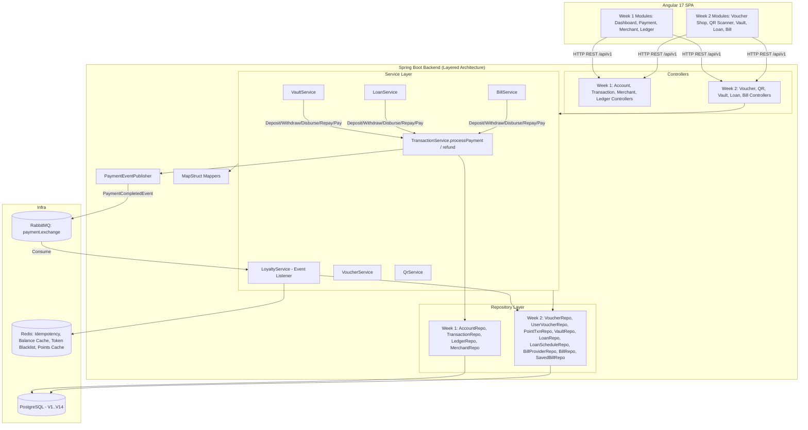
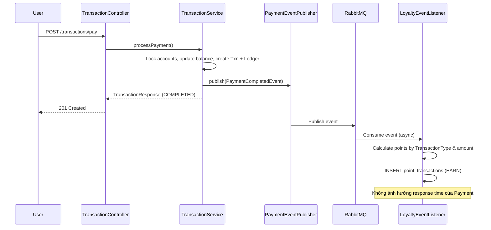
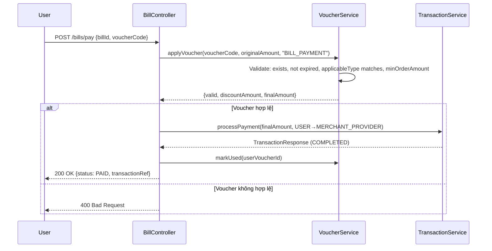
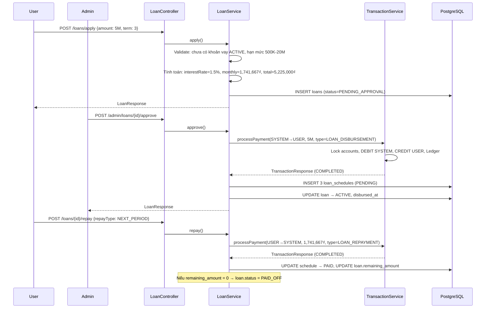
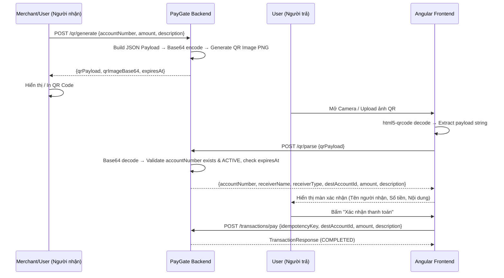

---
tags:
  - training
  - project
  - paygate
  - architecture
  - week2
created: 2026-07-27
---

# System Architecture — PayGate Week 2

## 1. Kiến trúc tổng thể (Week 1 + Week 2 Integration)



---

## 2. Nguyên tắc kiến trúc

### 2.1. Tái sử dụng Core Payment Engine
Tất cả 5 Features Week 2 đều **KHÔNG** tự viết logic trừ/cộng số dư hay tạo Ledger mới. Thay vào đó, chúng đều gọi lại `TransactionService.processPayment()` (hoặc tạo internal `PaymentRequest`) để đảm bảo:
- Tính nguyên tử (`@Transactional(SERIALIZABLE)`).
- Double-entry Ledger (DEBIT + CREDIT) tự động cân bằng.
- Account Lock theo thứ tự `id` tăng dần — chống deadlock.
- Idempotency Key — chống trùng lặp.

### 2.2. Event-Driven Loyalty (Asynchronous)
Loyalty Engine **không nằm** trong luồng đồng bộ (synchronous) của `processPayment()`. Nó lắng nghe event **sau khi** giao dịch đã `COMPLETED`:



### 2.3. Voucher Apply Flow (Synchronous - trước Payment)


---

## 3. Luồng tích hợp chi tiết (Integration Workflows)

### 3.1. Savings Vault — Account Isolation & Auto-Completion Pattern

Mỗi Hũ tiết kiệm sở hữu 1 `Account` riêng với `owner_type = VAULT`:

```
┌─────────────────────────────────────────────────────────────┐
│  User A                                                      │
│  ┌──────────────────────┐    ┌──────────────────────────┐   │
│  │ USER_ACCOUNT (AC001) │◄──►│ VAULT_ACCOUNT_1 (AC050)  │   │
│  │ balance: 8,000,000   │    │ balance: 2,000,000       │   │
│  │ ownerType: USER      │    │ ownerType: VAULT         │   │
│  └──────────────────────┘    │ vault: "Du lịch Đà Lạt"  │   │
│                              │ target: 5,000,000        │   │
│                              │ progress: 40%            │   │
│                              └──────────────────────────┘   │
└─────────────────────────────────────────────────────────────┘
```

- **Deposit** (`VAULT_DEPOSIT`): `@Transactional` `processPayment(source=AC001, dest=AC050, amount=500K)` → Ledger: DEBIT AC001, CREDIT AC050.
- **Auto-Completion Trigger**: Ngay sau khi `processPayment` thành công, `VaultServiceImpl.deposit()` kiểm tra `vaultAccount.balance >= vault.targetAmount`. Nếu đúng:
  - Cập nhật `vault.status = COMPLETED` và `vault.completedAt = NOW()`.
- **Withdraw** (`VAULT_WITHDRAW`): `@Transactional` `processPayment(source=AC050, dest=AC001, amount=200K)` → Ledger: DEBIT AC050, CREDIT AC001.
- Tổng DEBIT = tổng CREDIT toàn hệ thống vẫn cân bằng → `GET /admin/ledger/verify` vẫn trả `balanced = true`.

### 3.2. Loan System — Disbursement & Repayment Workflow



### 3.3. Bill Payment — Mock Provider Engine

```
┌──────────────────────┐        ┌────────────────────────────────┐
│  bill_providers      │───FK──→│  merchants (Week 1)            │
│  ┌────────────────┐  │        │  ┌──────────────────────────┐  │
│  │ EVN_HANOI      │──┼────────┼─→│ Merchant: EVN Hà Nội     │  │
│  │ type: ELECTRIC  │  │        │  │ Account: MERCHANT (AC80) │  │
│  └────────────────┘  │        │  └──────────────────────────┘  │
│  ┌────────────────┐  │        │  ┌──────────────────────────┐  │
│  │ VNPT_HN        │──┼────────┼─→│ Merchant: VNPT Hà Nội    │  │
│  │ type: INTERNET  │  │        │  │ Account: MERCHANT (AC81) │  │
│  └────────────────┘  │        │  └──────────────────────────┘  │
└──────────────────────┘        └────────────────────────────────┘

Luồng: User → lookup(providerCode, customerCode) → Trả info hóa đơn UNPAID
     → User bấm Pay → processPayment(USER_AC → MERCHANT_AC, amount, BILL_PAYMENT)
     → UPDATE bill.status = PAID
```

### 3.4. QR Code Payment — Frontend ↔ Backend Flow



---

## 4. Cấu trúc package bổ sung (Backend)

```
com.training.paygate
├── controller/
│   ├── VoucherController.java          # /api/v1/vouchers/*, /api/v1/admin/vouchers
│   ├── RewardController.java           # /api/v1/rewards/*
│   ├── QrController.java              # /api/v1/qr/*
│   ├── VaultController.java           # /api/v1/vaults/*
│   ├── LoanController.java            # /api/v1/loans/*, /api/v1/admin/loans/*
│   └── BillController.java            # /api/v1/bills/*
├── service/
│   ├── LoyaltyService.java            # interface
│   ├── VoucherService.java            # interface
│   ├── QrService.java                 # interface
│   ├── VaultService.java              # interface
│   ├── LoanService.java               # interface
│   ├── BillService.java               # interface
│   └── impl/
│       ├── LoyaltyServiceImpl.java     # @EventListener PaymentCompletedEvent
│       ├── VoucherServiceImpl.java
│       ├── QrServiceImpl.java
│       ├── VaultServiceImpl.java
│       ├── LoanServiceImpl.java
│       └── BillServiceImpl.java
├── entity/
│   ├── Voucher.java
│   ├── UserVoucher.java
│   ├── PointTransaction.java
│   ├── Vault.java
│   ├── Loan.java
│   ├── LoanSchedule.java
│   ├── BillProvider.java
│   ├── Bill.java
│   └── SavedBill.java
├── repository/
│   ├── VoucherRepository.java
│   ├── UserVoucherRepository.java
│   ├── PointTransactionRepository.java
│   ├── VaultRepository.java
│   ├── LoanRepository.java
│   ├── LoanScheduleRepository.java
│   ├── BillProviderRepository.java
│   ├── BillRepository.java
│   └── SavedBillRepository.java
├── dto/
│   ├── request/
│   │   ├── VoucherCreateRequest.java
│   │   ├── VoucherRedeemRequest.java
│   │   ├── VoucherApplyRequest.java
│   │   ├── QrGenerateRequest.java
│   │   ├── QrParseRequest.java
│   │   ├── VaultCreateRequest.java
│   │   ├── VaultDepositRequest.java
│   │   ├── LoanApplyRequest.java
│   │   ├── LoanRepayRequest.java
│   │   ├── BillLookupRequest.java
│   │   ├── BillPayRequest.java
│   │   └── SaveBillRequest.java
│   └── response/
│       ├── PointsResponse.java
│       ├── VoucherResponse.java
│       ├── UserVoucherResponse.java
│       ├── VoucherApplyResponse.java
│       ├── QrGenerateResponse.java
│       ├── QrParseResponse.java
│       ├── VaultResponse.java
│       ├── VaultTransactionResponse.java
│       ├── LoanResponse.java
│       ├── LoanScheduleResponse.java
│       ├── BillProviderResponse.java
│       ├── BillResponse.java
│       └── SavedBillResponse.java
└── enums/
    ├── VoucherApplicableType.java      # ALL, BILL_PAYMENT, PAYMENT, LOAN_REPAYMENT
    ├── UserVoucherStatus.java          # AVAILABLE, USED, EXPIRED
    ├── PointTransactionType.java       # EARN, REDEEM
    ├── VaultStatus.java                # ACTIVE, COMPLETED, CLOSED
    ├── LoanStatus.java                 # PENDING_APPROVAL, ACTIVE, PAID_OFF, REJECTED, OVERDUE
    ├── LoanScheduleStatus.java         # PENDING, PAID, OVERDUE
    ├── RepayType.java                  # NEXT_PERIOD, FULL_SETTLEMENT
    ├── BillType.java                   # ELECTRICITY, WATER, INTERNET
    └── BillStatus.java                 # UNPAID, PAID
```
