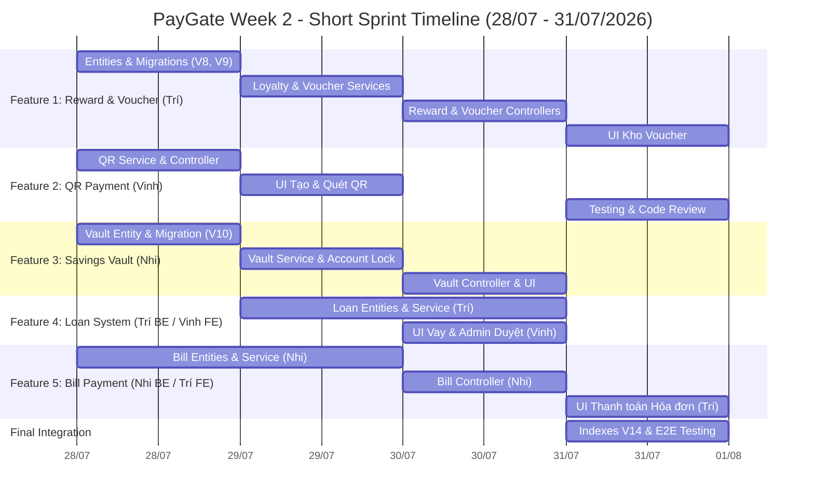

---
tags:
  - training
  - project
  - paygate
  - phan-cong
  - week2
created: 2026-07-27
updated: 2026-07-27
---

# Bảng Phân Công Công Việc — PayGate Week 2 (28/07/2026 – 31/07/2026)

## 1. Tổng quan phân công

**Team**: 3 thành viên (Trí, Vinh, Nhi)

**Nguyên tắc phân chia**: 3 Feature đầu phân riêng trọn vẹn (BE + FE). 2 Feature sau chia Backend/Frontend chéo nhau để luyện collaboration.

| Feature | Mô Tả | Backend (API & DB) | Frontend (UI/UX) |
|---|---|---|---|
| **Feature 1: Reward Points & Voucher** | Tích điểm tự động, Đổi Voucher, Áp dụng giảm giá | **Trí** | **Trí** |
| **Feature 2: QR Code Payment** | Sinh QR Payload, Quét Camera, Parse & Thanh toán | **Vinh** | **Vinh** |
| **Feature 3: Savings Vault Goal** | Hũ tiết kiệm, Nạp/Rút, Progress Bar | **Nhi** | **Nhi** |
| **Feature 4: Loan System** | Đăng ký vay, Admin duyệt & Giải ngân, Lịch trả nợ | **Trí** | **Vinh** |
| **Feature 5: Bill Payment** | Tra cứu & Thanh toán hóa đơn Điện/Nước/Internet | **Nhi** | **Trí** |

---

## 2. Lịch trình chi tiết theo ngày (28/07 – 31/07/2026)

### Ngày 1 — Thứ Ba 28/07/2026: Database, Migration & Core Backend Foundation

| Người | REQ | Công việc | Branch |
|---|---|---|---|
| **Trí** | REQ-PAY-W2-B-101, B-102, B-103 | Entity `Voucher`, `UserVoucher`, `PointTransaction` + Flyway V8, V9. Tạo Repositories + `VoucherMapper` | `feature/w2-reward-entities` |
| **Vinh** | REQ-PAY-W2-B-201, B-202 | `QrService` & `QrController`: logic `generate()`, `parse()`, Base64 payload. Tích hợp ZXing library | `feature/w2-qr-backend` |
| **Nhi** | REQ-PAY-W2-B-301, B-501, B-502 | Entity `Vault`, `BillProvider`, `Bill`, `SavedBill` + Flyway V10, V12, V13 (Seed data). Enum `VAULT` | `feature/w2-vault-bill-entities` |

> 🔔 **Cuối ngày 1**: Sync & Merge các enum mới (`OwnerType.VAULT`, các `TransactionType` mới) vào `develop`.

---

### Ngày 2 — Thứ Tư 29/07/2026: Service Layer & Core Business Logic

| Người | REQ | Công việc | Branch |
|---|---|---|---|
| **Trí** | REQ-PAY-W2-B-104, B-105, B-401, B-402 | `LoyaltyServiceImpl` (EventListener), `VoucherServiceImpl` (redeem, apply). Entity `Loan`, `LoanSchedule` + Flyway V11 | `feature/w2-reward-loan-service` |
| **Vinh** | REQ-PAY-W2-F-201, F-202 | Angular: UI Tạo QR Code & UI Quét QR Code (Camera + Upload ảnh với `html5-qrcode`) | `feature/w2-qr-ui` |
| **Nhi** | REQ-PAY-W2-B-302, B-303, B-504, B-505 | `VaultServiceImpl` (create, deposit, withdraw), `BillServiceImpl` (lookup, pay via processPayment) | `feature/w2-vault-bill-service` |

---

### Ngày 3 — Thứ Năm 30/07/2026: REST Controllers & UI Modules (Part 1)

| Người | REQ | Công việc | Branch |
|---|---|---|---|
| **Trí** | REQ-PAY-W2-B-106, B-107, B-403, B-404, B-405, B-406, B-407 | REST Controllers: `RewardController`, `VoucherController`, `LoanController` (User + Admin approve/disburse) | `feature/w2-backend-controllers` |
| **Vinh** | REQ-PAY-W2-F-401, F-402 | Angular: UI Vay tiêu dùng (Form vay, danh sách khoản vay, lịch trả nợ, trả nợ) + UI Admin duyệt vay | `feature/w2-loan-ui` |
| **Nhi** | REQ-PAY-W2-B-304, B-506, F-301 | REST Controllers: `VaultController`, `BillController`. Angular: UI Hũ tiết kiệm (Vault dashboard, nạp/rút, progress bar) | `feature/w2-vault-bill-ui` |

---

### Ngày 4 — Thứ Sáu 31/07/2026: UI Modules (Part 2), Integration, Indexes & Testing

| Người | REQ | Công việc | Branch |
|---|---|---|---|
| **Trí** | REQ-PAY-W2-F-101, F-102, F-501, F-502 | Angular: UI Kho Voucher (shop, redeem, my-vouchers) + UI Thanh toán Hóa đơn (Điện/Nước/Internet, Saved Bills) | `feature/w2-reward-bill-ui` |
| **Vinh** | — | Integration test QR & Loan flow. Code review PRs. Fix bug | `feature/w2-testing-vinh` |
| **Nhi** | — | Flyway V14 (Indexes Week 2). Integration test Vault & Bill flow (`verify` Ledger balanced). Code review PRs | `feature/w2-indexes-testing` |

> 🔔 **Cuối ngày 4 (Thứ Sáu 31/07/2026)**: Merge toàn bộ feature branches vào `develop`. End-to-End Testing & nghiệm thu Week 2.

---

## 3. Gantt Chart (Timeline 28/07 – 31/07/2026)



---

## 4. Nhánh Git & Quy tắc PR

### 4.1. Naming convention
```
feature/w2-{feature-name}-{scope}
```
Ví dụ:
- `feature/w2-reward-entities`
- `feature/w2-qr-backend`
- `feature/w2-vault-bill-service`
- `feature/w2-loan-ui`

### 4.2. Quy tắc PR
- PR review **chéo** (Trí ↔ Vinh ↔ Nhi) trước khi merge `develop`.
- Mỗi PR tối đa **300 LOC** (nếu nhiều hơn → tách thành 2 PR).
- PR phải pass CI (build + existing tests) trước khi approve.
- **Commit message format**: `[W2-F{N}] {description}`, ví dụ: `[W2-F1] Add Voucher entity and migration V8`.

### 4.3. Dependency order (merge thứ tự)
```
1. Enum updates (TransactionType, OwnerType) — merge Ngày 1
2. Database Migrations (V8-V13) & Repositories — merge Ngày 1-2
3. Service & Controller layers — merge Ngày 2-3
4. UI Components — merge Ngày 3-4
5. Indexes V14 & Integration Tests — merge Ngày 4
```

---

## 5. Checklist hoàn thành (Definition of Done — Week 2)

- [ ] Toàn bộ 9 bảng mới (V8-V13) tạo thành công qua Flyway migration.
- [ ] 5 Controller mới có Swagger annotation đầy đủ, hoạt động qua Swagger UI.
- [ ] `GET /admin/ledger/verify` vẫn trả `balanced = true` sau tất cả giao dịch Week 2.
- [ ] Loyalty Engine tích điểm tự động khi Payment/BillPay/LoanRepay/VaultDeposit.
- [ ] QR generate → parse → pay hoạt động end-to-end.
- [ ] Vault deposit/withdraw tạo Transaction + Ledger cân bằng.
- [ ] Loan apply → approve → disburse → repay → paid_off hoạt động trọn vẹn.
- [ ] Bill lookup → pay → PAID + Ledger ghi nhận.
- [ ] ≥ 3 Integration test mới pass (Testcontainers).
- [ ] Code review chéo ≥ 5 comment/PR.
- [ ] Merge thành công vào `develop` trước 23:59 Thứ Sáu 31/07/2026.
