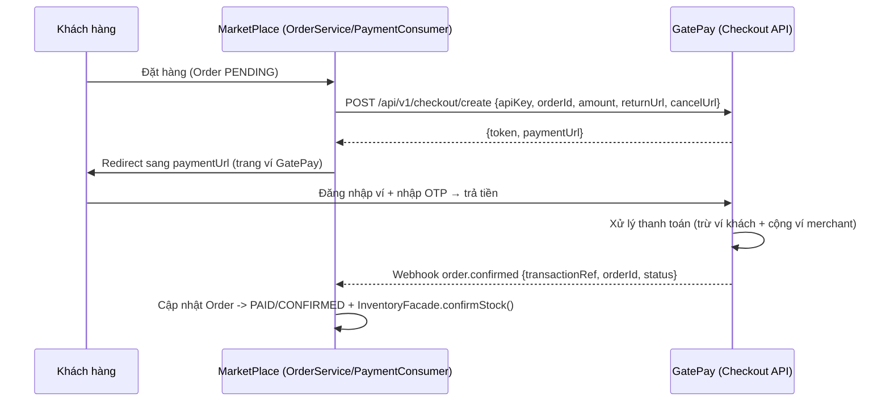
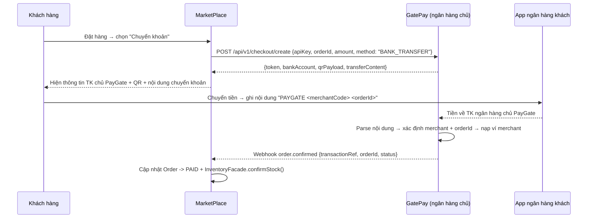

# 🔌 FEATURE 00: Payment Gateway — Gắn cổng thanh toán GatePay lên MarketPlace

> **Tên tính năng:** Thay thế cổng thanh toán giả lập (`simulatePaymentGateway`) bằng cổng thanh toán thật GatePay.
> **Mã quy chuẩn:** `FEATURE-00-GATEWAY`
> **Thành viên phụ trách:**
> - **GatePay (Backend):** **Trí** (3 ngày)
> - **MarketPlace (UI/Client):** **Hoàng** (2-3 ngày)
> - **Review:** Vinh (chỉ review code, không code)
>
> ⚠️ **ĐÂY LÀ FEATURE NỀN TẢNG — phải làm TRƯỚC** các feature 01-04. Vì BNPL, Instant Settlement, Working Capital, Refund đều cần **doanh thu thật** chạy qua cổng.

---

## 📌 1. Mô tả Nghiệp vụ & Kịch bản
Hiện tại MarketPlace dùng 1 **payment giả lập** — `PaymentConsumer.simulatePaymentGateway()` luôn trả `true`, tức Order tự chuyển `CONFIRMED` mà **không trừ tiền thật**.

Feature này thay thế bằng **luồng thanh toán thật qua GatePay** với **2 phương thức**:

### Phương thức A — Ví GatePay (redirect + OTP) *(khách đã có ví)*
1. Khách đặt đơn → MarketPlace tạo checkout session trên GatePay.
2. GatePay trả `paymentUrl` → MarketPlace **redirect** khách sang trang ví GatePay.
3. Khách đăng nhập ví + nhập OTP → trả tiền.
4. GatePay gọi **webhook** → MarketPlace cập nhật Order `PAID`/`FAILED`.

### Phương thức B — Bank Transfer / QR chuyển khoản *(mặc định cho khách mới, không cần lập ví)* ⭐
> **Lý do:** Bắt khách đăng ký ví + nạp tiền = UX rất tệ. Khách mua hàng bình thường chỉ muốn **chuyển khoản ngân hàng** quen thuộc.

1. Khách đặt đơn → MarketPlace tạo checkout session → GatePay trả **thông tin chuyển khoản** (số TK chủ PayGate + mã giao dịch QR).
2. MarketPlace hiện màn hình: thông tin ngân hàng chủ PayGate + **nội dung chuyển khoản chuẩn**.
3. Khách chuyển khoản từ app ngân hàng của họ, ghi đúng nội dung.
4. PayGate (giữ tài khoản ngân hàng chủ) nhận tiền → **parse nội dung chuyển khoản** → xác định merchant + orderId.
5. PayGate nạp tiền cho **ví merchant** + gọi webhook → MarketPlace cập nhật Order `PAID`.

> **Lưu ý hiện tại:** chưa liên kết ngân hàng thật → giai đoạn này **MOCK luồng nhận chuyển khoản** (mô phỏng "đã nhận tiền") để demo, sau này cắm ngân hàng thật.

---

## 🔄 2. Sơ đồ Luồng Giao Dịch (Sequence Diagram)

### Phương thức A — Ví GatePay (redirect + OTP)


### Phương thức B — Bank Transfer / QR chuyển khoản ⭐


---

## 🔌 3. Danh Sách API Specifications

### 3.1. MarketPlace tạo phiên thanh toán (Gọi GatePay)
- **Endpoint:** `POST /api/v1/checkout/create`
- **Request Body:**
```json
{
  "apiKey": "gp_live_marketplace_key_99",
  "orderId": "ORD-2026-0803-9988",
  "amount": 15000000,
  "description": "Thanh toan don hang",
  "returnUrl": "http://marketplace.local/payment-success",
  "cancelUrl": "http://marketplace.local/payment-cancelled"
}
```
- **Response (200 OK):**
```json
{
  "code": 200,
  "message": "Checkout session created",
  "data": {
    "token": "CHK_A1B2C3D4E5F6",
    "paymentUrl": "http://localhost:8081/checkout?token=CHK_A1B2C3D4E5F6",
    "expiresAt": "2026-08-03T15:30:00"
  }
}
```

### 3.2. Webhook GatePay gọi lại MarketPlace (kết quả thanh toán)
- **Endpoint:** `POST /api/v1/webhooks/gatepay`
- **Request Body:**
```json
{
  "transactionRef": "TXN-PAY-2026-...",
  "orderId": "AM_2026-1003-9988",
  "status": "COMPLETED",
  "amount": 15000000
}
```
- **Response:** `{ "status": "success" }` (báo nhận)

> **Lưu ý:** chi tiết endpoint webhook/ mã chữ ký — tra theo `API_CONNECTION_GUIDE.md` / `PAYMENT_GATEWAY_INTEGRATION_GUIDE.md` của GatePay.

### 3.3. Tạo phiên thanh toán theo phương thức Bank Transfer
- **Endpoint:** `POST /api/v1/checkout/create` (thêm `method: "BANK_TRANSFER"`)
- **Request Body:**
```json
{
  "apiKey": "gp_live_marketplace_key_99",
  "orderId": "ORD-2026-0803-9988",
  "amount": 15000000,
  "method": "BANK_TRANSFER",
  "returnUrl": "http://marketplace.local/payment-success",
  "cancelUrl": "http://marketplace.local/payment-cancelled"
}
```
- **Response (200 OK) — kèm thông tin chuyển khoản:**
```json
{
  "code": 200,
  "message": "Checkout session created (bank transfer)",
  "data": {
    "token": "CHK_B1C2D3E4F5G6",
    "method": "BANK_TRANSFER",
    "bankAccount": {
      "bankName": "Ngân hàng chủ PayGate",
      "accountNumber": "PAYGATE-0001",
      "accountHolder": "PayGate JSC",
      "amount": 15000000
    },
    "transferContent": "PAYGATE MER-ADIDAS-VN ORD-2026-0803-9988",
    "qrPayload": "PAYGATE|MER-ADIDAS-VN|ORD-2026-0803-9988|15000000",
    "expiresAt": "2026-08-03T15:45:00"
  }
}
```

### 3.4. Webhook nạp tiền merchant (khi PayGate nhận chuyển khoản)
- **Endpoint (nội bộ GatePay):** `POST /api/v1/bank-transfers/receive` *(mock trước)*
- **Request Body:**
```json
{
  "bankRef": "BANK-REF-20260803-001",
  "amount": 15000000,
  "transferContent": "PAYGATE MER-ADIDAS-VN ORD-2026-0803-9988"
}
```
- **Logic:** parse `transferContent` → `merchantCode` + `orderId` → tìm checkout session → **nạp ví merchant** → publish webhook về MarketPlace.

---

## 🗄️ 4. Cơ Sở Dữ Liệu & Migration
- **GatePay:** tái dùng bảng `checkout_sessions` + `transactions` (đã có) — **không cần bảng mới**.
- **MarketPlace:** thêm cột `gatepay_token` + `gatepay_status` vào bảng `orders` (Migration trong repo MarketPlace).

---

## 📋 5. Phân Công Chi Tiết Task

### 🟢 Phía GatePay (Trí - 3 ngày):
- [ ] Kiểm tra / đảm bảo API `POST /api/v1/checkout/create` hoạt động (có sẵn trong `CheckoutController`).
- [ ] Đảm bảo webhook gọi đúng `webhookUrl` của Merchant khi thanh toán xong (có sẵn).
- [ ] Cung cấp **API Key** + `webhookUrl` cho Merchant MarketPlace.
- [ ] Viết tài liệu ngắn cho MarketPlace cách gọi (đã có `API_CONNECTION_GUIDE.md`).
- [ ] **Bank Transfer:** tạo endpoint mock `POST /bank-transfers/receive` + **parse `transferContent`** → xác định merchant + orderId.
- [ ] **Bank Transfer:** nạp tiền ví merchant khi nhận chuyển khoản + sinh `qrPayload`.

### 🔵 Phía MarketPlace (Hoàng - 2-3 ngày):
- [ ] Thay `simulatePaymentGateway()` trong `PaymentConsumer` bằng **gọi `POST /checkout/create`**.
- [ ] Lưu `gatepay_token` + `gateway_status` vào bảng `orders`.
- [ ] **Redirect** khách sang `paymentUrl` sau khi tạo đơn.
- [ ] Tạo endpoint **webhook** `POST /api/v1/webhooks/gatepay` — verify chữ ký/API key (không public trần), cập nhật Order → `PAID`, gọi `inventoryFacade.confirmStock()`.
- [ ] Xử lý luồng lỗi: hết hạn token, hủy đơn, webhook miss (poll `GET /checkout/info/{token}`).
- [ ] **Bank Transfer UI:** màn hình hiển thị thông tin TK chủ PayGate + QR + nội dung chuyển khoản khi khách chọn "Chuyển khoản".

---

## 🔒 6. Security (bắt buộc)
- **API Key** Merchant trong body `POST /checkout/create` — verify `findByApiKey` + ACTIVE.
- **Webhook có chữ ký / xác thực** (không để public trần) — MarketPlace verify trước khi update Order.
- **Idempotent** webhook bằng `transactionRef` — tránh xử lý trùng khi retry.
- **JWT Bearer** cho khách khi xác nhận thanh toán trên GatePay (đã có).
- **Bank Transfer — chống sai tiền/sai nội dung:**
  - Validate `amount` nhận được **khớp** `checkout_session.amount` (chênh lệch cho phép ± nhỏ).
  - `transferContent` phải đúng format `PAYGATE <merchantCode> <orderId>` — parse + tra session hợp lệ.
  - `bankRef` idempotent — không nạp merchant 2 lần cho 1 chuyển khoản.

---

## 🔗 7. Phụ thuộc & Thứ tự
- **Phụ thuộc:** Không phụ thuộc feature khác — **đây là nền tảng**.
- **Thứ tự:** **LÀM ĐẦU TIÊN** — trước FEATURE-01 BNPL, vì BNPL cần duyệt trả sau trên nền thanh toán thật chạy đúng.

---

## ✅ 8. Definition of Done (DoD)
- [ ] `POST /checkout/create` từ MarketPlace trả `paymentUrl`.
- [ ] Redirect khách sang GatePay → trả tiền thật thành công.
- [ ] Webhook về cập nhật Order → `PAID` + stock confirm.
- [ ] Đơn thất bại/hủy → Order → `CANCELLED`, release stock.
- [ ] Kiểm thử end-to-end (đặt đơn → thanh toán → PAID).

**Bank Transfer (phương thức B):**
- [ ] `POST /checkout/create` với `method: "BANK_TRANSFER"` trả `bankAccount` + `qrPayload` + `transferContent`.
- [ ] Màn hình hiển thị thông tin chuyển khoản + QR cho khách.
- [ ] Mock `POST /bank-transfers/receive` → parse `transferContent` → xác định merchant + orderId → **nạp ví merchant**.
- [ ] Validate amount khớp + idempotent `bankRef` (không nạp 2 lần).
- [ ] Webhook về MarketPlace → Order `PAID` sau khi nạp merchant.
- [ ] `./mvnw -o test-compile` xanh + unit test.