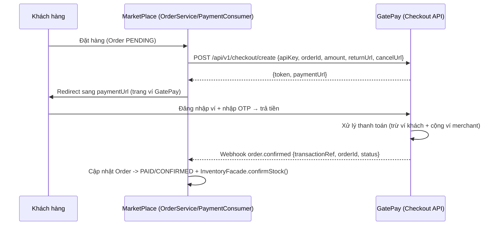

# 🔌 FEATURE 00: Payment Gateway — Gắn cổng thanh toán GatePay lên MarketPlace

> **Tên tính năng:** Thay thế cổng thanh toán giả lập (`simulatePaymentGateway`) bằng cổng thanh toán thật GatePay.
> **Mã quy chuẩn:** `FEATURE-00-GATEWAY`
> **Thành viên phụ trách:**
> - **GatePay (Backend):** [Member khác — không phải Vinh] (3 ngày)
> - **MarketPlace (UI/Client):** [Gán 1 người] (2-3 ngày)
> - **Review:** Vinh (chỉ review code, không code)
>
> ⚠️ **ĐÂY LÀ FEATURE NỀN TẢNG — phải làm TRƯỚC** các feature 01-04. Vì BNPL, Instant Settlement, Working Capital, Refund đều cần **doanh thu thật** chạy qua cổng.

---

## 📌 1. Mô tả Nghiệp vụ & Kịch bản
Hiện tại MarketPlace dùng 1 **payment giả lập** — `PaymentConsumer.simulatePaymentGateway()` luôn trả `true`, tức Order tự chuyển `CONFIRMED` mà **không trừ tiền thật**.

Feature này thay thế bằng **luồng thanh toán thật qua GatePay**:
1. Khách đặt đơn trên MarketPlace → tạo checkout session trên GatePay.
2. GatePay trả `paymentUrl` → MarketPlace **redirect** khách sang trang thanh toán ví GatePay.
3. Khách đăng nhập ví + nhập OTP → trả tiền.
4. GatePay gọi **webhook** về MarketPlace → cập nhật Order `PAID` / `FAILED`.

---

## 🔄 2. Sơ đồ Luồng Giao Dịch (Sequence Diagram)



---

## 🔌 3. Danh Sách API Specifications

### 3.1. MarketPlace tạo phiên thanh toán (Gọi GatePay)
- **Endpoint:** `POST /api/v1/checkout/create`
- **Request Body:**
```json
{
  "apiKey": "gp_live_marketplace_key_99",
  "orderId": "ORD-2026-0803-9988",
  "amount": 15000000,
  "description": "Thanh toan don hang",
  "returnUrl": "http://marketplace.local/payment-success",
  "cancelUrl": "http://marketplace.local/payment-cancelled"
}
```
- **Response (200 OK):**
```json
{
  "code": 200,
  "message": "Checkout session created",
  "data": {
    "token": "CHK_A1B2C3D4E5F6",
    "paymentUrl": "http://localhost:8081/checkout?token=CHK_A1B2C3D4E5F6",
    "expiresAt": "2026-08-03T15:30:00"
  }
}
```

### 3.2. Webhook GatePay gọi lại MarketPlace (kết quả thanh toán)
- **Endpoint:** `POST /api/v1/webhooks/gatepay`
- **Request Body:**
```json
{
  "transactionRef": "TXN-PAY-2026-...",
  "orderId": "AM_2026-1003-9988",
  "status": "COMPLETED",
  "amount": 15000000
}
```
- **Response:** `{ "status": "success" }` (báo nhận)

> **Lưu ý:** chi tiết endpoint webhook/ mã chữ ký — tra theo `API_CONNECTION_GUIDE.md` / `PAYMENT_GATEWAY_INTEGRATION_GUIDE.md` của GatePay.

---

## 🗄️ 4. Cơ Sở Dữ Liệu & Migration
- **GatePay:** tái dùng bảng `checkout_sessions` + `transactions` (đã có) — **không cần bảng mới**.
- **MarketPlace:** thêm cột `gatepay_token` + `gatepay_status` vào bảng `orders` (Migration trong repo MarketPlace).

---

## 📋 5. Phân Công Chi Tiết Task

### 🟢 Phía GatePay ([Member khác] - 3 ngày):
- [ ] Kiểm tra / đảm bảo API `POST /api/v1/checkout/create` hoạt động (có sẵn trong `CheckoutController`).
- [ ] Đảm bảo webhook gọi đúng `webhookUrl` của Merchant khi thanh toán xong (có sẵn).
- [ ] Cung cấp **API Key** + `webhookUrl` cho Merchant MarketPlace.
- [ ] Viết tài liệu ngắn cho MarketPlace cách gọi (đã có `API_CONNECTION_GUIDE.md`).

### 🔵 Phía MarketPlace ([Người] - 2-3 ngày):
- [ ] Thay `simulatePaymentGateway()` trong `PaymentConsumer` bằng **gọi `POST /checkout/create`**.
- [ ] Lưu `gatepay_token` + `gateway_status` vào bảng `orders`.
- [ ] **Redirect** khách sang `paymentUrl` sau khi tạo đơn.
- [ ] Tạo endpoint **webhook** `POST /api/v1/webhooks/gatepay` — verify chữ ký/API key (không public trần), cập nhật Order → `PAID`, gọi `inventoryFacade.confirmStock()`.
- [ ] Xử lý luồng lỗi: hết hạn token, hủy đơn, webhook miss (poll `GET /checkout/info/{token}`).

---

## 🔒 6. Security (bắt buộc)
- **API Key** Merchant trong body `POST /checkout/create` — verify `findByApiKey` + ACTIVE.
- **Webhook có chữ ký / xác thực** (không để public trần) — MarketPlace verify trước khi update Order.
- **Idempotent** webhook bằng `transactionRef` — tránh xử lý trùng khi retry.
- **JWT Bearer** cho khách khi xác nhận thanh toán trên GatePay (đã có).

---

## 🔗 7. Phụ thuộc & Thứ tự
- **Phụ thuộc:** Không phụ thuộc feature khác — **đây là nền tảng**.
- **Thứ tự:** **LÀM ĐẦU TIÊN** — trước FEATURE-01 BNPL, vì BNPL cần duyệt trả sau trên nền thanh toán thật chạy đúng.

---

## ✅ 8. Definition of Done (DoD)
- [ ] `POST /checkout/create` từ MarketPlace trả `paymentUrl`.
- [ ] Redirect khách sang GatePay → trả tiền thật thành công.
- [ ] Webhook về cập nhật Order → `PAID` + stock confirm.
- [ ] Đơn thất bại/hủy → Order → `CANCELLED`, release stock.
- [ ] Kiểm thử end-to-end (đặt đơn → thanh toán → PAID).
- [ ] `./mvnw -o test-compile` xanh + unit test.