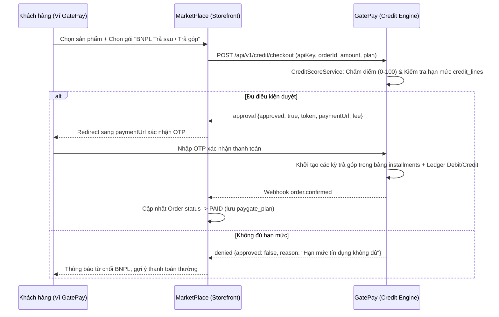

# 💳 FEATURE 01: BNPL & Credit Score Engine
> **Tên tính năng:** Mua trước Trả sau 0% & Động cơ Chấm điểm Tín dụng  
> **Mã quy chuẩn:** `FEATURE-01-BNPL`  
> **Thành viên phụ trách:**  
> - **GatePay (Backend):** Nhi (5 ngày)  
> - **MarketPlace (UI/Client):** Hoàng (4 ngày)  

---

## 📌 1. Mô tả Nghiệp vụ & Kịch bản
Khách hàng mua hàng trên MarketPlace có thể chọn phương thức **"Mua trước Trả sau (BNPL)"** với thời gian thù lao 30–45 ngày hoặc trả góp 3–6 tháng.

1. **Credit Score Engine (GatePay)** tự động tính toán điểm tín dụng (0-100) của khách hàng dựa trên lịch sử nạp/rút/chuyển tiền ví GatePay và lịch sử mua/hoàn đơn trên MarketPlace.
2. Dựa trên điểm tín dụng, GatePay phê duyệt **Hạn mức BNPL (Credit Line)** và mức phí trả góp ưu đãi cho khách hàng.
3. Khi thanh toán thành công, đơn hàng trên MarketPlace chuyển sang `PAID` và GatePay khởi tạo lịch trình trả góp `installments`.

---

## 🔄 2. Sơ đồ Luồng Giao Dịch (Sequence Diagram)



---

## 🔌 3. Danh Sách API Specifications

### 3.1. MarketPlace gọi GatePay (Duyệt BNPL)
- **Endpoint:** `POST /api/v1/credit/checkout`
- **Request Body:**
```json
{
  "apiKey": "gp_live_marketplace_key_99",
  "orderId": "ORD-2026-0803-9988",
  "amount": 15000000,
  "plan": "GTHP_6M",
  "customerId": 1024
}
```
- **Response (200 OK):**
```json
{
  "code": 200,
  "message": "Approved BNPL checkout session",
  "data": {
    "approved": true,
    "token": "BNPL_CHK_A1B2C3D4E5F6",
    "paymentUrl": "http://localhost:4200/checkout?token=BNPL_CHK_A1B2C3D4E5F6",
    "monthlyInstallment": 2500000,
    "fee": 150000
  }
}
```

### 3.2. Webhook Event tín dụng từ MarketPlace gửi sang GatePay
- **Endpoint:** `POST /api/v1/credit/events`
- **Request Body:**
```json
{
  "customerId": 1024,
  "eventType": "ORDER_COMPLETED",
  "orderId": "ORD-2026-0803-9988",
  "amount": 15000000
}
```

---

## 🗄️ 4. Cơ Sở Dữ Liệu & Migration

### Các bảng mới trên GatePay:
1. `credit_lines`: Quản lý hạn mức được duyệt và số dư khả dụng của từng khách hàng.
2. `installments`: Quản lý danh sách lịch trình trả góp theo từng kỳ (kỳ 1, kỳ 2, kỳ 3...).
3. `credit_events`: Lưu lịch sử sự kiện mua hàng / trả hàng từ MarketPlace phục vụ tính điểm tín dụng.

---

## 📋 5. Phân Công Chi Tiết Task

### 🟢 Phía GatePay (Nhi - 5 ngày):
- [ ] Viết API `/api/v1/credit/checkout` & `/api/v1/credit/events`.
- [ ] Xây dựng `CreditScoreService` (máy chấm điểm 0-100).
- [ ] Tạo Flyway migration `V28__create_installments.sql` + Entity `Installment`, `CreditLine`, `CreditEvent`.
- [ ] Tích hợp xác thực OTP & Hạch toán Sổ cái kép Ledger.

### 🔵 Phía MarketPlace (Hoàng - 4 ngày):
- [ ] Xây dựng UI chọn gói BNPL (`BNPL_30/45`, `GTHP_3M/6M`) tại trang Checkout.
- [ ] Lưu thông tin `paygate_plan` vào bảng `orders`.
- [ ] Xử lý Webhook callback chuyển trạng thái đơn sang `PAID`.

---

## 🔒 6. Security (bắt buộc)
- **API Key** merchant bắt buộc trong body `POST /credit/checkout` — verify `findByApiKey` + merchant `ACTIVE`.
- **OTP** bắt buộc khi khách xác nhận trả sau (dùng `OtpService`, 1 lần/hết hạn).
- **Rate limit** trên `/credit/checkout` (chống spam duyệt, vd 10 req/phút/user).
- **Fraud check** trước khi duyệt BNPL (gọi `FraudDetectionService` — nếu CRITICAL → từ chối).
- **Idempotent** bằng `orderId` — tránh duyệt trùng khi retry.
- **Credit score** là dữ liệu nhạy cảm → chỉ ADMIN xem, webhook event dùng API key.

---

## 🔗 7. Phụ thuộc & Thứ tự
- **Phụ thuộc:** Cần `CreditScoreService` (đã có, V27) + `OtpService` + merchant `apiKey` có sẵn.
- **Làm trước:** Buy-Now-Pay-Later là **nền tảng** → các feature khác (Refund, Working Capital) phụ thuộc luồng thanh toán chạy đúng.
- **Thứ tự trong team:** không chặn; FEATURE-02/04 có thể chạy song song.

---

## ✅ 8. Definition of Done (DoD)
- [ ] `POST /credit/checkout` duyệt BNPL end-to-end (score → hạn mức → token → OTP).
- [ ] `installments` được tạo đúng số kỳ khi khách xác nhận.
- [ ] Ledger Debit/Credit ghi đúng (phí + trả merchant phần gốc).
- [ ] Webhook `order.confirmed` cập nhật order MarketPlace → `PAID`.
- [ ] Credit event từ MarketPlace → `credit_events` cập nhật score.
- [ ] `./mvnw -o test-compile` xanh + unit test happy path & edge case.
