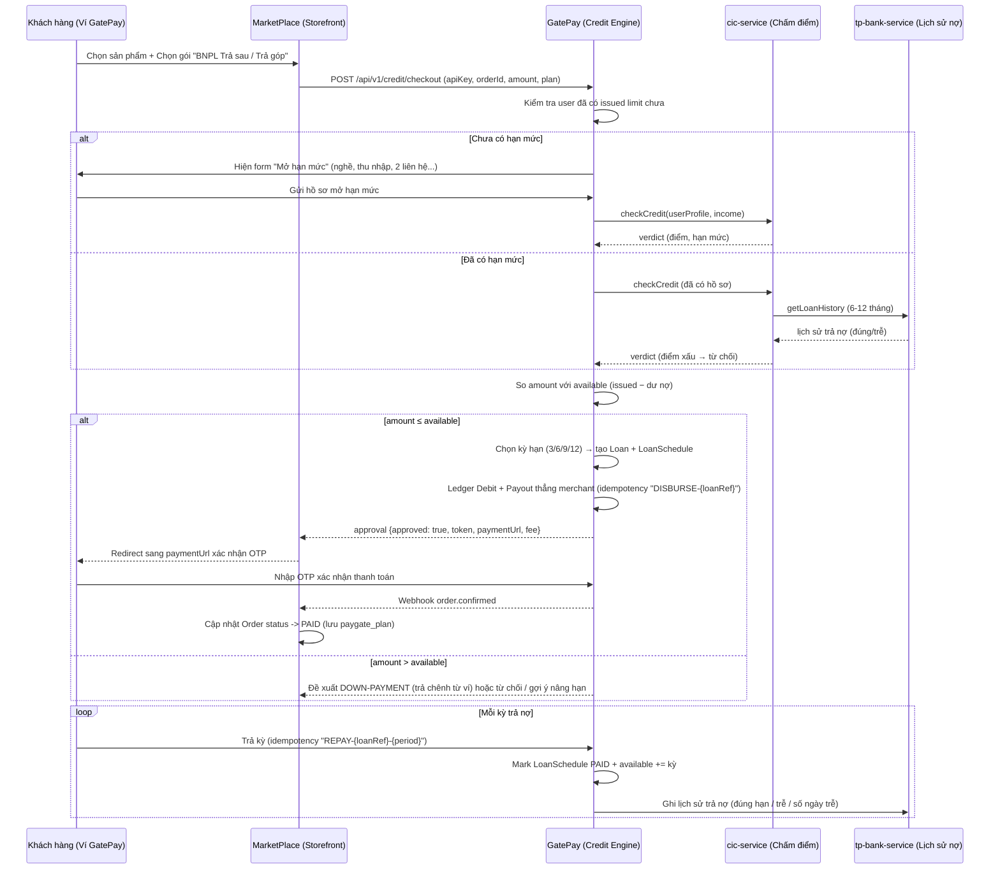

# 💳 FEATURE 01: BNPL & Credit Score Engine

> **Tên tính năng:** Mua trước Trả sau 0% & Động cơ Chấm điểm Tín dụng
> **Mã quy chuẩn:** `FEATURE-01-BNPL`
> **Thành viên phụ trách:**
> - **GatePay (Logic/API):** Nhi (5 ngày)
> - **GatePay (DB/Migration/Entity):** Trí + các member khác
> - **MarketPlace (UI/Client):** Hoàng (4 ngày)
> - **Review:** Vinh (chỉ review, không code)

---

## 📌 1. Mô tả Nghiệp vụ & Kịch bản

Người dùng bên MarketPlace (bán đồ điện tử) chọn mua hàng và thanh toán bằng **"Thẻ tín dụng PayGate"** — tức **vay ngay tại điểm bán**, nhận hàng liền, trả nợ trong kỳ hạn. PayGate đóng vai cổng thanh toán **cấp hạn mức tín dụng + xử lý tiền**.

Khách mua hàng trên MarketPlace có thể chọn phương thức **"Mua trước Trả sau (BNPL)"** với thời gian trả trong 30–45 ngày hoặc trả góp 3–6 tháng.

### Các bên tham gia & vai trò
| Bên | Vai trò |
|---|---|
| **MarketPlace** | Bán hàng. Khởi tạo đơn, chuyển thanh toán sang PayGate. Nhận tiền ngay khi user chọn trả góp. |
| **GatePay** | Cấp tài khoản, hạn mức tín dụng, tạo khoản vay, xử lý tiền cho merchant, thu nợ kỳ. |
| **cic-service (mới)** | Chấm điểm tín dụng → trả verdict (cho vay / giảm / từ chối). Lấy lịch sử từ tp-bank. |
| **tp-bank-service (mới)** | Nguồn tiền đối tác + nơi lưu lịch sử trả nợ gốc (đúng hạn / trễ). |

---

## 🧩 1.1 Khái niệm cốt lõi

- **Issued limit (hạn mức được duyệt):** con số tối đa user được nợ (do cic quyết định lúc mở/nâng).
- **Available limit (hạn mức khả dụng):** `issued − tổng dư nợ chưa trả`. Trả nợ → tăng dần lại.
- **Vay thẳng merchant:** tiền đi thẳng `PayGate→merchant`, **KHÔNG chạm ví user**. User chỉ 'mang nợ'.
- **Ghi nợ = Loan + LoanSchedule:** không trừ ví user; user trả từng kỳ để hồi phục available.
- **Merchant MarketPlace:** được tạo sẵn trong PayGate. MarketPlace chỉ gửi `apiKey`; PayGate tự resolve `Merchant` và ví merchant, payload không nhận `merchantId`.

---

## 🔄 2. Sơ đồ Luồng Giao Dịch (Sequence Diagram)



---

## 🧭 2.1 Luồng chi tiết 6 Phase

### 🔸 Phase 1 — Mua hàng & redirect (MarketPlace UI)
1. User chọn SP + số lượng.
2. Chọn PTTT **"Thẻ tín dụng PayGate"**.
3. Bấm `[Tiến hành thanh toán]`.
4. MarketPlace gọi `POST /api/v1/checkout/create` `{apiKey, orderId, amount, returnUrl, cancelUrl}`.
5. PayGate kiểm tra merchant active, tạo CheckoutSession (token `CHK_xxx`, expires 15 phút).
6. Trả về `paymentUrl = "http://localhost:4200/checkout?token=CHK_xxx"`.
7. Trình duyệt REDIRECT sang PayGate (flow này **đã có sẵn**).

### 🔸 Phase 2 — Chuẩn bị hạn mức (tại PayGate)
8. User đăng nhập PayGate (JWT).
9. Kiểm tra: user đã có `issued limit` chưa?
   - **CHƯA** → hiện form "Mở hạn mức": Họ tên, nghề nghiệp, tên công ty/địa chỉ, thu nhập tháng, 2 liên hệ (tên + sđt + mối quan hệ) → bấm `[Tiếp tục]`.
   - **CÓ** → đến Phase 3.

### 🔸 Phase 3 — Tính CIC & mở / nâng hạn mức
10. Gọi `cic-service → checkCredit(userProfile, income)`.
    - **Lần đầu mở hạn:** cic chấm dựa HỒ SƠ (income, nghề) — tp-bank chưa có history nên **KHÔNG gọi tp-bank**.
    - Điểm ok → tạo `issued limit = f(thu nhập, điểm)` (vd 50% × 15tr = 7tr).
    - Hồ sơ yếu → **từ chối mở hạn**.
11. (Tùy chọn) Nếu user muốn **NÂNG issued limit** (đơn > hạn): gọi cic → gọi tp-bank lấy lịch sử trả nợ → tính điểm mới → điều chỉnh issued.

### 🔸 Phase 4 — Tạo khoản vay & chi tiết đơn
12. Bắt đầu tạo khoản vay MỚI → **luôn gọi cic-service** (kể cả trong hạn đã duyệt). cic → tp-bank: đọc lịch sử 6-12 tháng trả (đúng hạn/trễ/số ngày trễ). cic tính điểm → trả verdict.
13. Verdict:
    - Điểm xấu (dưới ngưỡng) → ❌ **TỪ CHỐI** cho vay (dù available còn tiền).
    - Điểm tốt / TB → tiếp tục.
14. So `amount` (đơn) với `available` (issued − dư nợ):
    - `amount ≤ available` → số vay = amount; user chỉ chọn kỳ hạn (3/6/9/12).
    - `amount > available` → cho **DOWN-PAYMENT**: user trả phần chênh từ ví (vd 3tr), vay phần trong available. Hoặc/và: từ chối hoặc gợi ý nâng hạn / chọn SP thấp.

### 🔸 Phase 5 — Ghi sổ & trả thẳng merchant (1 giao dịch)
15. Tạo `Loan` (amount = số vay, term = kỳ, monthly = lãi+gốc) status `ACTIVE`.
16. Sinh `LoanSchedule` cho từng kỳ.
17. Ghi nợ user: `CreditLine.available -= số vay`.
18. **Payout thẳng merchant** (REUSE có sẵn):
    ```
    TransactionService.processPayment(
        idempotencyKey = "DISBURSE-{loanRef}",
        destAccountId = merchantAccount.id,
        amount = số vay, merchantId, ...)
    ```
    → Merchant MarketPlace nhận tiền ngay. **KHÔNG trừ ví user.**

### 🔸 Phase 5b — Redirect về merchant
19. Redirect về `returnUrl ?status=SUCCESS&orderId=..&transactionRef=..`
20. User nhận hàng từ MarketPlace.

### 🔸 Phase 6 — Trả nợ hàng kỳ (lặp lại đến khi xong nợ)
21. Đến hạn kỳ → user trả từ ví PayGate:
    ```
    TransactionService.processPayment(
        idempotencyKey = "REPAY-{loanRef}-{period}",
        destAccountId = systemAccount.id, amount = kỳ)   // USER → SYSTEM
    ```
22. Mark `LoanSchedule` PAID.
23. Cập nhật `available += kỳ` (trả về hạn khả dụng).
24. Ghi lịch sử vào tp-bank: kỳ, đúng hạn? trễ? số ngày trễ → làm dữ liệu cho cic khi user vay tiếp / nâng hạn (Phase 4).

---

## 🔌 3. Danh Sách API Specifications

### 3.1. MarketPlace gọi GatePay (Duyệt BNPL)
- **Endpoint:** `POST /api/v1/credit/checkout`
- **Merchant resolution:** PayGate dùng `apiKey` để tìm merchant ACTIVE và ví merchant đã seed sẵn; request từ MarketPlace **không gửi `merchantId`**.
- **Request Body:**
```json
{
  "apiKey": "gp_live_marketplace_key_99",
  "orderId": "ORD-2026-0803-9988",
  "amount": 15000000,
  "plan": "GTHP_6M",
  "customerId": 1024
}
```
- **Response (200 OK):**
```json
{
  "code": 200,
  "message": "Approved BNPL checkout session",
  "data": {
    "approved": true,
    "token": "BNPL_CHK_A1B2C3D4E5F6",
    "paymentUrl": "http://localhost:4200/checkout?token=BNPL_CHK_A1B2C3D4E5F6",
    "monthlyInstallment": 2500000,
    "fee": 150000
  }
}
```

### 3.2. Webhook Event tín dụng từ MarketPlace gửi sang GatePay
- **Endpoint:** `POST /api/v1/credit/events`
- **Request Body:**
```json
{
  "customerId": 1024,
  "eventType": "ORDER_COMPLETED",
  "orderId": "ORD-2026-0803-9988",
  "amount": 15000000
}
```

### 3.3. Mở / nâng hạn mức (tại PayGate)
- **Endpoint:** `POST /api/v1/credit/limit`
- **Request Body:**
```json
{
  "customerId": 1024,
  "profile": { "occupation": "Engineer", "company": "...", "monthlyIncome": 15000000,
               "contacts": [{"name":"...", "phone":"...", "relation":"...x2"}] }
}
```
- **Response:** `{ approved, issuedLimit, reason }`

### 3.4. Down-payment (khi amount > available)
- **Request:** `{ orderId, downPaymentAmount, loanAmount, plan }` → user trả `downPaymentAmount` từ ví + vay `loanAmount`.

---

## 🗄️ 4. Cơ Sở Dữ Liệu & Migration

### Các bảng mới trên GatePay:
1. `credit_lines`: hạn mức được duyệt (`issued`) + số dư khả dụng (`available`) của từng khách.
2. `installments`: lịch trình trả góp theo từng kỳ (tái dùng/ghi bổ sung `LoanSchedule`).
3. `credit_events`: lịch sử sự kiện mua/trả từ MarketPlace phục vụ tính điểm.

### Migration (GatePay, dải riêng):
- `V28__create_installments.sql` + `V28__create_credit_lines.sql` *(hoặc gộp)*.

### Microservice mới:
- `cic-service` (mock Spring Boot): endpoint `checkCredit`, đọc tp-bank.
- `tp-bank-service` (mock Spring Boot): seed vốn 50 tỷ, lưu lịch sử trả nợ, API `getLoanHistory`.

---

## 📋 5. Phân Công Chi Tiết Task

### 🟢 Phía GatePay — Logic/API (Nhi - 5 ngày):
- [ ] Viết API `/api/v1/credit/checkout` & `/api/v1/credit/events`.
- [ ] Xây dựng `CreditScoreService` (máy chấm điểm 0-100).
- [ ] Tích hợp xác thực OTP & Hạch toán Sổ cái kép Ledger.
- [ ] Tạo `cic-service` + `tp-bank-service` (mock) + integration.

### 🗄️ Phía GatePay — DB/Migration/Entity (Trí + các member khác):
- [ ] Tạo Flyway migration `V28__create_installments.sql` + `V28__create_credit_lines.sql` + Entity `Installment`, `CreditLine`, `CreditEvent`.
- [ ] Tạo migration `credit_events` + index.
- [ ] (Phối hợp Nhi) đảm bảo entity khớp schema cho logic.

### 🔵 Phía MarketPlace (Hoàng - 4 ngày):
- [ ] Xây dựng UI chọn gói BNPL (`BNPL_30/45`, `GTHP_3M/6M`) tại trang Checkout.
- [ ] Lưu thông tin `paygate_plan` vào bảng `orders`.
- [ ] Xử lý Webhook callback chuyển trạng thái đơn sang `PAID`.
- [ ] (Tùy chọn) Form "Mở hạn mức" + hiển thị hạn mức khả dụng.

### 👀 Review (Vinh):
- [ ] Review code PayGate F01 (chỉ review, không code).

---

## 🔒 6. Security (bắt buộc)
- **API Key** merchant bắt buộc trong body `POST /credit/checkout` — verify `findByApiKey` + merchant `ACTIVE`, sau đó resolve merchant account nội bộ.
- **OTP** bắt buộc khi khách xác nhận trả sau (dùng `OtpService`, 1 lần/hết hạn).
- **Rate limit** trên `/credit/checkout` (chống spam duyệt, vd 10 req/phút/user).
- **Fraud check** trước khi duyệt BNPL (gọi `FraudDetectionService` — nếu CRITICAL → từ chối).
- **Idempotent** bằng `orderId` + `DISBURSE-{loanRef}` + `REPAY-{loanRef}-{period}` — tránh đúp tiền.
- **Credit score** là dữ liệu nhạy cảm → chỉ ADMIN xem; webhook event dùng API key.
- **cic/tp-bank** là service nội bộ → chỉ GatePay gọi, không public.

---

## 🔗 7. Phụ thuộc & Thứ tự
- **Phụ thuộc:** `CreditScoreService` (đã có, V27) + `OtpService` + merchant `apiKey` có sẵn + `cic-service`/`tp-bank-service` (mock trước).
- **Làm trước:** BNPL là **nền tảng** → Refund, Working Capital phụ thuộc luồng thanh toán chạy đúng.
- **Thứ tự trong team:** không chặn; FEATURE-02/04 có thể chạy song song.
- **Ghi chú an toàn:** 
  - KHÔNG để tiền chạm ví user khi mua — chỉ "nợ" (Loan/Schedule) + "trả thẳng merchant".
  - **1 transaction duy nhất** khi tạo loan + payout merchant (toàn vẹn).
  - Ghi tp-bank **async/outbox sau commit**, tránh rollback nhầm.
  - `available` cộng dồn khi trả nợ nhưng **"được vay tiếp hay không" do verdict cic** — 2 chuyện TÁCH RỜI.

---

## ✅ 8. Definition of Done (DoD)
- [ ] `POST /credit/checkout` duyệt BNPL end-to-end (score → hạn mức → token → OTP).
- [ ] `installments` được tạo đúng số kỳ khi khách xác nhận.
- [ ] Ledger Debit/Credit ghi đúng (phí + trả merchant phần gốc) + **KHÔNG chạm ví user**.
- [ ] Webhook `order.confirmed` cập nhật order MarketPlace → `PAID`.
- [ ] Credit event từ MarketPlace → `credit_events` cập nhật score.
- [ ] Mở/nâng hạn mức qua cic; verdict từ chối hoạt động đúng.
- [ ] Down-payment khi `amount > available`.
- [ ] Trả nợ kỳ → `available` hồi phục + ghi tp-bank lịch sử.
- [ ] `./mvnw -o test-compile` xanh + unit test happy path & edge case.
