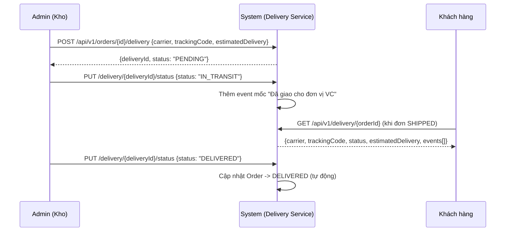

# 🚚 FEATURE 02: Delivery Tracking (Theo dõi Giao hàng)

> **Tên tính năng:** Theo dõi hành trình giao hàng đơn hàng (delivery tracking) cho khách & admin.
> **Mã quy chuẩn:** `FEATURE-02-DELIVERY`
> **Thành viên phụ trách:**
> - **MarketPlace (Backend + UI):** **Vinh** (3 ngày) — *Vinh code feature này (bên MarketPlace), không đụng code GatePay.*
> - **Review:** Vinh tự review / member khác review chéo.
>
> Hướng **end-user**: khách xem được đơn hàng đang ở đâu, dự kiến khi nào tới.

---

## 📌 1. Mô tả Nghiệp vụ & Kịch bản
MarketPlace hiện có `OrderStatus` (`SHIPPED`/`DELIVERED`) nhưng chỉ là trạng thái "cứng", **không có chi tiết hành trình giao hàng**.

Feature này thêm **theo dõi vận chuyển chi tiết**:
1. Khi đơn hàng chuyển `SHIPPED`, admin tạo hồ sơ **Delivery** với đơn vị vận chuyển + mã tracking + dự kiến giao.
2. Các **mốc vận chuyển** (`events`) được ghi nhận: đóng gói → lấy hàng → đang giao → đã giao.
3. Khách xem **timeline vận chuyển** + trạng thái hiện tại trên chi tiết đơn.

---

## 🔄 2. Sơ đồ Luồng (Sequence Diagram)

---

## 🔌 3. Danh Sách API

| Method | Endpoint | Body | Trả về |
|---|---|---|---|
| POST | `/api/v1/orders/{id}/delivery` | `{carrier, trackingCode, estimatedDelivery}` | `{deliveryId, status}` |
| GET | `/api/v1/delivery/{orderId}` | — | `{carrier, trackingCode, status, estimatedDelivery, events[]}` |
| PUT | `/api/v1/delivery/{deliveryId}/status` | `{status: PENDING/IN_TRANSIT/DELIVERED/FAILED}` | `{deliveryId, status}` |

---

## 🗄️ 4. Cơ Sở Dữ Liệu & Migration

### Bảng mới (MarketPlace):
1. `deliveries`: `order_id`, `carrier`, `tracking_code`, `status`, `estimated_delivery`, `created_at`, `updated_at`.
2. `delivery_events`: `delivery_id`, `status`, `note`, `occurred_at` (các mốc).

### Migration (MarketPlace, dải riêng — thêm sau V8):
- `V9__create_deliveries_table.sql` + `V10__create_delivery_events_table.sql`

---

## 📋 5. Phân Công Chi Tiết Task

### MarketPlace (Vinh - 3 ngày):
- [ ] Tạo Entity `Delivery` + `DeliveryEvent` + repository.
- [ ] Tạo migration V9/V10.
- [ ] Viết API tạo/xem/cập nhật trạng thái delivery.
- [ ] Liên kết: khi delivery `DELIVERED` → tự cập nhật `OrderStatus.DELIVERED`.
- [ ] UI: hiển thị **timeline vận chuyển** trên trang chi tiết đơn (khách) + form tạo delivery (admin).

---

## 🔒 6. Security
- **Khách** chỉ xem delivery của **đơn của mình** (kiểm tra ownership qua token).
- **Admin/Staff** mới tạo & cập nhật trạng thái delivery (RBAC).
- Validate `orderId` hợp lệ + chỉ cho tạo delivery khi order ở trạng thái `SHIPPED`.

---

## 🔗 7. Phụ thuộc & Thứ tự
- **Phụ thuộc:** Cần `OrderStatus` + luồng đặt đơn hoạt động (đã có).
- **Thứ tự:** làm **sau** FEATURE 00 (payment thật) để đơn có trạng thái rõ ràng; có thể song song với FEATURE 04 Refund.

---

## ✅ 8. Definition of Done (DoD)
- [ ] Admin tạo delivery cho đơn SHIPPED thành công.
- [ ] Cập nhật mốc vận chuyển → khách xem được timeline.
- [ ] Khi `DELIVERED` → Order tự chuyển `DELIVERED`.
- [ ] Khách chỉ xem được delivery của đơn mình.
- [ ] `./mvnw -o test-compile` xanh + unit test.
