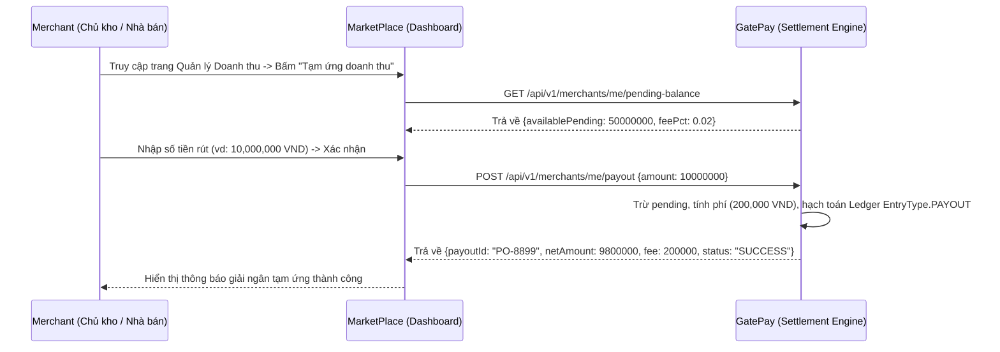

# 💰 FEATURE 02: Instant Settlement For Merchants
> **Tên tính năng:** Quyết toán Tạm ứng Doanh thu Sớm cho Nhà bán  
> **Mã quy chuẩn:** `FEATURE-02-SETTLEMENT`  
> **Thành viên phụ trách:**  
> - **GatePay (Backend):** Vinh (3 ngày)  
> - **MarketPlace (UI/Client):** Giảng & Trí v2 (2 ngày)  

---

## 📌 1. Mô tả Nghiệp vụ & Kịch bản
Doanh thu bán hàng của Merchant trên MarketPlace khi thanh toán qua GatePay được giữ ở trạng thái tạm giữ (`pending`). Merchant có quyền **"Tạm ứng / Rút doanh thu sớm"** về tài khoản ví/ngân hàng bất kỳ lúc nào với khoản phí dịch vụ quy định (~2%).

1. Merchant xem **"Số dư doanh thu đang giữ (Pending Balance)"** trên Dashboard MarketPlace.
2. Merchant thực hiện yêu cầu **"Tạm ứng"** số tiền mong muốn.
3. GatePay hạch toán Sổ cái kép: Trừ tiền `pending`, thu phí tạm ứng ~2%, và giải ngân số tiền ròng vào Ví Merchant.

---

## 🔄 2. Sơ đồ Luồng Giao Dịch (Sequence Diagram)



---

## 🔌 3. Danh Sách API Specifications

### 3.1. Lấy số dư pending khả dụng
- **Endpoint:** `GET /api/v1/merchants/me/pending-balance`
- **Headers:** `Authorization: Bearer <Merchant_Token>`
- **Response (200 OK):**
```json
{
  "code": 200,
  "message": "Pending balance fetched successfully",
  "data": {
    "availablePending": 50000000,
    "onHold": 5000000,
    "feePct": 0.02,
    "currency": "VND"
  }
}
```

### 3.2. Yêu cầu rút tạm ứng
- **Endpoint:** `POST /api/v1/merchants/me/payout`
- **Request Body:**
```json
{
  "amount": 10000000,
  "bankAccountId": "BANK-998877"
}
```
- **Response (200 OK):**
```json
{
  "code": 200,
  "message": "Payout processed successfully",
  "data": {
    "payoutId": "PO-2026-0803-0012",
    "requestedAmount": 10000000,
    "fee": 200000,
    "netDisbursed": 9800000,
    "status": "COMPLETED"
  }
}
```

---

## 🗄️ 4. Cơ Sở Dữ Liệu & Migration

### Các bảng mới trên GatePay:
1. `payouts`: Lưu vết toàn bộ các lịch sử rút tiền / tạm ứng doanh thu của Merchant.
2. Tái sử dụng bảng `ledger_entries` với loại bút toán `EntryType.PAYOUT`.

---

## 📋 5. Phân Công Chi Tiết Task

### 🟢 Phía GatePay (Vinh - 3 ngày):
- [ ] Viết API `GET /merchants/me/pending-balance` và `POST /merchants/me/payout`.
- [ ] Tạo Flyway migration `V29__create_payouts_table.sql` + Entity `Payout`.
- [ ] Hạch toán Sổ cái kép `EntryType.PAYOUT` và xử lý giới hạn tần suất rút tiền/ngày.

### 🔵 Phía MarketPlace (Giảng & Trí v2 - 2 ngày):
- [ ] Thêm Card **"Doanh thu đang giữ"** + Nút **"Tạm ứng"** trên Merchant Dashboard.
- [ ] Xây dựng bảng hiển thị Lịch sử rút tiền & trạng thái giải ngân.

---

## 🔒 6. Security (bắt buộc)
- **JWT Bearer** của merchant sở hữu — chỉ merchant đó mới xem pending/rút được (kiểm tra ownership bằng token).
- **Rate limit** số lần rút/ngày (chống rút khống, vd ≤ 5 lần/ngày) + giới hạn `amount` mỗi lần.
- **Validate** `amount > 0` và `amount ≤ availablePending` — không được rút quá.
- **Idempotent** payout (bằng `payoutId` hoặc `idempotencyKey`) — tránh rút trùng khi retry.
- **Ledger** `EntryType.PAYOUT` ghi đúng — phí + netDisbursed tách rõ.

---

## 🔗 7. Phụ thuộc & Thứ tự
- **Phụ thuộc:** Cần merchant có **pending balance** — phát sinh khi Merchant bán hàng qua GatePay (payment thật). FEATURE-01 BNPL giúp tạo doanh thu, nhưng không bắt buộc.
- **Thứ tự:** có thể chạy **song song** với FEATURE-01/04.

---

## ✅ 8. Definition of Done (DoD)
- [ ] `GET /pending-balance` trả đúng `availablePending`/`onHold`/`feePct`.
- [ ] `POST /payout` rút thành công → ledger PAYOUT ghi đúng, trừ pending, phí đúng `netDisbursed`.
- [ ] Chặn rút quá số dư + quá số lần/ngày.
- [ ] Dashboard Merchant hiển thị pending + nút "Tạm ứng" + lịch sử rút.
- [ ] `./mvnw -o test-compile` xanh + unit test.
