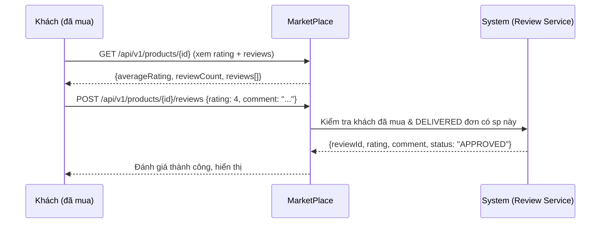

# ⭐ FEATURE 03: Product Reviews & Ratings (Đánh giá Sản phẩm)

> **Tên tính năng:** Khách đánh giá sản phẩm sau khi mua (rating 1-5 + bình luận).
> **Mã quy chuẩn:** `FEATURE-03-REVIEWS`
> **Thành viên phụ trách:**
> - **MarketPlace (Backend + UI):** **Vinh** (3 ngày) — *Vinh code feature này (bên MarketPlace), không đụng code GatePay.*
> - **Review:** Vinh tự review / member khác review chéo.
>
> Hướng **end-user**: tăng tin tưởng mua hàng, hiển thị đánh giá trên trang sản phẩm.

---

## 📌 1. Mô tả Nghiệp vụ & Kịch bản
Khách sau khi mua và nhận đơn có thể **đánh giá sản phẩm**:
1. Khách vào trang sản phẩm → xem **điểm trung bình** + danh sách review.
2. Khách đã mua (order DELIVERED) được phép **gửi đánh giá** (rating 1-5 + comment).
3. Rating trung bình hiển thị trên trang sản phẩm để người khác tham khảo.

> **Lưu ý:** branch MarketPlace có nhánh `feature/FEATURE-STP-01-reviews` từng thêm reviews — nếu còn dùng được thì kế thừa/hoàn thiện thay vì viết mới.

---

## 🔄 2. Sơ đồ Luồng (Sequence Diagram)

---

## 🔌 3. Danh Sách API

| Method | Endpoint | Body | Trả về |
|---|---|---|---|
| GET | `/api/v1/products/{id}/reviews` | — | `{averageRating, reviewCount, reviews[]}` |
| POST | `/api/v1/products/{id}/reviews` | `{rating: 1-5, comment}` | `{reviewId, rating, comment, status}` |

---

## 🗄️ 4. Cơ Sở Dữ Liệu & Migration

### Bảng mới (MarketPlace):
1. `reviews`: `product_id`, `user_id`, `rating` (1-5), `comment`, `status` (APPROVED/PENDING), `created_at`.

### Migration (MarketPlace, dải riêng — thêm sau V8):
- `V11__create_reviews_table.sql`

---

## 📋 5. Phân Công Chi Tiết Task

### MarketPlace (Vinh - 3 ngày):
- [ ] Entity `Review` + repository (tìm theo product, tính avg rating).
- [ ] Migration V11.
- [ ] API: GET reviews theo product (có avg) + POST review (validate đã mua).
- [ ] Chỉ cho review khi khách đã mua & đơn DELIVERED (kiểm tra qua order/order_item).
- [ ] UI: hiển thị rating trung bình + form đánh giá + danh sách review trên trang sản phẩm.

---

## 🔒 6. Security
- **Khách phải đăng nhập** (JWT) mới review được.
- **Chỉ đánh giá khi đã mua & đơn DELIVERED** — chống đánh giá ảo.
- **1 khách 1 review / sản phẩm** (unique `product_id + user_id`).
- Có thể duyệt thủ công (ADMIN) trước khi hiển thị, chống spam/bôi nhọ.

---

## 🔗 7. Phụ thuộc & Thứ tự
- **Phụ thuộc:** Cần product + order hoạt động (đã có). Tốt nhất sau FEATURE 00 (payment thật) + FEATURE 02 (delivery) để có đơn DELIVERED thật.
- **Thứ tự:** làm **sau** FEATURE 02 (delivery) — vì đánh giá cần đơn đã giao.

---

## ✅ 8. Definition of Done (DoD)
- [ ] Khách xem rating trung bình + reviews trên trang sản phẩm.
- [ ] Khách đã mua (đơn DELIVERED) review được.
- [ ] Chặn: chưa mua / 1 khách 2 review / rating ngoài 1-5.
- [ ] Rating trung bình cập nhật đúng.
- [ ] `./mvnw -o test-compile` xanh + unit test.
