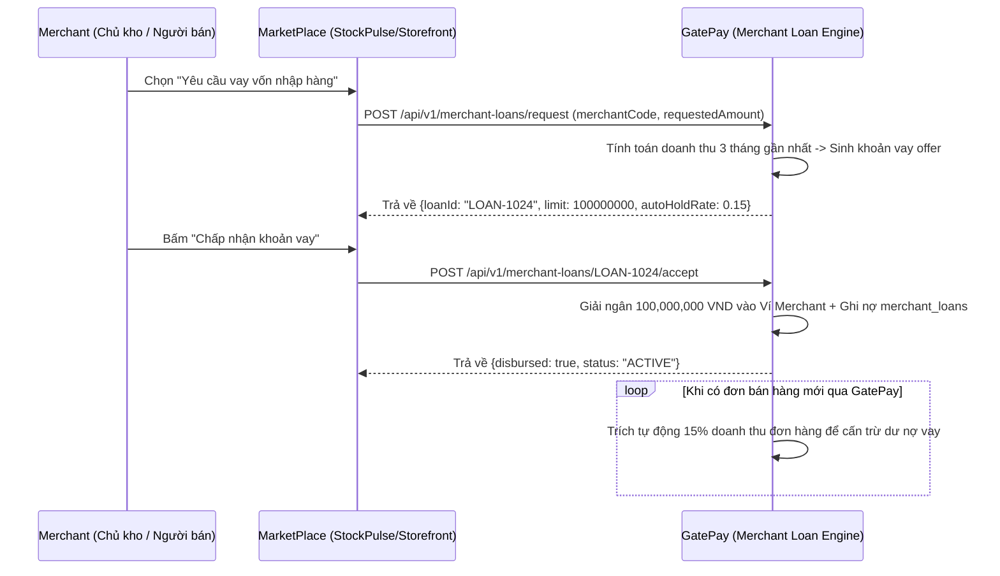

# 🏢 FEATURE 03: Merchant Working Capital Loan
> **Tên tính năng:** Vay Vốn Lưu Động Nhập Hàng Cho Người Bán  
> **Mã quy chuẩn:** `FEATURE-03-WORKING-CAPITAL`  
> **Thành viên phụ trách:**  
> - **GatePay (Backend):** Trí (4 ngày)  
> - **MarketPlace (UI/Client):** Khoa (2-3 ngày)  

---

## 📌 1. Mô tả Nghiệp vụ & Kịch bản
Người bán / Chủ kho trên MarketPlace có nhu cầu vay vốn lưu động để nhập hàng. GatePay tự động tính toán hạn mức vay dựa trên doanh thu thực tế xử lý qua cổng thanh toán.

1. Merchant bấm **"Vay vốn nhập hàng"** trên MarketPlace.
2. GatePay gửi đề xuất Hạn mức vay (Offer Loan Limit).
3. Sau khi Merchant xác nhận vay, tiền nạp thẳng vào Ví Merchant.
4. **Tự động thu nợ:** Mỗi khi Merchant có doanh thu đơn hàng mới thu qua GatePay, hệ thống tự động giữ lại `%` doanh thu (Auto-Hold <= 50%) để trả nợ dần.

---

## 🔄 2. Sơ đồ Luồng Giao Dịch (Sequence Diagram)



---

## 🔌 3. Danh Sách API Specifications

### 3.1. Gửi yêu cầu vay vốn nhập hàng
- **Endpoint:** `POST /api/v1/merchant-loans/request`
- **Request Body:**
```json
{
  "merchantCode": "MC-EXPRESS-99",
  "amount": 100000000,
  "termMonths": 6
}
```
- **Response (200 OK):**
```json
{
  "code": 200,
  "message": "Loan offer generated",
  "data": {
    "loanId": "MLOAN-2026-0088",
    "approvedLimit": 100000000,
    "autoHoldRate": 0.15,
    "interestRate": 0.012
  }
}
```

### 3.2. Chấp nhận khoản vay & Giải ngân
- **Endpoint:** `POST /api/v1/merchant-loans/{loanId}/accept`
- **Response (200 OK):**
```json
{
  "code": 200,
  "message": "Loan disbursed successfully to merchant wallet",
  "data": {
    "loanId": "MLOAN-2026-0088",
    "disbursedAmount": 100000000,
    "status": "DISBURSED"
  }
}
```

---

## 🗄️ 4. Cơ Sở Dữ Liệu & Migration

### Các bảng mới trên GatePay:
1. `merchant_loans`: Lưu thông tin các khoản vay vốn lưu động của Merchant.
2. `merchant_loan_repayments`: Lưu lịch sử từng kỳ trích tiền tự động trả nợ từ doanh thu đơn hàng.

---

## 📋 5. Phân Công Chi Tiết Task

### 🟢 Phía GatePay (Trí - 4 ngày):
- [ ] Tạo Flyway migration `V30__create_merchant_loans.sql` + Entity `MerchantLoan`.
- [ ] Viết API `/merchant-loans/request`, `/accept`, `/{id}/repayment`.
- [ ] Viết `RepaymentScheduler` tự động trích `%` doanh thu trừ nợ mỗi khi đơn hàng được thanh toán.

### 🔵 Phía MarketPlace (Khoa - 2-3 ngày):
- [ ] Thêm Card **"Hạn mức vay nhập hàng"** + Nút **"Đi vay"** trên Dashboard.
- [ ] Gọi API yêu cầu vay và hiển thị tiến trình hoàn nợ.
