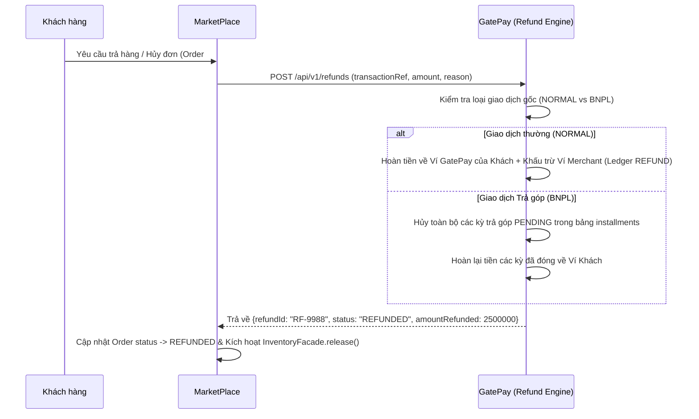

# 🔄 FEATURE 04: Refund & Installment Cancellation

> **Tên tính năng:** Xử Lý Hoàn Tiền Giao Dịch & Hủy Kỳ Trả Góp BNPL
> **Mã quy chuẩn:** `FEATURE-04-REFUND`
> **Thành viên phụ trách:**
> - **GatePay:** **Trí** (3–5 ngày)
> - **MarketPlace:** **Trí v2**
> - **Review:** Vinh (PM — chỉ review, không code)

---

## 📌 1. Mô tả Nghiệp vụ & Kịch bản
Khi Khách hàng yêu cầu hủy đơn hoặc trả hàng trên MarketPlace, hệ thống tự động kích hoạt luồng **Hoàn tiền (Refund)** bảo mật:

> **LƯU Ý CẬP NHẬT MỚI DÀNH CHO TRÍ v2 (MarketPlace):** Đơn hàng mua bằng hình thức trả góp (BNPL) tuyệt đối **KHÔNG** được phép gửi yêu cầu Trả hàng / Hoàn tiền. Trí v2 cần block ngay điều kiện này ở MarketPlace. Luồng hoàn tiền BNPL phức tạp phía dưới tạm thời bị vô hiệu hóa từ nguồn.

1. **Đối với Đơn hàng Mua Thường:** Hoàn tiền ròng lại trực tiếp vào Số dư Ví GatePay của khách hàng.
2. **Đối với Đơn hàng Mua Trả Góp BNPL (Hoàn Toàn Bộ):** Tự động **Hủy/Hoãn toàn bộ các kỳ trả góp `installments` chưa đến hạn**, và hoàn trả lại số tiền khách đã thanh toán ở các kỳ trước đó về Ví.
3. **Hoàn tiền một phần (Partial Refund):** Khi khách chỉ trả 1 vài sản phẩm trong đơn.
   - **Luồng Mua Thường:** Chỉ hoàn đúng số tiền tương ứng của các sản phẩm bị trả (`amount`) vào Ví khách.
   - **Luồng BNPL (Phức tạp):** KHÔNG hủy toàn bộ khoản vay. Số tiền hoàn sẽ được **cấn trừ trực tiếp vào Dư nợ gốc (Principal)**. Hệ thống ưu tiên gạch nợ (Mark as PAID/CANCELLED) từ kỳ trả góp **xa nhất lùi về hiện tại** (giảm thời gian mang nợ của khách). Nếu số tiền hoàn LỚN HƠN tổng dư nợ còn lại, phần dư thừa sẽ được cộng thẳng vào Ví GatePay của khách.
4. Hạch toán Sổ cái kép `EntryType.REFUND` để thu hồi lại số tiền hoàn tương ứng từ Ví Merchant.

---


## 🔄 2. Sơ đồ Luồng Giao Dịch (Sequence Diagram)



---

## 🔌 3. Danh Sách API Specifications

### 3.1. Tạo yêu cầu hoàn tiền
- **Endpoint:** `POST /api/v1/refunds`
- **Request Body:**
```json
{
  "transactionRef": "TX-2026-0803-9988",
  "orderId": "ORD-2026-0803-9988",
  "amount": 2500000,
  "refundItems": ["ITEM-1", "ITEM-3"], 
  "reason": "Khách trả hàng do sai kích thước (Hoàn 1 phần)"
}
```
- **Response (200 OK):**
```json
{
  "code": 200,
  "message": "Refund processed successfully",
  "data": {
    "refundId": "RF-2026-0803-0055",
    "transactionRef": "TX-2026-0803-9988",
    "amountRefunded": 2500000,
    "sourceType": "BNPL",
    "installmentsCancelled": 4,
    "status": "COMPLETED"
  }
}
```


---

## 🗄️ 4. Cơ Sở Dữ Liệu & Migration

### Các bảng mới trên GatePay:
1. `refunds`: Lưu vết toàn bộ thông tin các yêu cầu hoàn tiền.
2. Tái sử dụng bảng `ledger_entries` với loại bút toán `EntryType.REFUND`.
   - `V31__create_refunds_table.sql`

---

## 📋 5. Phân Công Chi Tiết Task

### 🟢🔵 Phụ trách chính (Trí - 3 đến 5 ngày):
- [ ] Tạo Flyway migration `V31__create_refunds_table.sql` + Entity `Refund`.
- [ ] Viết API `POST /api/v1/refunds` xử lý hoàn tiền mua thường vs. mua BNPL.
- [ ] Hạch toán Sổ cái kép Ledger `EntryType.REFUND` để thu hồi tiền từ ví Merchant.
- [ ] Thêm Nút **"Hoàn tiền"** trên màn hình Chi tiết đơn hàng của MarketPlace và cập nhật trạng thái đơn.


---

## 🔒 6. Security (bắt buộc)
- **JWT Bearer** — chỉ người liên quan giao dịch (khách/merchant) hoặc ADMIN mới hoàn được.
- **Idempotent** bằng `orderId` — tránh hoàn trùng 2 lần khi retry (kiểm tra `refunds` đã tồn tại).
- **Chặn hoàn quá số đã trả** — validate `amount ≤ tổng đã thanh toán`.
- **Rate limit** request hoàn tiền.
- **REFUND ledger** hoàn ngược đúng — không để số dư âm.

---

## 🔗 7. Phụ thuộc & Thứ tự
- **Phụ thuộc:** Cần có **giao dịch thật** (NORMAL hoặc BNPL) — tức phụ thuộc FEATURE-01 (BNPL) tạo ra đơn trả góp để hoàn.
- **Thứ tự:** làm **SAU** FEATURE-01 (cần giao dịch/installment có sẵn).

---

## ✅ 8. Definition of Done (DoD)
- [ ] `POST /refunds` hoàn tiền NORMAL → về Ví khách đúng.
- [ ] Hoàn BNPL → hủy các kỳ installment PENDING + hoàn các kỳ đã đóng.
- [ ] Hỗ trợ hoàn tiền một phần (Partial Refund) giảm trừ đúng số tiền tương ứng.
- [ ] Ledger `EntryType.REFUND` thu hồi từ ví Merchant đúng.
- [ ] Chặn hoàn trùng / hoàn quá số đã trả.
- [ ] MarketPlace nút "Hoàn tiền" + cập nhật order → `REFUNDED` + `InventoryFacade.release()`.

- [ ] `./mvnw -o test-compile` xanh + unit test.
