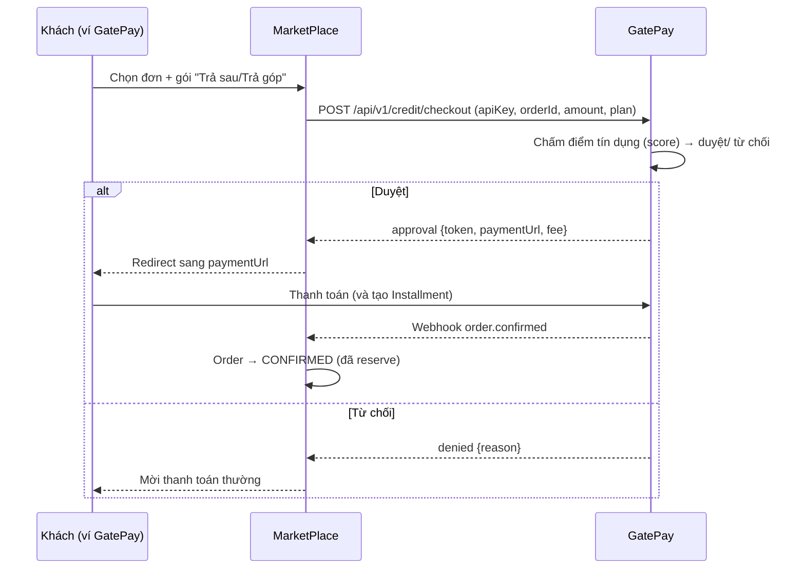
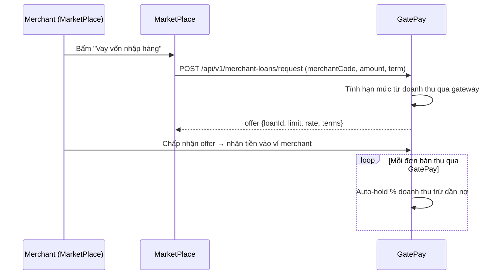
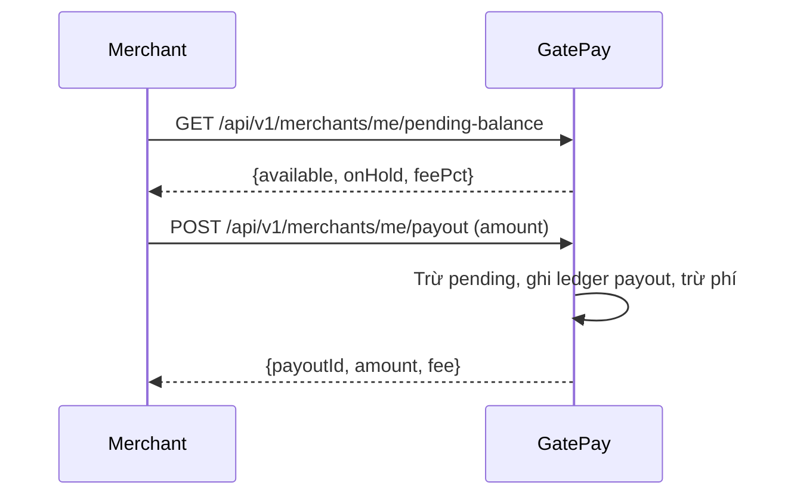
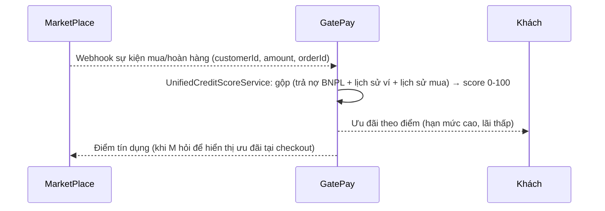

# 🔗 Kế hoạch Liên kết GatePay ↔ MarketPlace

> **Mục đích:** Blueprint 4 tính năng để sau này GatePay (payment/ví/credit) và MarketPlace (bán hàng/order) liên kết chéo nhau — **không merge code**, nối qua API + Webhook.
> **Trạng thái:** Đề xuất — chưa triển khai.

---

## 🧭 Vai trò 2 bên
| Bên | Thế mạnh | Vai trong liên kết |
|---|---|---|
| **GatePay** | Ví, giao dịch, Fraud/Score 0-100, Loan, Checkout gateway, Merchant | **Cấp vốn + Thanh toán + Dữ liệu tín dụng** |
| **MarketPlace** | Catalog SPU/SKU, giỏ hàng, đơn hàng, kho (InventoryFacade), người bán | **Sinh nhu cầu mua/trả + Doanh thu** |

---

## ✅ FEATURE 1 — BNPL: Mua trước Trả sau (Buy Now, Pay Later)

### Mô tả
Khách mua hàng trên MarketPlace ngay, trả tiền sau (đáo hạn 30–45 ngày) hoặc trả góp 3–6 tháng.

### Luồng

### API — MarketPlace gọi GatePay
| Method | Endpoint | Body | Trả về |
|---|---|---|---|
| POST | `/api/v1/credit/checkout` | `apiKey, orderId, amount, plan(BNPL_30/45 | GTHP_3M/6M)` | `{approved, token, paymentUrl, fee}` |

### API — GatePay gọi lại MarketPlace
| Method | Endpoint | Body |
|---|---|---|
| POST | `/api/v1/webhooks/paygate/order` | `{transactionRef, orderId, status, amount}` |

### Bảng mới (GatePay)
- `credit_lines` — hạn mức & trạng thái của từng khách.
- `installments` — kỳ hạn trả của từng giao dịch BNPL.
- (Thêm enum `TransactionType: BNPL_PURCHASE`)

### Bảng mới (MarketPlace)
- `orders.paygate_plan` (thêm cột) — lưu gói đã chọn.

---

## ✅ FEATURE 2 — Merchant Working-Capital Loan (vay vốn lưu động cho người bán)

### Mô tả
Người bán trên MarketPlace vay tiền nhập hàng; **trả dần bằng % doanh thu** thu qua GatePay (kiểu Shopee Capital / Stripe Capital).

### Luồng

### API
| Method | Endpoint | Body | Trả về |
|---|---|---|---|
| POST | `/api/v1/merchant-loans/request` | `merchantCode, amount, term` | `{loanId, limit, rate}` |
| POST | `/api/v1/merchant-loans/{id}/accept` | — | `{disbursed}` |
| GET | `/api/v1/merchant-loans/{id}/repayment` | — | `{paid, remaining}` |

### Bảng mới (GatePay)
- `merchant_loans` — khoản vay merchant, trạng thái.
- `merchant_loan_repayments` — từng kỳ trừ %.

### Bảng mới (MarketPlace)
- Dashboard merchant thêm card "Hạn mức vay: X" + nút đi vay.

---

## ✅ FEATURE 3 — Instant Settlement / Tạm ứng doanh thu

### Mô tả
Doanh thu bán hàng của Merchant được giữ ở ví GatePay (pending). Merchant có thể **tạm ứng / rút sớm** một phần (trừ phí ~2%) — giống Stripe Instant Payout.

### Luồng

### API
| Method | Endpoint | Body | Trả về |
|---|---|---|---|
| GET | `/api/v1/merchants/me/pending-balance` | — | `{available, onHold, feePct}` |
| POST | `/api/v1/merchants/me/payout` | `{amount}` | `{payoutId, amount, fee}` |
| GET | `/api/v1/merchants/me/payouts` | — | `[]` |

### Bảng mới (GatePay)
- `payouts` — lịch sử rút/tạm ứng.
- (Có thể tái dùng `ledger_entries` với `EntryType.PAYOUT`)

---

## ✅ FEATURE 4 — Unified Credit Score & Cross Loyalty

### Mô tả
Kết hợp dữ liệu **mua hàng (MarketPlace)** + **tài chính ví/trả nợ (GatePay)** → **1 điểm tín dụng chung** cho khách, dùng để ưu đãi + mở hạn mức BNPL/vay.

### Luồng

### API
| Method | Endpoint | Trả về |
|---|---|---|
| POST | `/api/v1/credit/events` (webhook từ MarketPlace) | `{received}` |
| GET | `/api/v1/credit/score/{customerId}` | `{score, tier}` |

### Bảng mới (GatePay)
- `credit_events` — sự kiện mua/hoàn từ MarketPlace.
- `credit_scores` — điểm gần nhất + lịch sử.
- **Tái dùng** FraudDetection 0-100 làm đầu vào.

---

## 🧭 Thứ tự triển khai đề xuất

1. **Nền tảng:** MarketPlace thay `simulatePaymentGateway` → gọi checkout thật (đã ghi trong `MARKETPLACE_REVIEW.md` `#C`).
2. **Đồng nhất định danh:** đảm bảo `merchant` = user có ví GatePay; `merchantId` thống nhất 2 đầu.
3. **FEATURE 1 (BNPL)** trước — đơn giản, tạo doanh thu ngay.
4. **FEATURE 3 (Instant Settlement)** — độc lập, ít phụ thuộc, tăng trải nghiệm merchant.
5. **FEATURE 4 (Score chung)** — cần dữ liệu lịch sử → triển khai sau khi BNPL chạy 1 thời gian.
6. **FEATURE 2 (Working Capital)** — phụ thuộc nhiều nhất vào doanh thu qua gateway → triển khai cuối.

---

## 👥 Phân công đội (khi triển khai)

| Feature | GatePay team | MarketPlace team |
|---|---|---|
| **1. BNPL** | CreditEngine, installments, API duyệt | UI chọn gói + gọi API + lưu plan |
| **2. Working Capital** | MerchantLoan, auto-collect, rate | Dashboard merchant + gọi vay |
| **3. Instant Settlement** | Pending balance, payout, phí | Hiển thị pending + nút rút |
| **4. Credit Score** | ScoreService, webhook events | Gửi event mua/hoàn, hiển thị ưu đãi |

---

## 🛡️ Lưu ý (khi liên kết)
- **Bảo mật:** API 2 đầu cần xác thực lẫn nhau (API key hoặc chữ ký HMAC) — không để endpoint public trần.
- **Idempotency:** Webhook BNPL/payment cần `transactionRef` (đã có) để tránh xử lý trùng.
- **Compliance:** Cho vay/BNPL phải có điều khoản, phí công khai, xử lý nợ xấu.
- **Dữ liệu nhạy cảm:** Điểm tín dụng là dữ liệu nhạy cảm — cần phân quyền truy cập nghiêm ngặt (ADMIN).
