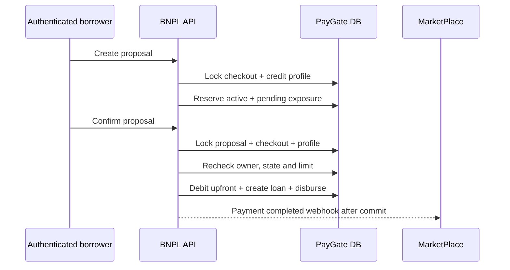

# PayGate (GatePay) — Báo cáo đối chiếu và khắc phục BNPL

> [!info] Phạm vi
> Báo cáo này chỉ đối chiếu các issue thuộc repository **PayGate**. Baseline review là nhánh `develop`, commit `04cfa1e`; bản khắc phục nằm trên nhánh `fix/bnpl-review-hardening`.

## 1. Kết luận điều hành

| Issue | Kết quả đối chiếu | Trạng thái hiện tại |
|---|---|---|
| `BNPL-C1` | Đúng; phạm vi thực tế rộng hơn báo cáo gốc vì confirm từng là public | Đã fix |
| `BNPL-H1` | Thiếu lock là bug thật; hậu quả “nhiều loan cùng commit” bị phóng đại do unique idempotency key | Đã harden |
| `BNPL-H2` | Tăng approved limit là nghiệp vụ có chủ ý; bug thật là replay cộng nhiều lần cho cùng repayment | Đã fix replay, giữ limit growth |
| `BNPL-H3` | Đúng; create proposal không trừ active/pending exposure | Đã fix |
| `BNPL-H4` | Đúng; checkout terminal có thể bị tái sử dụng | Đã fix |

> [!success] Trạng thái
> Toàn bộ năm issue phía PayGate trong phạm vi đã được khắc phục và có focused regression tests.

## 2. Invariant BNPL được áp dụng



- Proposal chỉ được confirm bởi đúng authenticated borrower.
- Một proposal/session chỉ được settle một lần.
- Tổng active/overdue debt và pending proposals không vượt approved limit.
- Repayment khôi phục available credit bằng việc giảm debt, không tăng approved limit.
- Checkout terminal không được quay lại BNPL state machine.

## 3. Chi tiết issue và khắc phục

### BNPL-C1 — IDOR khi confirm proposal

> [!danger] Vấn đề trước khi sửa
> Confirm endpoint từng `permitAll`, controller không truyền principal và service không so sánh caller với `proposal.userId`.

**Khắc phục:**

- Bỏ borrower profile, create proposal và confirm proposal khỏi `permitAll`.
- Controller truyền authenticated username xuống service.
- Service resolve active user và kiểm tra ownership trước mọi mutation.
- Checkout session cũng phải thuộc cùng borrower với proposal.
- Caller anonymous/sai borrower bị từ chối.

**File chính:**

- `GatePay/backend/src/main/java/com/training/paygate/security/SecurityConfig.java`
- `GatePay/backend/src/main/java/com/training/paygate/controller/BnplCheckoutController.java`
- `GatePay/backend/src/main/java/com/training/paygate/service/BnplCheckoutService.java`

---

### BNPL-H1 — Race condition khi confirm cùng proposal

> [!warning] Bug thật, hậu quả trong báo cáo gốc bị phóng đại
> Unique constraint trên transaction idempotency key đã ngăn nhiều disbursement cùng proposal cùng commit, nhưng hệ thống vẫn phụ thuộc gián tiếp vào constraint và có thể trả concurrency error.

**Khắc phục:**

- `findByProposalRefForUpdate()` dùng pessimistic write lock.
- Checkout session cũng được đọc bằng lock.
- Trạng thái được kiểm tra lại sau lock.
- Proposal đã `APPROVED` trả về loan hiện có theo hướng idempotent.

---

### BNPL-H2 — Repayment replay cộng approved limit nhiều lần

> [!info] Chính sách nghiệp vụ đã xác nhận
> Mỗi repayment thành công phải cộng toàn bộ `event.amount()` — gồm cả gốc và lãi — vào `approvedLimit`, không áp dụng trần tối đa. Vì vậy bản thân việc tăng approved limit không phải bug.

**Vấn đề thật trước khi sửa:** handler không yêu cầu schedule phải thực sự chuyển trạng thái trước khi cập nhật loan/profile. Khi RabbitMQ giao lại cùng event, code có thể trừ tiếp `remainingAmount` và cộng lại `approvedLimit` cho cùng một repayment.

**Khắc phục:**

- Lock schedules theo transaction reference.
- Chỉ cập nhật loan khi có schedule thật sự chuyển từ `PROCESSING` sang `PAID`.
- Replay khi không còn schedule processing được bỏ qua idempotently.
- Lock BNPL profile và cộng toàn bộ số tiền repayment vào `approvedLimit` đúng một lần.
- Không áp dụng cap, đúng chính sách tăng hạn mức tối đa không giới hạn đã xác nhận.

**File chính:**

- `GatePay/backend/src/main/java/com/training/paygate/repository/LoanScheduleRepository.java`
- `GatePay/backend/src/main/java/com/training/paygate/service/impl/LoanServiceImpl.java`

---

### BNPL-H3 — Không trừ active debt khi xét hạn mức

> [!danger] Vấn đề trước khi sửa
> Proposal dùng trực tiếp approved limit dù repository đã có khả năng tính active BNPL remaining amount.

**Khắc phục:**

```text
availableCredit = approvedLimit
                - active/overdue loan remaining amount
                - pending proposal financed amount
```

- Lock BNPL profile để serialize credit decisions của cùng user.
- Tính available credit khi create proposal.
- Pending proposal hiện tại được xem như phần hạn mức đã reserve.
- Recheck tổng exposure trong transaction confirm trước khi debit/disburse.

**File chính:**

- `GatePay/backend/src/main/java/com/training/paygate/repository/BnplProfileRepository.java`
- `GatePay/backend/src/main/java/com/training/paygate/repository/BnplProposalRepository.java`
- `GatePay/backend/src/main/java/com/training/paygate/service/BnplCheckoutService.java`

---

### BNPL-H4 — Reuse checkout session đã terminal

> [!danger] Vấn đề trước khi sửa
> `checkout(token)` từng chỉ kiểm tra expiry, cho phép session `SUCCESS` quay lại `CREDIT_APPROVED` và tạo proposal mới.

**Khắc phục:**

- Từ chối mọi mutation với `SUCCESS`, `CANCELLED`, `EXPIRED`, `FAILED`.
- Lock checkout session trong create/confirm flow.
- Chặn proposal thứ hai dùng cùng checkout token.

## 4. Regression tests

Đã bổ sung coverage cho:

- anonymous confirm bị từ chối;
- authenticated username được truyền đúng xuống service;
- user khác không thể confirm proposal;
- confirm proposal đã approved trả kết quả idempotent;
- active và pending exposure được trừ khỏi hạn mức;
- hạn mức được recheck khi confirm;
- terminal checkout không thể tạo proposal;
- repayment event hợp lệ tăng approved limit bằng toàn bộ gốc và lãi;
- replay cùng event không thay đổi loan/schedule/approved limit lần hai.

```powershell
cd GatePay\backend
.\mvnw.cmd test "-Dtest=BnplCheckoutControllerTest,BnplCheckoutServiceTest,LoanServiceImplTest"
```

Kết quả: **12/12 PASS**; `git diff --check`: **PASS**.

> [!warning] Test debt ngoài phạm vi
> PayGate full suite vẫn đỏ ở các test legacy: nhiều `@WebMvcTest` thiếu `MerchantRepository` cho `SignatureValidationFilter`, `CheckoutServiceTest` dùng `@InjectMocks` trên interface, và một lỗi có sẵn trong `TransactionServiceTest`. Các lỗi fixture này không phát sinh từ BNPL patch và không được mở rộng xử lý trong nhánh này.

## 5. Kết luận

> [!summary]
> PayGate đã đóng authorization gap, chuyển state transition sang lock-based/idempotent handling, enforce credit exposure ở cả create và confirm, chặn terminal-session reuse và ngăn repayment replay trong khi vẫn giữ chính sách tăng approved limit bằng toàn bộ gốc và lãi, không giới hạn.
