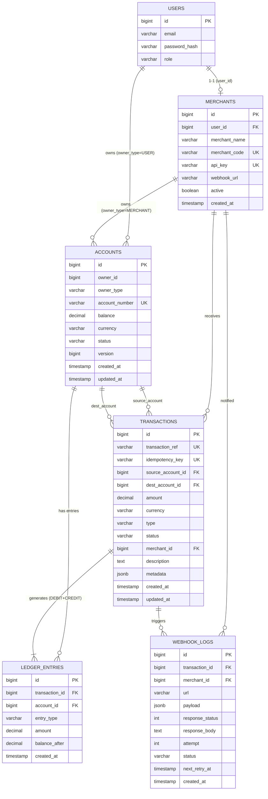

---
tags:
  - training
  - project
  - paygate
  - database
created: 2026-07-20
---

# Database Design — PayGate

## 1. Tổng quan
- RDBMS: **PostgreSQL**
- Quản lý schema qua **Flyway migration**, đặt tại `src/main/resources/db/migration`.
- `V1` (kế thừa từ starter): bảng `users`.
- `V2` → `V7`: các bảng nghiệp vụ PayGate (mô tả bên dưới).
- Tất cả số tiền dùng `DECIMAL(15,2)` — **không** dùng `FLOAT/DOUBLE`.
- Các entity thông thường (không phải bảng tài chính cốt lõi) kế thừa `BaseEntity` (id, createdAt, updatedAt) theo `backend_code_template.md`; riêng các bảng lõi (`accounts`, `transactions`, `ledger_entries`, `webhook_logs`) định nghĩa timestamp tường minh vì có `version`/`updatedAt` custom cho optimistic locking.

## 2. Sơ đồ quan hệ (ERD - dạng mô tả)



## 3. Chi tiết bảng & migration

### V2 — `merchants`
```sql
CREATE TABLE merchants (
    id BIGSERIAL PRIMARY KEY,
    user_id BIGINT NOT NULL UNIQUE REFERENCES users(id),
    merchant_name VARCHAR(255) NOT NULL,
    merchant_code VARCHAR(50) NOT NULL UNIQUE,
    api_key VARCHAR(255) NOT NULL UNIQUE,
    webhook_url VARCHAR(500),
    active BOOLEAN NOT NULL DEFAULT TRUE,
    created_at TIMESTAMP NOT NULL DEFAULT NOW()
);
```
**Ghi chú thiết kế**: `user_id UNIQUE` đảm bảo 1 user ↔ 1 merchant. `api_key` sinh tự động (UUID/random string) trong `MerchantService.create()`.

### V3 — `accounts`
```sql
CREATE TABLE accounts (
    id BIGSERIAL PRIMARY KEY,
    owner_id BIGINT NOT NULL,
    owner_type VARCHAR(20) NOT NULL,     -- USER, MERCHANT, SYSTEM
    account_number VARCHAR(20) NOT NULL UNIQUE,
    balance DECIMAL(15,2) NOT NULL DEFAULT 0.00,
    currency VARCHAR(3) NOT NULL DEFAULT 'VND',
    status VARCHAR(20) NOT NULL DEFAULT 'ACTIVE',
    version BIGINT NOT NULL DEFAULT 0,
    created_at TIMESTAMP NOT NULL DEFAULT NOW(),
    updated_at TIMESTAMP NOT NULL DEFAULT NOW()
);
```
**Ghi chú thiết kế**:
- `owner_id + owner_type` là polymorphic reference thay vì FK trực tiếp (vì có thể trỏ tới `users`, `merchants`, hoặc tài khoản `SYSTEM` nội bộ dùng cho bút toán trung gian).
- `version` dùng cho `@Version` (JPA optimistic locking) **hoặc** kết hợp với `SELECT ... FOR UPDATE` (pessimistic locking) khi xử lý thanh toán — dự án chọn pessimistic lock theo thứ tự `id` để đảm bảo SERIALIZABLE + tránh deadlock (xem REQ-PAY-B-201).
- `status`: `ACTIVE`, `FROZEN`, `CLOSED`.

### V4 — `transactions`
```sql
CREATE TABLE transactions (
    id BIGSERIAL PRIMARY KEY,
    transaction_ref VARCHAR(50) NOT NULL UNIQUE,
    idempotency_key VARCHAR(100) UNIQUE,
    source_account_id BIGINT NOT NULL REFERENCES accounts(id),
    dest_account_id BIGINT NOT NULL REFERENCES accounts(id),
    amount DECIMAL(15,2) NOT NULL,
    currency VARCHAR(3) NOT NULL DEFAULT 'VND',
    type VARCHAR(20) NOT NULL,          -- PAYMENT, REFUND, TOPUP, WITHDRAW
    status VARCHAR(20) NOT NULL DEFAULT 'PENDING',
    merchant_id BIGINT REFERENCES merchants(id),
    description TEXT,
    metadata JSONB,
    created_at TIMESTAMP NOT NULL DEFAULT NOW(),
    updated_at TIMESTAMP NOT NULL DEFAULT NOW()
);
```
**Ghi chú thiết kế**:
- `transaction_ref`: mã public trả về client (ví dụ `TXN-20260720-000123`), khác với `id` nội bộ.
- `idempotency_key`: nullable nhưng UNIQUE — cho phép các giao dịch hệ thống (VD do consumer tạo) không cần key, nhưng nếu có thì phải duy nhất.
- `type = TOPUP` dùng `source_account_id` là tài khoản `SYSTEM` (nạp tiền ảo).
- `status` flow: `PENDING → PROCESSING → COMPLETED|FAILED`, hoặc `PENDING → EXPIRED`.

### V5 — `ledger_entries`
```sql
CREATE TABLE ledger_entries (
    id BIGSERIAL PRIMARY KEY,
    transaction_id BIGINT NOT NULL REFERENCES transactions(id),
    account_id BIGINT NOT NULL REFERENCES accounts(id),
    entry_type VARCHAR(6) NOT NULL,     -- DEBIT, CREDIT
    amount DECIMAL(15,2) NOT NULL,
    balance_after DECIMAL(15,2) NOT NULL,
    created_at TIMESTAMP NOT NULL DEFAULT NOW()
);
```
**Ghi chú thiết kế**: mỗi `transaction_id` luôn có đúng 2 dòng (1 DEBIT, 1 CREDIT) với `amount` bằng nhau. `balance_after` lưu snapshot số dư ngay sau bút toán để phục vụ audit/không cần tính lại lịch sử.

**Bất biến nghiệp vụ (invariant)**:
```
SELECT SUM(CASE WHEN entry_type='DEBIT' THEN amount ELSE 0 END) AS total_debit,
       SUM(CASE WHEN entry_type='CREDIT' THEN amount ELSE 0 END) AS total_credit
FROM ledger_entries;
-- total_debit phải luôn bằng total_credit
```

### V6 — `webhook_logs`
```sql
CREATE TABLE webhook_logs (
    id BIGSERIAL PRIMARY KEY,
    transaction_id BIGINT NOT NULL REFERENCES transactions(id),
    merchant_id BIGINT NOT NULL REFERENCES merchants(id),
    url VARCHAR(500) NOT NULL,
    payload JSONB NOT NULL,
    response_status INT,
    response_body TEXT,
    attempt INT NOT NULL DEFAULT 1,
    status VARCHAR(20) NOT NULL DEFAULT 'PENDING',
    next_retry_at TIMESTAMP,
    created_at TIMESTAMP NOT NULL DEFAULT NOW()
);
```
**Ghi chú thiết kế**: mỗi lần gọi lại webhook tạo 1 dòng mới (append-only) hoặc cập nhật `attempt`/`status` tùy chiến lược — khuyến nghị: 1 row đại diện cho 1 webhook logic, cập nhật `attempt`, `status`, `next_retry_at` sau mỗi lần retry để dễ truy vấn `idx_webhook_pending`. `status`: `PENDING`, `SUCCESS`, `FAILED`.

### V7 — Indexes
```sql
CREATE INDEX idx_transactions_ref ON transactions(transaction_ref);
CREATE INDEX idx_transactions_idempotency ON transactions(idempotency_key) WHERE idempotency_key IS NOT NULL;
CREATE INDEX idx_transactions_source ON transactions(source_account_id);
CREATE INDEX idx_transactions_dest ON transactions(dest_account_id);
CREATE INDEX idx_transactions_merchant ON transactions(merchant_id);
CREATE INDEX idx_transactions_status ON transactions(status) WHERE status IN ('PENDING', 'PROCESSING');
CREATE INDEX idx_ledger_transaction ON ledger_entries(transaction_id);
CREATE INDEX idx_ledger_account ON ledger_entries(account_id);
CREATE INDEX idx_webhook_pending ON webhook_logs(status, next_retry_at) WHERE status = 'PENDING';
```
Toàn bộ index là **partial index** cho các cột trạng thái để tối ưu truy vấn "đang chờ xử lý" (theo REQ-PAY-B-305, xác minh bằng `EXPLAIN ANALYZE`).

## 4. Khóa & khóa ngoại — tóm tắt ràng buộc toàn vẹn
| Bảng | Khóa chính | Khóa ngoại | Unique |
|---|---|---|---|
| merchants | id | user_id → users.id | user_id, merchant_code, api_key |
| accounts | id | — (polymorphic) | account_number |
| transactions | id | source/dest_account_id → accounts.id, merchant_id → merchants.id | transaction_ref, idempotency_key |
| ledger_entries | id | transaction_id → transactions.id, account_id → accounts.id | — |
| webhook_logs | id | transaction_id → transactions.id, merchant_id → merchants.id | — |

## 5. Chiến lược khóa & concurrency
- **Isolation level**: `SERIALIZABLE` cho transaction xử lý thanh toán (`@Transactional(isolation = Isolation.SERIALIZABLE)`).
- **Lock ordering**: khi thanh toán liên quan 2 account, luôn `SELECT ... FOR UPDATE` theo thứ tự `id` tăng dần (id nhỏ hơn khóa trước) để loại bỏ deadlock khi 2 giao dịch ngược chiều xảy ra đồng thời (A→B và B→A).
- **Idempotency trước khi khóa DB**: kiểm tra Redis `tx:dedup:{key}` trước, giảm tải khóa DB không cần thiết cho request trùng lặp.

## 6. Cache layer (Redis) liên quan tới dữ liệu
| Key pattern | Giá trị | TTL | Mục đích |
|---|---|---|---|
| `tx:dedup:{idempotencyKey}` | `transactionRef` | 24h | Chống trùng lặp thanh toán |
| `account:balance:{accountId}` | `balance` | 5 phút | Giảm tải truy vấn số dư, invalidate ngay sau khi có giao dịch ảnh hưởng account đó |
