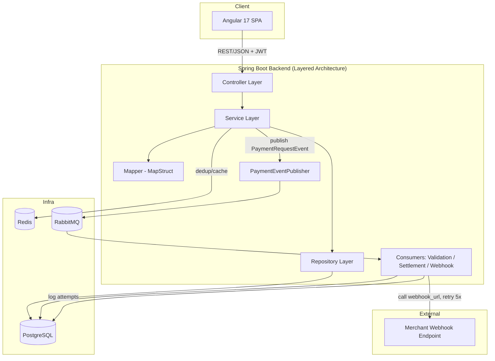

---
tags:
  - training
  - project
  - paygate
  - architecture
created: 2026-07-20
---

# System Architecture — PayGate

## 1. Kiến trúc tổng thể



## 2. Kiến trúc Backend — Layered Architecture

Tuân thủ nghiêm ngặt `backend_code_template.md`. Luồng dữ liệu chuẩn cho mọi tính năng CRUD (Merchant, Account...):

```
Client → Controller (validate DTO) → Service (business logic, @Transactional)
      → Repository (JpaRepository) → DB
      ← Entity ← Repository ← DB
      → Mapper (MapStruct: Entity → Response DTO) → Service
Controller → ApiResponse<T> / PageResponse<T> → Client
```

### 2.1. Cấu trúc package (áp dụng cho các module Merchant, Account, Transaction, Ledger, Webhook)
```text
com.training.paygate
│
├── common/                     # ApiResponse, PageResponse
├── entity/
│   ├── BaseEntity.java
│   ├── Merchant.java
│   ├── Account.java
│   ├── Transaction.java
│   ├── LedgerEntry.java
│   └── WebhookLog.java
├── repository/
│   ├── MerchantRepository.java
│   ├── AccountRepository.java
│   ├── TransactionRepository.java
│   ├── LedgerEntryRepository.java
│   └── WebhookLogRepository.java
├── dto/
│   ├── request/    (CreateMerchantRequest, PaymentRequest, TopUpRequest, RefundRequest ...)
│   └── response/   (MerchantResponse, AccountResponse, TransactionResponse, LedgerEntryResponse ...)
├── mapper/          # MapStruct: MerchantMapper, AccountMapper, TransactionMapper ...
├── exception/        # ResourceNotFoundException, DuplicateResourceException,
│                     # InsufficientBalanceException, DuplicateIdempotencyException, GlobalExceptionHandler
├── service/
│   ├── MerchantService.java / impl/MerchantServiceImpl.java
│   ├── AccountService.java  / impl/AccountServiceImpl.java
│   ├── TransactionService.java / impl/TransactionServiceImpl.java
│   └── LedgerService.java   / impl/LedgerServiceImpl.java
├── controller/
│   ├── MerchantController.java      (/api/v1/admin/merchants)
│   ├── AccountController.java       (/api/v1/accounts)
│   ├── TransactionController.java   (/api/v1/transactions)
│   └── LedgerController.java        (/api/v1/admin/ledger)
├── messaging/                # Riêng cho PayGate — không có trong starter Product template
│   ├── config/RabbitMQConfig.java      # Khai báo exchange/queue/binding
│   ├── event/PaymentRequestEvent.java
│   ├── event/PaymentCompletedEvent.java
│   ├── publisher/PaymentEventPublisher.java
│   └── consumer/
│       ├── ValidationConsumer.java
│       ├── SettlementConsumer.java
│       └── WebhookConsumer.java
├── cache/                    # Redis helper
│   └── IdempotencyCacheService.java
│   └── BalanceCacheService.java
└── config/
    ├── SecurityConfig.java   (JWT, phân quyền USER/ADMIN)
    └── SwaggerConfig.java
```

### 2.2. Nguyên tắc riêng cho PayGate (mở rộng từ template chung)
- `TransactionService.processPayment()` **không** gọi trực tiếp webhook — chỉ publish `PaymentRequestEvent` lên `payment.exchange`, việc gọi webhook do `WebhookConsumer` xử lý bất đồng bộ để không chặn response HTTP.
- `Service` là nơi duy nhất mở transaction DB `SERIALIZABLE` và thực hiện lock account theo thứ tự id — **không** đặt logic này ở Controller hay Repository.
- Exception nghiệp vụ mới cần bổ sung ngoài chuẩn (`ResourceNotFoundException`, `DuplicateResourceException`):
  - `InsufficientBalanceException` → 422/400
  - `DuplicateIdempotencyKeyException` → trả lại kết quả giao dịch cũ (200), không phải lỗi
  - `InvalidTransactionStateException` (VD refund giao dịch chưa COMPLETED) → 409

## 3. Luồng xử lý thanh toán (Payment Flow) chi tiết

```mermaid
sequenceDiagram
    participant C as Client
    participant Ctrl as TransactionController
    participant Svc as TransactionService
    participant Redis as Redis
    participant DB as PostgreSQL
    participant Pub as PaymentEventPublisher
    participant MQ as RabbitMQ
    participant WHConsumer as WebhookConsumer
    participant M as Merchant Endpoint

    C->>Ctrl: POST /transactions/pay (idempotencyKey, amount, destAccount)
    Ctrl->>Svc: processPayment(request)
    Svc->>Redis: GET tx:dedup:{idempotencyKey}
    alt key tồn tại
        Redis-->>Svc: transactionRef cũ
        Svc-->>Ctrl: trả kết quả giao dịch cũ (idempotent)
    else key chưa tồn tại
        Svc->>DB: BEGIN SERIALIZABLE, SELECT accounts FOR UPDATE (order by id)
        Svc->>DB: validate balance, UPDATE balance, INSERT transaction, INSERT 2 ledger_entries
        DB-->>Svc: COMMIT
        Svc->>Redis: SET tx:dedup:{key}=ref TTL 24h; DEL account:balance:{id}
        Svc->>Pub: publish PaymentCompletedEvent
        Pub->>MQ: routing_key=payment.completed
        MQ->>WHConsumer: deliver to webhook.queue
        WHConsumer->>M: POST webhook_url (payload giao dịch)
        alt thành công
            M-->>WHConsumer: 2xx
            WHConsumer->>DB: log webhook_logs status=SUCCESS
        else thất bại
            WHConsumer->>DB: log status=PENDING, next_retry_at, attempt++
            Note over WHConsumer: retry backoff: 1p, 5p, 30p, 2h (tối đa 5 lần)
        end
        Svc-->>Ctrl: TransactionResponse
    end
    Ctrl-->>C: ApiResponse<TransactionResponse>
```

## 4. Messaging Architecture (RabbitMQ)

| Exchange | Type | Queue | Routing Key | Consumer |
|---|---|---|---|---|
| payment.exchange | Topic | payment.validate.queue | payment.request | ValidationConsumer |
| payment.exchange | Topic | settlement.queue | payment.completed | SettlementConsumer |
| payment.exchange | Topic | webhook.queue | payment.completed | WebhookConsumer |
| payment.exchange | Topic | notification.queue | payment.# | (tuỳ chọn) NotificationConsumer |

- `payment.request` → validate độc lập trước khi xử lý nặng (tuỳ mức triển khai, có thể gộp vào service đồng bộ ở early weeks, tách consumer ở Week 2).
- `payment.completed` được bind bởi **2** queue khác nhau (`settlement.queue`, `webhook.queue`) do dùng topic exchange — cho phép nhiều consumer độc lập cùng nhận 1 sự kiện.
- `notification.queue` dùng wildcard `payment.#` để nhận mọi sự kiện liên quan payment (mở rộng sau này, VD SMS/email).

## 5. Cache Architecture (Redis)

| Mục đích | Key | TTL | Ghi/Đọc |
|---|---|---|---|
| Idempotency dedup | `tx:dedup:{idempotencyKey}` | 24h | Ghi khi tạo transaction thành công; đọc đầu tiên trong `processPayment()` |
| Balance cache | `account:balance:{accountId}` | 5 phút | Đọc ở `GET /accounts/{id}/balance`; invalidate ngay sau mọi transaction ảnh hưởng account đó |

## 6. Kiến trúc Frontend (Angular 17+ Standalone)

Tuân thủ `frontend_code_template.md`. Cấu trúc mở rộng cho PayGate:

```text
frontend/src/app
├── core/
│   ├── guards/          (AuthGuard, AdminGuard)
│   ├── interceptors/    (JwtInterceptor, ErrorInterceptor)
│   ├── models/           (api-response.model.ts, page-response.model.ts)
│   └── services/         (AuthService, NotificationService)
├── shared/components/    (confirm-dialog, loading-spinner)
├── layout/               (Sidebar, Header)
├── features/
│   ├── dashboard/
│   ├── merchants/
│   │   ├── merchant-list/
│   │   ├── merchant-form/
│   │   └── merchant.service.ts
│   ├── accounts/
│   │   ├── account-dashboard/
│   │   ├── topup/
│   │   └── account.service.ts
│   ├── transactions/
│   │   ├── payment-form/
│   │   ├── transaction-list/
│   │   ├── transaction-detail/
│   │   └── transaction.service.ts
│   └── admin/
│       ├── admin-dashboard/
│       ├── ledger-verify/
│       └── webhook-logs/
├── app.config.ts
└── app.routes.ts
```

**Nguyên tắc**: mọi service feature giao tiếp qua `ApiResponse<T>`/`PageResponse<T>` như template; route bảo vệ bằng `AuthGuard` (USER) và `AdminGuard` (khu vực `/admin/*`).

## 7. Bảo mật (tổng quan)
- JWT Bearer token cho toàn bộ API (trừ `/auth/**`).
- Phân quyền theo role: `USER` cho các endpoint `/accounts/**`, `/transactions/**` (trừ refund); `ADMIN` cho `/admin/**` và refund.
- `api_key` merchant chỉ dùng nội bộ (không expose qua response API cho USER thường).

## 8. Công nghệ sử dụng
| Thành phần | Công nghệ |
|---|---|
| Backend | Spring Boot 3.x, Spring Data JPA, Spring Security (JWT), Spring AMQP, Spring Data Redis |
| Database | PostgreSQL + Flyway |
| Cache | Redis |
| Message Broker | RabbitMQ |
| Mapping | MapStruct |
| API Docs | springdoc-openapi (Swagger UI) |
| Frontend | Angular 17+ (Standalone Components), Angular Material |
| Testing | JUnit 5, Mockito, Testcontainers, Apache Bench (ab) |
