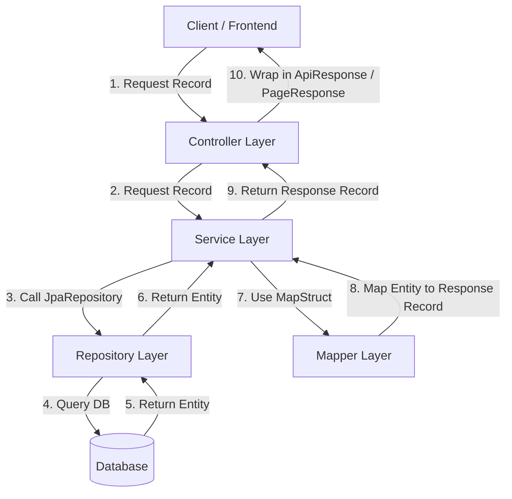

# Hướng dẫn & Template Code chuẩn Layered Architecture (Spring Boot)

Tài liệu này cung cấp cấu trúc code chuẩn của hệ thống Backend dựa trên **Layered Architecture**. Khi tạo một tính năng (feature) mới, các lập trình viên cần tuân thủ cấu trúc thư mục, các quy tắc đặt tên, sử dụng annotation và luồng dữ liệu dưới đây.

---

## 1. Tổng quan Luồng dữ liệu (Data Flow)



---

## 2. Thư mục & Package cấu trúc mẫu (ví dụ tính năng `Product`)

```text
com.training.starter
│
├── common                      # Chứa các wrapper response dùng chung
│   ├── ApiResponse.java        # Wrapper định dạng JSON trả về cho Client
│   └── PageResponse.java       # Wrapper định dạng phân trang
│
├── entity                      # Chứa các JPA Entity mapping trực tiếp với Database
│   ├── BaseEntity.java         # Entity cha chứa id, createdAt, updatedAt
│   └── Product.java            # [NEW] Ví dụ Product Entity kế thừa BaseEntity
│
├── repository                  # Chứa các Spring Data JPA Repository
│   └── ProductRepository.java  # [NEW] Database access layer cho Product
│
├── dto                         # Data Transfer Objects
│   ├── request
│   │   ├── CreateProductRequest.java  # [NEW] Record dùng khi tạo mới
│   │   └── UpdateProductRequest.java  # [NEW] Record dùng khi cập nhật
│   └── response
│       └── ProductResponse.java       # [NEW] Record trả thông tin cho Client
│
├── mapper                      # Các interface ánh xạ Entity <-> DTO (dùng MapStruct)
│   └── ProductMapper.java      # [NEW] Bộ mapper tự động sinh bởi MapStruct
│
├── exception                   # Định nghĩa Custom Exceptions & Global Exception Handler
│   ├── ResourceNotFoundException.java
│   ├── DuplicateResourceException.java
│   └── GlobalExceptionHandler.java
│
├── service                     # Interface chứa nghiệp vụ (Business Logic)
│   ├── ProductService.java     # [NEW] Định nghĩa các hàm nghiệp vụ
│   └── impl
│       └── ProductServiceImpl.java # [NEW] Triển khai nghiệp vụ thực tế
│
└── controller                  # Entry point cho API (Rest API Endpoints)
    └── ProductController.java  # [NEW] Expose API qua HTTP, validate dữ liệu đầu vào
```

---

## 3. Chi tiết Template Code từng Layer

### 3.1. Entity Layer

Tất cả các thực thể nghiệp vụ thông thường nên kế thừa từ `BaseEntity` để tự động có các trường `id`, `createdAt`, `updatedAt`.
Sử dụng **Lombok** (`@Getter`, `@Setter`, `@NoArgsConstructor`, `@AllArgsConstructor`, `@Builder`) và các JPA annotations.

```java
package com.training.starter.entity;

import jakarta.persistence.*;
import lombok.*;
import java.math.BigDecimal;

@Entity
@Table(name = "products")
@Getter
@Setter
@NoArgsConstructor
@AllArgsConstructor
@Builder
public class Product extends BaseEntity {

    @Column(nullable = false, unique = true, length = 100)
    private String code;

    @Column(nullable = false, length = 200)
    private String name;

    @Column(nullable = false, precision = 12, scale = 2)
    private BigDecimal price;

    @Column(columnDefinition = "TEXT")
    private String description;

    @Column(nullable = false)
    @Builder.Default
    private boolean active = true;
}
```

### 3.2. Repository Layer

Mỗi Entity có một Repository tương ứng kế thừa từ `JpaRepository<Entity, Long>`. Không thêm logic xử lý ở đây mà chỉ dùng để giao tiếp DB (Query Methods, `@Query` custom).

```java
package com.training.starter.repository;

import com.training.starter.entity.Product;
import org.springframework.data.jpa.repository.JpaRepository;
import org.springframework.stereotype.Repository;
import java.util.Optional;

@Repository
public interface ProductRepository extends JpaRepository<Product, Long> {

    Optional<Product> findByCode(String code);

    boolean existsByCode(String code);
}
```

### 3.3. DTO Layer (Requests & Responses)

Sử dụng **Java Record** để định nghĩa DTO. 
- **Requests**: Chứa các annotation validate của `jakarta.validation.constraints` như `@NotBlank`, `@Size`, `@NotNull`, `@Min`, v.v...
- **Responses**: Immutable data structure chứa dữ liệu trả về cho client.

#### Create Request DTO:
```java
package com.training.starter.dto.request;

import jakarta.validation.constraints.*;
import java.math.BigDecimal;

public record CreateProductRequest(
        @NotBlank(message = "Product code is required")
        @Size(min = 3, max = 50, message = "Code must be between 3 and 50 characters")
        String code,

        @NotBlank(message = "Product name is required")
        @Size(max = 200, message = "Name must not exceed 200 characters")
        String name,

        @NotNull(message = "Price is required")
        @Positive(message = "Price must be greater than zero")
        BigDecimal price,

        String description
) {}
```

#### Update Request DTO:
```java
package com.training.starter.dto.request;

import jakarta.validation.constraints.*;
import java.math.BigDecimal;

public record UpdateProductRequest(
        @NotBlank(message = "Product name is required")
        @Size(max = 200, message = "Name must not exceed 200 characters")
        String name,

        @NotNull(message = "Price is required")
        @Positive(message = "Price must be greater than zero")
        BigDecimal price,

        String description,

        Boolean active
) {}
```

#### Response DTO:
```java
package com.training.starter.dto.response;

import java.math.BigDecimal;
import java.time.LocalDateTime;

public record ProductResponse(
        Long id,
        String code,
        String name,
        BigDecimal price,
        String description,
        boolean active,
        LocalDateTime createdAt,
        LocalDateTime updatedAt
) {}
```

### 3.4. Mapper Layer (MapStruct)

Sử dụng **MapStruct** để map tự động dữ liệu giữa Entity và DTO. 
*Quy tắc*: Cần khai báo `@Mapper(componentModel = "spring")`. Đối với update, dùng `@MappingTarget` để cập nhật trực tiếp vào Entity hiện hành từ Request.

```java
package com.training.starter.mapper;

import com.training.starter.dto.request.CreateProductRequest;
import com.training.starter.dto.request.UpdateProductRequest;
import com.training.starter.dto.response.ProductResponse;
import com.training.starter.entity.Product;
import org.mapstruct.*;

@Mapper(componentModel = "spring")
public interface ProductMapper {

    ProductResponse toResponse(Product product);

    @Mapping(target = "active", ignore = true) // Sẽ được set mặc định tại Service hoặc Builder
    Product toEntity(CreateProductRequest request);

    @BeanMapping(nullValuePropertyMappingStrategy = NullValuePropertyMappingStrategy.IGNORE)
    @Mapping(target = "code", ignore = true) // Tránh cập nhật trường code
    void updateEntity(@MappingTarget Product product, UpdateProductRequest request);
}
```

### 3.5. Service Layer

Bao gồm **Interface** định nghĩa API nghiệp vụ và **Class Implementation** chứa logic chi tiết.
- Các hàm chỉ đọc (query): Gắn `@Transactional(readOnly = true)`.
- Các hàm ghi (create, update, delete): Gắn `@Transactional`.
- Bắn các Exception kế thừa từ `RuntimeException` nếu có lỗi nghiệp vụ (ví dụ: `ResourceNotFoundException`, `DuplicateResourceException`).

#### Service Interface:
```java
package com.training.starter.service;

import com.training.starter.dto.request.CreateProductRequest;
import com.training.starter.dto.request.UpdateProductRequest;
import com.training.starter.dto.response.ProductResponse;
import org.springframework.data.domain.Page;
import org.springframework.data.domain.Pageable;

public interface ProductService {

    Page<ProductResponse> getAll(Pageable pageable);

    ProductResponse getById(Long id);

    ProductResponse create(CreateProductRequest request);

    ProductResponse update(Long id, UpdateProductRequest request);

    void delete(Long id);
}
```

#### Service Implementation:
```java
package com.training.starter.service.impl;

import com.training.starter.dto.request.CreateProductRequest;
import com.training.starter.dto.request.UpdateProductRequest;
import com.training.starter.dto.response.ProductResponse;
import com.training.starter.entity.Product;
import com.training.starter.exception.DuplicateResourceException;
import com.training.starter.exception.ResourceNotFoundException;
import com.training.starter.mapper.ProductMapper;
import com.training.starter.repository.ProductRepository;
import com.training.starter.service.ProductService;
import lombok.RequiredArgsConstructor;
import org.springframework.data.domain.Page;
import org.springframework.data.domain.Pageable;
import org.springframework.stereotype.Service;
import org.springframework.transaction.annotation.Transactional;

@Service
@RequiredArgsConstructor
public class ProductServiceImpl implements ProductService {

    private final ProductRepository productRepository;
    private final ProductMapper productMapper;

    @Override
    @Transactional(readOnly = true)
    public Page<ProductResponse> getAll(Pageable pageable) {
        return productRepository.findAll(pageable)
                .map(productMapper::toResponse);
    }

    @Override
    @Transactional(readOnly = true)
    public ProductResponse getById(Long id) {
        Product product = productRepository.findById(id)
                .orElseThrow(() -> new ResourceNotFoundException("Product", id));
        return productMapper.toResponse(product);
    }

    @Override
    @Transactional
    public ProductResponse create(CreateProductRequest request) {
        if (productRepository.existsByCode(request.code())) {
            throw new DuplicateResourceException("Product", "code", request.code());
        }

        Product product = productMapper.toEntity(request);
        product.setActive(true);

        Product savedProduct = productRepository.save(product);
        return productMapper.toResponse(savedProduct);
    }

    @Override
    @Transactional
    public ProductResponse update(Long id, UpdateProductRequest request) {
        Product product = productRepository.findById(id)
                .orElseThrow(() -> new ResourceNotFoundException("Product", id));

        // Tiến hành cập nhật bằng mapper tự động bỏ qua null fields
        productMapper.updateEntity(product, request);

        Product updatedProduct = productRepository.save(product);
        return productMapper.toResponse(updatedProduct);
    }

    @Override
    @Transactional
    public void delete(Long id) {
        Product product = productRepository.findById(id)
                .orElseThrow(() -> new ResourceNotFoundException("Product", id));
        productRepository.delete(product);
    }
}
```

### 3.6. Controller Layer

Đóng vai trò điều hướng, nhận request đầu vào, gọi Service xử lý và bao bọc response trả về qua `ApiResponse` hoặc `PageResponse`.
- Sử dụng `@RestController`, `@RequestMapping` với prefix URL `/api/v1/...`
- Sử dụng `@Tag` và `@Operation` từ **Swagger / OpenAPI** để phục vụ việc viết tài liệu API.
- Validate request body bằng `@Valid @RequestBody`.
- Định nghĩa HttpStatus cụ thể cho các action (`@ResponseStatus(HttpStatus.CREATED)` cho tạo mới, `HttpStatus.NO_CONTENT` cho xóa).

```java
package com.training.starter.controller;

import com.training.starter.common.ApiResponse;
import com.training.starter.common.PageResponse;
import com.training.starter.dto.request.CreateProductRequest;
import com.training.starter.dto.request.UpdateProductRequest;
import com.training.starter.dto.response.ProductResponse;
import com.training.starter.service.ProductService;
import io.swagger.v3.oas.annotations.Operation;
import io.swagger.v3.oas.annotations.tags.Tag;
import jakarta.validation.Valid;
import lombok.RequiredArgsConstructor;
import org.springframework.data.domain.PageRequest;
import org.springframework.data.domain.Sort;
import org.springframework.http.HttpStatus;
import org.springframework.web.bind.annotation.*;

@RestController
@RequestMapping("/api/v1/products")
@RequiredArgsConstructor
@Tag(name = "Products", description = "Endpoints for managing products")
public class ProductController {

    private final ProductService productService;

    @GetMapping
    @Operation(summary = "Get all products with pagination")
    public ApiResponse<PageResponse<ProductResponse>> getAll(
            @RequestParam(defaultValue = "0") int page,
            @RequestParam(defaultValue = "20") int size,
            @RequestParam(defaultValue = "createdAt") String sortBy,
            @RequestParam(defaultValue = "DESC") String sortDir) {
        Sort sort = Sort.by(Sort.Direction.fromString(sortDir), sortBy);
        var pageResult = productService.getAll(PageRequest.of(page, size, sort));
        return ApiResponse.success(PageResponse.from(pageResult, r -> r));
    }

    @GetMapping("/{id}")
    @Operation(summary = "Get product by ID")
    public ApiResponse<ProductResponse> getById(@PathVariable Long id) {
        return ApiResponse.success(productService.getById(id));
    }

    @PostMapping
    @ResponseStatus(HttpStatus.CREATED)
    @Operation(summary = "Create a new product")
    public ApiResponse<ProductResponse> create(@Valid @RequestBody CreateProductRequest request) {
        return ApiResponse.success("Product created successfully", productService.create(request));
    }

    @PutMapping("/{id}")
    @Operation(summary = "Update an existing product")
    public ApiResponse<ProductResponse> update(
            @PathVariable Long id,
            @Valid @RequestBody UpdateProductRequest request) {
        return ApiResponse.success("Product updated successfully", productService.update(id, request));
    }

    @DeleteMapping("/{id}")
    @ResponseStatus(HttpStatus.NO_CONTENT)
    @Operation(summary = "Delete product")
    public void delete(@PathVariable Long id) {
        productService.delete(id);
    }
}
```

---

## 4. Quản lý Exception tập trung (Global Exception Handling)

Hệ thống bắt các ngoại lệ lỗi thông qua `GlobalExceptionHandler` và chuyển chúng thành định dạng `ApiResponse.error("thông báo lỗi")`:

* **`ResourceNotFoundException`**: Trả về `404 Not Found` kèm thông tin cụ thể (Ví dụ: `Product not found with id: 1`).
* **`DuplicateResourceException`**: Trả về `409 Conflict` (Ví dụ: `Product already exists with code: PROD001`).
* **`MethodArgumentNotValidException`**: Trả về `400 Bad Request` kèm theo danh sách chi tiết các trường bị lỗi validate (validation errors map).

---

## 5. Quy tắc chung cần tuân thủ (Clean Code & Best Practices)

1. **Lombok**:
   - Sử dụng `@RequiredArgsConstructor` ở Class level cho các class cần tiêm dependency (như Controller, ServiceImpl). Tiêm thông qua constructor tự động này thay vì dùng `@Autowired` trực tiếp lên field.
   - Tránh dùng `@Data` trên các JPA Entity vì có thể gây lỗi tuần hoàn `hashCode()` / `equals()` hoặc `toString()` khi có quan hệ liên kết (Lazy loading). Thay vào đó hãy dùng `@Getter`, `@Setter`.
2. **Transaction**:
   - Luôn luôn khai báo `@Transactional` cụ thể cho các method làm thay đổi trạng thái database ở tầng Service.
   - Thêm `readOnly = true` cho các method chỉ đọc để tăng hiệu năng DB.
3. **MapStruct**:
   - Không thực hiện map tay thủ công (manual mapping) trừ khi logic quá đặc thù. Sử dụng `@Mapper(componentModel = "spring")` của MapStruct.
4. **Validation**:
   - Luôn kiểm tra ràng buộc dữ liệu tại DTO request bằng `@Valid` và các annotation kiểm tra dữ liệu tương ứng. Không để dữ liệu rỗng hoặc sai định dạng đi vào Service Layer.
5. **API Responses**:
   - Tất cả các API trả ra dữ liệu (JSON) phải được bọc trong class `ApiResponse`.
   - Kết quả phân trang bắt buộc trả về qua `PageResponse` tạo từ phân trang của Spring Data.
